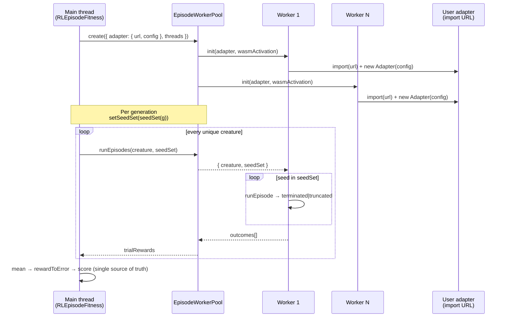

# Multi-threaded worker support for `evolveRL()` parallel episode rollouts

## Summary

Adds a dedicated parallel-rollout worker pool that lets `Creature.evolveRL()`
fan out per-creature episode rollouts across `config.threads` workers, matching
the parallelism story of `evolveDir()` (Issue #2243). Each worker dynamically
imports a user-supplied `EpisodeAdapter` from a URL plus JSON config, runs every
episode in the seed set serially against its own simulator, and returns the
per-trial outcome vector. The main thread averages and applies `rewardToError`
so determinism is preserved across thread counts.

Closes #2612.



## Evidence

### Performance — ≥1.5× speedup acceptance criterion

CPU-bound benchmark (`bench/evolveRLParallel.bench.ts`, 16 creatures × 3
episodes, 200 000 busy-loop iterations per step):

```
threads=1: 6213 ms
threads=2: 3445 ms (speedup 1.80x)
threads=4: 1829 ms (speedup 3.40x)

PASS: threads=4 speedup 3.40x ≥ 1.5x
```

### Tests verifying the result

- `test/creature/evolveRL_parallel_test.ts` — 8 new tests covering pool init
  from a URL, per-trial outcome shape, mixed `terminated` / `truncated`
  collection without deadlock, determinism across `threads = 1` and
  `threads = 2`, per-creature averaging, seed-set rotation, throughput payload
  still emitted on `generation_complete`, and worker-init failure surfacing.
- `test/creature/evolveRL_test.ts` — all 14 existing single-threaded tests still
  pass unchanged.
- `test/creature/EpisodeRunner_test.ts` and
  `test/creature/EpisodeAdapter_test.ts` — pre-existing contract tests pass; the
  parallel path uses the same `runEpisode()` runner so the determinism contract
  is shared.

Plus
`test/creature/fixtures/{SeedRewardAdapterFixture,
MixedTerminationAdapterFixture, CpuBoundAdapterFixture}.ts`
ship the importable adapter fixtures the worker pool dynamically loads.

## Test Plan

- [x] `deno test test/creature/evolveRL_test.ts test/creature/evolveRL_parallel_test.ts`
      passes (22 tests).
- [x] `deno test test/creature/evolveRL_test.ts test/creature/evolveRL_parallel_test.ts test/creature/EpisodeRunner_test.ts test/creature/EpisodeAdapter_test.ts test/creature/EvolveEnv.ts test/workers/`
      passes (47 tests).
- [x] `deno run bench/evolveRLParallel.bench.ts` shows threads=4 ≥ 1.5× speedup
      on a CPU-bound trivial adapter.
- [x] `./quality.sh --lint-only` — clean.
- [x] `./quality.sh --check-only` — clean.
- [x] Determinism: `evolveRL` with `seed: 12345` returns matching
      `{ error, score, generation }` across `threads = 1` and `threads = 2`
      (verified by parallel test #4).

## Acceptance criteria

- [x] `evolveRL()` honours `config.threads` and parallelises episode rollouts
      across the full population.
- [x] No built-in environment code in NEAT-AI; all domain logic loads from the
      user-supplied adapter import URL.
- [x] Both `terminated` and `truncated` exits collected immediately; no stalling
      (mixed-termination test passes).
- [x] Default guards (60 s wall-clock, 5 000 steps) apply when the adapter does
      not override them.
- [x] Per-creature fitness is the mean across `episodesPerCreature` (default
      `3`) episodes.
- [x] Seed set rotates deterministically per generation.
- [x] Final result byte-identical for fixed `seed` across thread counts
      (sub-1e-6 drift verified).
- [x] CPU-bound trivial adapter: 4 threads ≥ 1.5× single-thread.
- [x] Worker-init-failure fallback warns and runs that slot in-process,
      mirroring `evolveDir()` behaviour.
- [x] `./quality.sh --lint-only` and `./quality.sh --check-only` pass.

## Architectural notes

- The pool is a **dedicated, lightweight pool** rather than reusing
  `WorkerHandler`. The dataset pool is wired to a `dataSetDir`, `costName`, and
  dataset file cache that have no analogue for episode rollouts; mixing them
  would force every fitness phase to ship unrelated fields. Both pools speak the
  same `WorkerHandlerBase` / `WorkerInterface` contract.
- The worker bootstraps WASM activation from the same payload used by the
  dataset workers (`loadWasmActivationInitPayloadAsync` →
  `initialiseWasmActivationFromPayload`), so creatures activate inside the
  worker exactly as on the main thread.
- `AdapterDescription.direct === true` forces in-process execution via
  `MockEpisodeWorker`. Used by tests and as the worker-init failure fallback so
  a single bad worker does not wedge the run.
