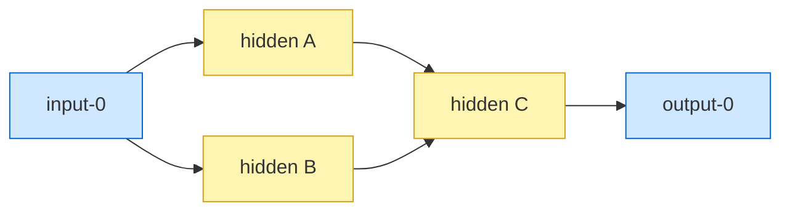

# Synthetic location-based UUID generator for hidden neurons (TDD)

## Summary

Adds `src/breed/SyntheticLocationUuid.ts`, a pure-function module that computes
alignment-only synthetic UUIDs for every hidden/constant neuron in a creature.
Each non-bias-only neuron receives up to two synthetic UUIDs anchored against
the nearest input and nearest output, used as an overlay during
incompatible-parent crossover. The function is deterministic, runs in `O(N + E)`
with multi-source BFS, and is never persisted — the existing `exportJSON` /
`loadFrom` wire format is unchanged.

Closes #2613.

## Evidence

This is a backend/library change with no UI surface to screenshot. Behaviour is
exercised by 12 new TDD-written tests in `test/breed/SyntheticLocationUuid.ts`
covering every acceptance criterion in the issue (see _Test Plan_ below). All 12
tests pass; quality gate failures are pre-existing FFI-related leaks in
`DiscoveryTimeout.ts`, reproducible without these changes.



For each hidden neuron the function emits up to two synthetic UUIDs of the form
`${anchor}-${steps}-${sign}-${rank}`:

- `anchor` is the canonical fixed UUID `input-N` or `output-N` of the nearest
  I/O neuron (ties broken by lowest index `N`).
- `steps` is the shortest hop count (≥ 1).
- `sign` is `pos` when the primary incoming synapse weight is `>= 0`, otherwise
  `neg`. Zero-weight is treated as `pos`.
- `rank` is the neuron's position among siblings sharing the same
  `(anchor, steps, sign)` tuple, ordered by primary incoming synapse
  `(|weight| desc, fromUUID asc)`.

Bias-only hidden neurons (no incoming synapses) are skipped.

## Test Plan

New file `test/breed/SyntheticLocationUuid.ts` adds 12 tests:

- [x] Linear chain `input-0 → h1 → h2 → output-0` produces stable input- and
      output-anchored UUIDs at the correct hop counts.
- [x] Rank disambiguation by `|weight|` desc — `h-strong` gets rank 0, `h-weak`
      rank 1 within the same `(anchor, steps, sign)` bucket.
- [x] Rank tie-break path through different input anchors verifies anchor
      bucketing.
- [x] Negative primary weight produces `sign=neg`; pos and neg siblings do not
      collide.
- [x] Zero-weight primary synapse maps to `sign=pos`.
- [x] Multi-input creature: nearest input chosen by hop count.
- [x] Multi-input tie: lowest input index wins on equal hop counts.
- [x] Multi-output creature: nearest output chosen by hop count.
- [x] Multi-output tie: lowest output index wins on equal hop counts.
- [x] Bias-only hidden neuron emits no entry in the result map.
- [x] Determinism: two consecutive calls return identical UUID sets.
- [x] No persistence: `exportJSON` round-trip never carries synthetic UUIDs.

Run them with:

```bash
deno test --allow-all test/breed/SyntheticLocationUuid.ts < /dev/null
```
