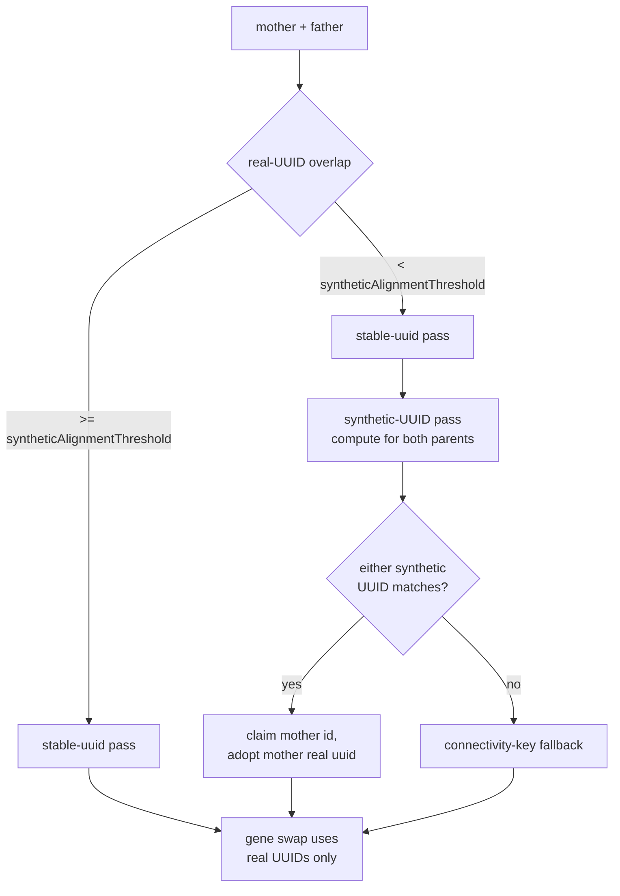

# PR Summary — Issue #2614

## Summary

Wire the synthetic location-based UUID alignment fallback (delivered as a
pure function in #2613) into `createCompatibleFather` and
`createCompatibleFatherFromCreatures` so genetically incompatible parents
gain real crossover anchor points without persisting any synthetic
identifiers. The new pass runs **after** the existing stable-UUID
alignment and **before** the connectivity-key fallback, gated on a
configurable threshold (default `0.2`). Aligned father neurons inherit
the mother's real UUID; the resulting `CreatureExport` only ever carries
real UUIDs.

Closes #2614.

## Evidence

This is a backend / library change with no UI surface. Verified via:

- 6 new unit tests in `test/breed/SyntheticLocationFatherAlignment.ts`
  cover the above-threshold no-op, below-threshold synthetic alignment,
  loose-match behaviour, double-claim guard, the `createCompatibleFatherFromCreatures`
  variant, and the regression that no synthetic-UUID strings appear in
  the resulting export (including a `Creature.fromJSON` → `exportJSON`
  round-trip).
- The full quality gate (`./quality.sh`) was run; 6,590 tests pass. The
  three pre-existing FFI-leak failures in
  `test/ErrorGuidedStructuralEvolution/DiscoveryTimeout.ts` reproduce on
  the unmodified `Develop` branch and are unrelated to this change.

### Alignment flow

## Test Plan

New tests added in `test/breed/SyntheticLocationFatherAlignment.ts`:

- `createCompatibleFather: above-threshold case is a no-op` — overlap = 1
  leaves the existing alignment untouched.
- `createCompatibleFather: below-threshold case aligns at least one
  neuron via synthetic UUID` — disjoint-UUID linear chains pick up the
  mother's real UUIDs via the synthetic pass, with a baseline run at
  `threshold = 0` confirming the alignment depended on the new pass.
- `createCompatibleFather: loose match — input-anchor only also aligns`
  — output-anchor mismatch still yields alignment via the input anchor.
- `createCompatibleFather: stable-UUID alignment is not double-claimed
  by synthetic pass` — a mother neuron already claimed by the
  stable-UUID pass is not re-bound by the synthetic pass.
- `createCompatibleFatherFromCreatures: below-threshold case aligns via
  synthetic UUID and exports cleanly` — Creatures input path aligns and
  the round-trip `exportJSON` contains zero `-pos-` / `-neg-` strings.
- `createCompatibleFatherFromCreatures: threshold = 0 disables synthetic
  pass` — explicit opt-out.

Modified tests (documented in-line):

- `test/breed/CompatibilityGating.ts`: two tests previously asserted
  `geneticCompatibility(mother, dad) == 0` after `findFather` to verify
  the lowest-compat candidate was selected. With the synthetic-UUID
  fallback in place, the returned father inherits the mother's UUIDs so
  post-alignment compatibility is no longer a stable proxy. The tests
  now identify the chosen candidate by hidden-neuron count, preserving
  the original intent.
