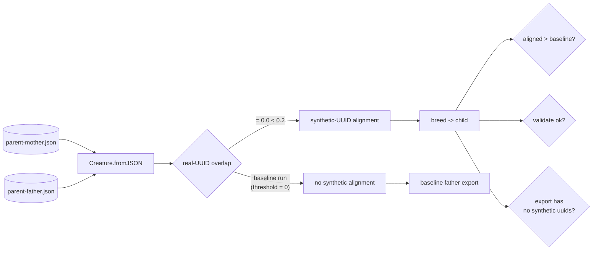

## Summary

Adds an end-to-end regression test (`test/breed/SyntheticLocationE2E.ts`) and
hand-crafted production-shape parent fixtures under
`test/breed/fixtures/synthetic-alignment/` that exercise the synthetic-UUID
alignment fallback delivered by Issue #2614. The test loads two genetically
incompatible parents (modelled on the GRQ-cluster mother and GRQ-teams Europa
father from Issue #2609), proves the fallback aligns more father neurons than
the disabled-pass baseline, breeds a child via `Offspring.breed`, validates the
child, and asserts that no synthetic UUIDs ever leak into the exported
genome. Closes #2615.

## Evidence

The change is test-only — no library code changed. Verification:

- New test passes: `deno test test/breed/SyntheticLocationE2E.ts` →
  `1 passed (8ms)`, well under the 30-second budget required by the issue.
- Lint, format, and type-check pass cleanly via `./quality.sh --lint-only`.
- The 3 pre-existing failures in
  `test/ErrorGuidedStructuralEvolution/DiscoveryTimeout.ts` are dynamic-library
  leak-detection failures unrelated to this PR (verified by running that test
  file alone with no local modifications).

## Test Plan

- [x] `Synthetic-alignment E2E: GRQ-style incompatible parents (Issue #2615)`
      — single test in `test/breed/SyntheticLocationE2E.ts` that:
  1. Loads `parent-mother.json` and `parent-father.json` via
     `Creature.fromJSON`.
  2. Asserts real-UUID overlap < 0.2 (actual: 0.0 — fully disjoint hidden
     UUIDs).
  3. Calls `createCompatibleFatherFromCreatures(mother, father, 0)` for the
     baseline (synthetic pass disabled) and counts father neurons remapped to
     mother UUIDs.
  4. Calls `createCompatibleFatherFromCreatures(mother, father)` at the
     default threshold (0.2) and asserts the synthetic pass remaps strictly
     more neurons than the baseline.
  5. Asserts neither intermediate export contains synthetic UUIDs
     (regex `^(input|output)-\d+-\d+-(pos|neg)-\d+$`).
  6. Calls `Offspring.breed(mother, father, { geneticCompatibilityThreshold: 1 })`
     and asserts the child is non-undefined and passes `creatureValidate`.
  7. Asserts the child's `exportJSON()` contains zero synthetic UUID strings on
     any `uuid`, `fromUUID`, or `toUUID` field.
- [x] Fixtures committed:
      `test/breed/fixtures/synthetic-alignment/parent-mother.json` (~1.7 KB),
      `parent-father.json` (~1.7 KB), and a short `README.md` documenting
      provenance and licence — both fixtures well under the 200 KB cap.
- [x] Test runtime: 8 ms — comfortably within the 30 s acceptance budget and
      the 120 s per-test cap.
