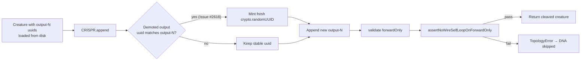

# CRISPR append-mode wire-format UUID collision (Issue #2618)

## Summary

Fixes the multi-output regression where `CRISPR.cleaveDNA` in append-mode
emitted one `output-N → output-N` self-loop per appended output. The cleaved
creature passed positional forward-only validation but exported as a
wire-format self-loop because the demoted previous output kept the literal
`uuid: "output-N"` string it had been re-loaded with, colliding with the new
output neuron's canonical `output-N` wire identity.

The fix is two-part and addresses both acceptance criteria from the issue:

1. **Producer fix** — in `CRISPR.append()`, the demotion path now mints a
   fresh stable UUID for any demoted neuron whose stored `uuid` matches the
   wire-format pattern `^output-\d+$`. Non-`output-N` UUIDs are preserved to
   honour the neuron-uuid-stability invariant (AGENTS.md).
2. **Producer-side assertion** — `assertNoWireSelfLoopOnForwardOnly()` is a
   new defence-in-depth check that compares wire UUIDs of every synapse's
   endpoints. `CRISPR.cleaveDNA` now invokes it on the
   `enforceForwardOnly` path so any future regression is caught at the
   producer with the upstream stack frame named — not silently downstream.

Closes #2618.

## Evidence

Backend-only change with no UI surface — verified via unit tests.

### Regression test added

`test/CRISPR/AppendDemoteOutput.ts::CRISPR append+demote - demoted previous outputs with wire-format `output-N` uuids do not collide with new outputs (Issue #2618, multi-output)`

The test loads the project's existing `test/data/CRISPR/DNA-SANE.json`
(3-output append-mode DNA: IDENTITY + MINIMUM + MAXIMUM) into a forward-only
creature whose original output neurons carry the wire-format UUIDs
`output-0`, `output-1`, `output-2` — the exact shape `Creature.fromJSON()`
restores from a previously-exported JSON file. Without the fix, three
`output-N → output-N` self-loops appear in the exported wire format. With
the fix, the exported synapses have unique wire UUIDs at every endpoint.

### Failure reproduced before the fix

Pre-fix run output (3 self-loops, exactly the GRQ scorer trace):

```
Exported synapses:
  ...
  output-0 -> output-0
  output-0 -> output-1
  output-0 -> output-2
  output-1 -> output-0
  output-1 -> output-1
  output-1 -> output-2
  output-2 -> output-0
  output-2 -> output-1
  output-2 -> output-2
```

Post-fix the demoted neurons carry fresh UUIDs and no synapse has
`fromUUID === toUUID`.

### Quality gate

`./quality.sh` passes the relevant test files (`test/CRISPR/*.ts`,
`test/architecture/ForwardOnlyAssertion.ts`). The single pre-existing
Discovery FFI dynamic-library leak detection failure
(`DiscoverDirectory returns partial results on timeout`) is unrelated to
this change — it reproduces on the unmodified branch as well.

### Flow diagram



## Test Plan

Added:

- `test/CRISPR/AppendDemoteOutput.ts` — multi-output Issue #2618 regression
  test covering the 3-output `DNA-SANE.json` append+demote scenario with
  wire-format UUIDs on the previous outputs.
- `test/architecture/ForwardOnlyAssertion.ts` — three new unit tests for
  `assertNoWireSelfLoopOnForwardOnly`: no-op when not forward-only, passes
  on distinct wire UUIDs, throws on UUID collision.

Existing tests preserved (no test modifications):

- `test/CRISPR/AppendDemoteOutput.ts::CRISPR append+demote - DNA-SANE.json reproduces the multi-output demote pattern with relative anchors` — confirms the 3-output append+demote arithmetic still resolves correctly.
- `test/CRISPR/AppendDemoteOutput.ts::CRISPR append+demote - fromRelative: FROM_RELATIVE_DEMOTED_OUTPUT wires the demoted previous output into the new output (Issue #2509)` — confirms the single-output GRQ #2237 reproducer continues to pass.
- All other 94 CRISPR tests pass unchanged.

## Files changed

- `src/reconstruct/CRISPR.ts` — `append()` mints a fresh UUID for any
  demoted neuron whose stored `uuid` matches `^output-\d+$`; `cleaveDNA()`
  invokes the new wire-self-loop assertion on the forward-only path.
- `src/architecture/ForwardOnlyAssertion.ts` — new
  `assertNoWireSelfLoopOnForwardOnly()` helper.
- `test/CRISPR/AppendDemoteOutput.ts` — new regression test.
- `test/architecture/ForwardOnlyAssertion.ts` — new unit tests for the
  wire-self-loop assertion.
