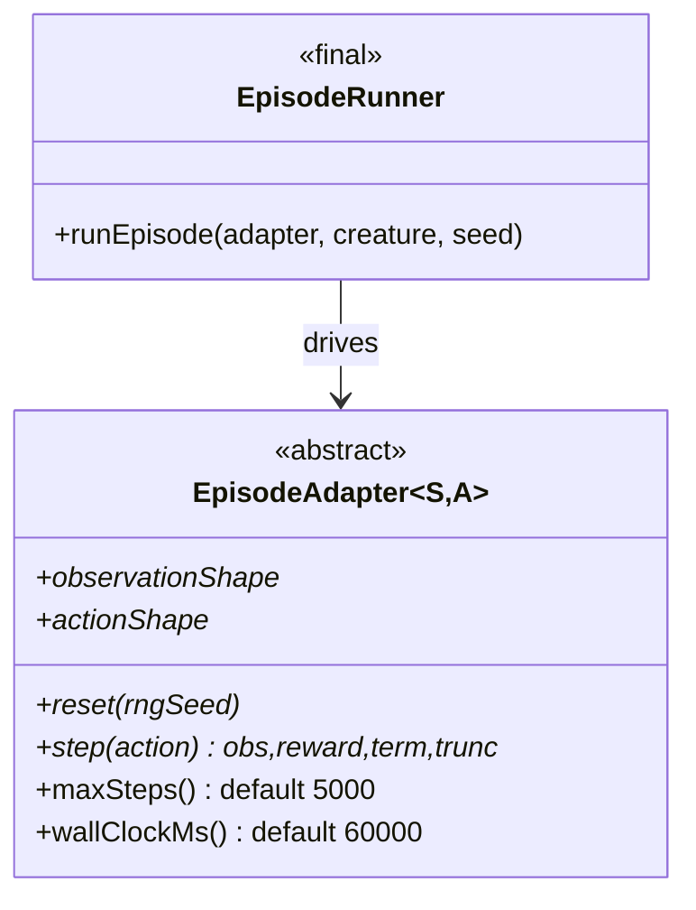

# Update event-driven-evolution.md for evolveRL design

## Summary

Rewrote `docs/event-driven-evolution.md` so it documents the renamed
`Creature.evolveRL()` API (was `evolveEnv` in RFC #2610) and the new
class-shaped adapter contract decided in #2624. Closes #2625.

The doc now covers, in order:

- The renamed entry point with a one-paragraph rename note.
- An explicit name justification for `evolveRL` against `evolveEnv`,
  `evolveOnline`, and `evolveInteractive`.
- The class-shaped `EpisodeAdapter<S, A>` contract split into three tiers —
  abstract (must override), overridable (may override), final (library-owned).
- Default termination guards: 60-second wall-clock and 5 000-step caps,
  Gym/Gymnasium-style `terminated` vs `truncated` semantics.
- Seed cadence: per-generation seed set shared by every creature, deterministic
  per-generation rotation, opt-in fixed seeds for tests.
- Per-creature averaging at `episodesPerCreature = 3`, with the mapping back to
  NEAT-AI's `error` for `targetError` and plateau detection.
- Opt-in geometric milestone statistics
  (`1, 2, 5, 10, 20, 50, 100, 200, 500, 1 000, …`) and the per-milestone payload
  (best score, best neuron / synapse counts, mean episode steps, generation
  wall-clock).
- Cross-reference to #2612 with the serialisable adapter descriptor (Option A).

`docs/REINFORCEMENT_LEARNING.md` now cross-references `evolveRL` in three places
(top tip, parallelism section, glossary), and `docs/README.md` updates the index
entry to describe the renamed API.

## Evidence

Documentation-only change.
`./quality.sh --skip-tests --skip-discovery
--skip-wasm` (formatting, lint, bash
check, type-check) passes cleanly.

## Test Plan

This is a design-doc refresh — no executable code changes, so no new unit tests.
The acceptance criteria from #2625 are verified by reading the doc:

- [x] No `evolveEnv` references outside the rename note.
- [x] `evolveRL` justified against `evolveEnv` / `evolveOnline` /
      `evolveInteractive`.
- [x] Class-shaped adapter contract documented (abstract / overridable / final).
- [x] Default termination guards (60 s wall-clock, 5 000 steps, truncated
      semantics) documented.
- [x] Seed-cadence rules (per-generation rotation, fixed-seed opt-in)
      documented.
- [x] `episodesPerCreature = 3` averaging documented.
- [x] Geometric statistics schedule + payload documented.
- [x] `docs/REINFORCEMENT_LEARNING.md` cross-references the renamed API.
- [x] `./quality.sh` passes (markdown lint + format + type-check).
