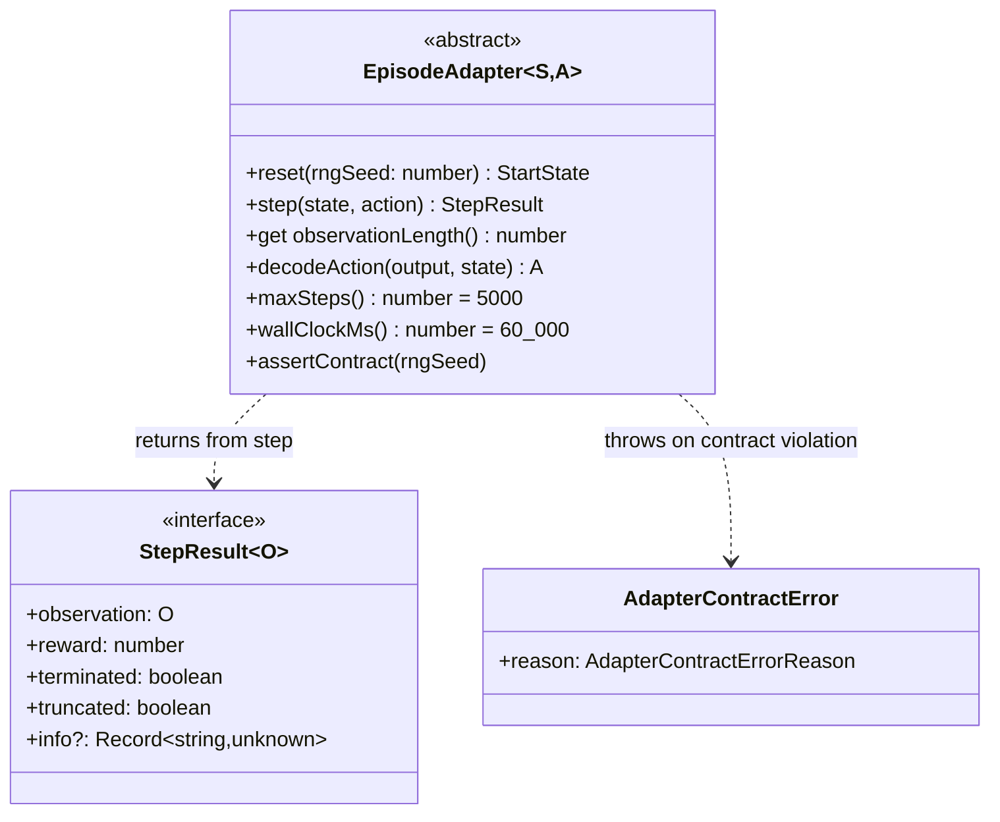

# Implement EpisodeAdapter base class with overridable termination guards

## Summary

Adds the class-shaped `EpisodeAdapter<S, A>` base class in
`src/creature/EpisodeAdapter.ts` — the single seam between NEAT-AI and a
caller's reinforcement-learning environment. Closes #2626.

The new contract follows Gym/Gymnasium return-shape semantics
(`terminated` vs `truncated` are distinct fields on `StepResult`) and uses a
Java-style abstract / overridable split:

- **MUST override** — `reset(rngSeed)`, `step(state, action)`,
  `observationLength`, `decodeAction(creatureOutput, state)`.
- **MAY override** — `maxSteps()` (default `5000`) and `wallClockMs()`
  (default `60_000`).

Contract violations surface lazily on first use via
`adapter.assertContract()` as the new typed `AdapterContractError`. Lazy
validation lets subclasses defer their own initialisation; library code
calls `assertContract()` once before driving the adapter.

The legacy `EpisodeAdapter` interface from #2611 (used by the still-shipping
`evolveEnv()` flow) is preserved unchanged as `LegacyEpisodeAdapter` in a
new `EpisodicFitnessTypes.ts` so the runner-replacement sub-issue can
migrate it to the new contract independently.

## Evidence

Backend / library change — no UI to screenshot.

Targeted tests for the new abstract class (10 cases, all passing):

```text
EpisodeAdapter: counting adapter happy path ........... ok
EpisodeAdapter: default guards are 5000 / 60_000 ...... ok
EpisodeAdapter: subclass guard overrides are honoured . ok
EpisodeAdapter: zero observationLength fails ........... ok
EpisodeAdapter: non-positive maxSteps() fails .......... ok
EpisodeAdapter: zero wallClockMs() fails ............... ok
EpisodeAdapter: non-Float32Array observation fails ..... ok
EpisodeAdapter: mismatched observation length fails .... ok
EpisodeAdapter: argmax decodeAction picks the largest .. ok
EpisodeAdapter: assertContract() is idempotent ......... ok
```

`./quality.sh --skip-discovery --skip-wasm` passes lint, format,
type-check, and 6611 tests. The two `DiscoveryTimeout` failures observed
are pre-existing on the milestone branch base (reproduced with
`git stash`) and unrelated to this change.



## Test Plan

- **Added** `test/creature/EpisodeAdapter_test.ts` — covers the five
  scenarios listed in #2626 (counting happy path, default guards, override
  guards, contract failure on `observationLength = 0`, argmax
  `decodeAction`) plus three additional contract-failure cases
  (`maxSteps`, `wallClockMs`, observation type / size mismatch) and an
  idempotency check on `assertContract()`.
- **Updated** `test/creature/EvolveEnv.ts` — type imports retargeted to
  `LegacyEpisodeAdapter` from `EpisodicFitnessTypes.ts`. All existing
  `evolveEnv()` tests still pass.
- **Quality gate**: `./quality.sh --skip-discovery --skip-wasm` runs
  lint + format + type-check + 6611 tests in parallel. New tests pass;
  no regressions introduced.
