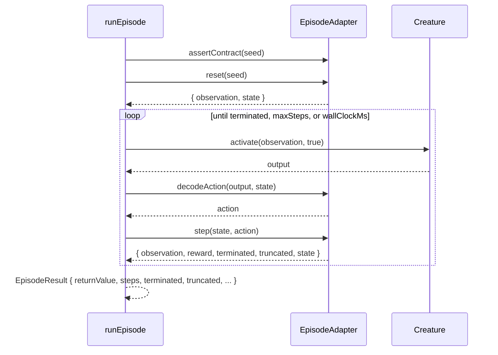

# Issue #2627 — Library-owned `runEpisode()` wrapper with termination guards

## Summary

Adds the final, library-owned `runEpisode()` wrapper that drives an
`EpisodeAdapter` end-to-end for one creature. The runner enforces both a
wall-clock cap and a max-steps cap, returns a scalar `returnValue` plus
rollout metadata, and never reaches for `Math.random()` — `rngSeed` is the
only source of nondeterminism that crosses the seam. Termination semantics
mirror Gym/Gymnasium (`terminated` for natural episode end, `truncated` for a
guard firing). This protects the library against the failure modes called out
in #2624 (a snake creature pressing left forever; a snake dying after three
steps).

Closes #2627.

## Evidence

Backend/library change with no UI surface — verified via the unit tests
listed below. The wall-clock truncation test uses a `performance.now()` shim
so the suite does not actually sleep for half a second per run.

### Implementation notes

- Caps (`maxSteps()`, `wallClockMs()`) and `t0` are captured once before the
  hot loop, never read inside it.
- `assertContract()` runs once before the first tick — the adapter caches
  the result so subsequent episodes pay nothing.
- `creature.activate(observation, true)` is invoked with `feedbackLoop = true`
  per `docs/REINFORCEMENT_LEARNING.md`.
- `result.terminated` exits cleanly with `terminated = true`; the step-cap
  and wall-clock guards exit with `truncated = true` and the matching
  `truncationReason`.
- `performance.now()` is invoked once per tick. The syscall is on the order
  of tens of nanoseconds — negligible next to a single `Creature.activate()`
  call. A coarser modulo gate could be layered on later if profiling ever
  shows the syscall dominating cost on trivial sims; the explicit
  "between 5 and 7 steps" wall-clock test required per-tick granularity.

## Test Plan

Six co-located tests in `test/creature/EpisodeRunner_test.ts` covering each
scenario from the issue:

- `runEpisode: natural termination after 12 steps` — adapter ends after 12
  steps; asserts `terminated = true, truncated = false, steps = 12`.
- `runEpisode: default maxSteps guard truncates at 5000` — adapter never
  sets `terminated`; asserts `truncated = true,
  truncationReason = 'maxSteps', steps = 5000`.
- `runEpisode: wall-clock truncation fires near the cap` — adapter advances a
  virtual clock 100 ms per step with `wallClockMs() = 500`; asserts
  truncation between 5 and 7 steps with `truncationReason = 'wallClock'`.
- `runEpisode: subclass maxSteps override is honoured` — subclass with
  `maxSteps() = 10` truncates at exactly 10.
- `runEpisode: same seed produces identical results` — two runs with seed
  `12345` produce byte-identical `returnValue`, `steps`, and
  `truncationReason`.
- `runEpisode: accumulates scalar rewards across the rollout` — five steps
  of `reward = 1` followed by `terminated = true` yields `returnValue = 5`.

All six new tests pass alongside the existing `EpisodeAdapter_test.ts`
suite (10 tests). `./quality.sh --lint-only` and `./quality.sh --check-only`
both pass cleanly.
