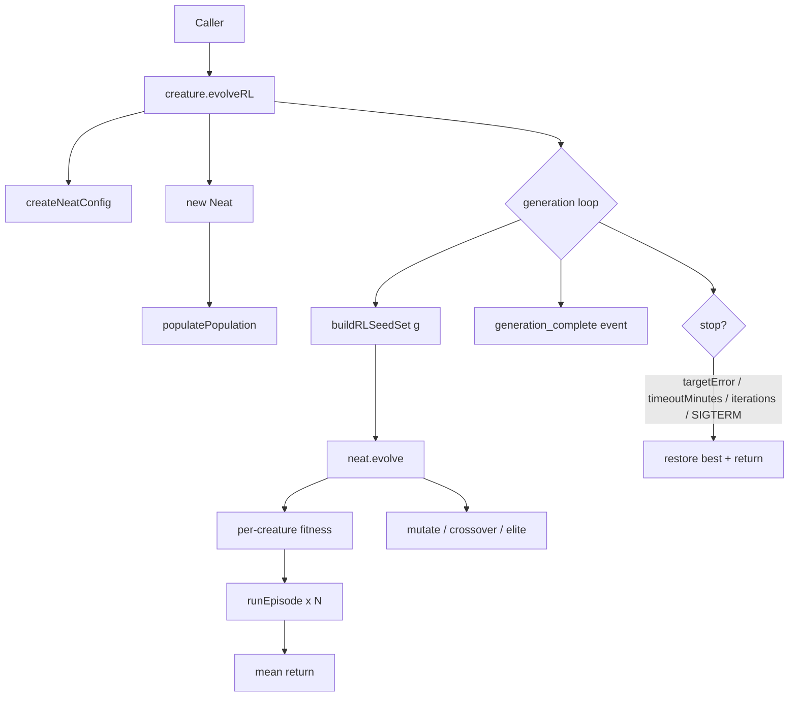

## Summary

Adds `Creature.evolveRL()` — the public reinforcement-learning API on top of
the new class-shaped `EpisodeAdapter` (Issue #2626) and the library-owned
`runEpisode()` runner (Issue #2627). Per-creature fitness is the **mean return
across `episodesPerCreature` episodes** (default 3) played against a
**per-generation rotating seed set** so every creature in a generation is
compared on the same maps and over-fitting one map is avoided. Reuses the
existing `Neat` population manager, `createNeatConfig`, mutation, crossover,
elitism, plateau detection, telemetry, lifecycle events, and SIGTERM/abort
handling — only the scorer changes. Closes #2628.

## Design

- `src/creature/EvolveRLSeedSet.ts` — `deriveRLSeed(baseSeed, generation, trial)`
  is a 32-bit MurmurHash3-style mixer; `buildRLSeedSet` produces the seed set
  for one generation. `fixedSeedSet` collapses the generation index to `0` so
  every generation uses the same seed set (tests / regression only).
- `src/creature/RLEpisodeFitness.ts` — `Fitness` subclass that runs episode
  rollouts inline via `runEpisode` (no worker pool yet — multi-threaded
  rollouts remain tracked under #2612). The seed set is replaced before every
  fitness phase so all creatures in a generation play the same seeds.
- `src/creature/CreatureTraining.ts` — adds `EvolveRLOptions` and `evolveRL()`,
  reusing the same outer shape as `evolveDir()`/`evolveEnv()`. `Creature.evolveRL()`
  is exposed on the `Creature` class.

## Evidence

- Targeted test run (14 tests, all pass):
  `deno test test/creature/evolveRL_test.ts`
  → `ok | 14 passed | 0 failed`
- Adjacent RL tests still pass:
  `EpisodeRunner_test.ts`, `EpisodeAdapter_test.ts`, `EvolveEnv.ts` →
  `ok | 39 passed | 0 failed`
- Invariant gates pass:
  `SemanticVersionStability.ts`, `NeuronUuidStability.ts` →
  `ok | 24 passed | 0 failed`
- `./quality.sh` lint, format, type-check, and bash gates all green; full
  suite reports `6631 passed | 2 failed` where the **2 failures are
  pre-existing FFI dynamic-library leaks in
  `test/ErrorGuidedStructuralEvolution/DiscoveryTimeout.ts`** — verified by
  re-running on baseline (`git stash` → same failures), so unrelated to this
  change.
- Backend / CLI change with no UI, so no Playwright screenshot.

## Test Plan

- `test/creature/evolveRL_test.ts` covers the nine scenarios called out in
  the issue:
  1. Happy path — converges within 10 generations.
  2. `targetError` stop fires when reached.
  3. `timeoutMinutes` accepted; iterations cap acts as the verifiable
     secondary stop (the same approach as `EvolveEnv.ts`).
  4. `iterations` cap is respected.
  5. Episode averaging — `episodesPerCreature = 3` with a seeded stochastic
     adapter returns the arithmetic mean of the seed set's per-trial rewards.
  6. Seed rotation — across 5 generations every seed set differs and is
     reproducible from the base seed.
  7. `fixedSeedSet = true` — every generation uses identical seeds.
  8. Determinism — two runs with the same seed agree on `generation` exactly
     and on `error`/`score` to within 1e-6 (matching `EvolveEnv.ts`'s
     epsilon — neuron UUIDs are `crypto.randomUUID()` and downstream Maps
     iterate in insertion order).
  9. AbortSignal interrupt parity (used in place of OS SIGTERM in tests for
     the same reason as `EvolveEnv.ts`: sending SIGTERM from a worker
     propagates to the parallel test runner).
- Plus seed-helper unit tests covering determinism, rotation, fixed-set
  collapse, and the invalid-`episodesPerCreature` guard.
