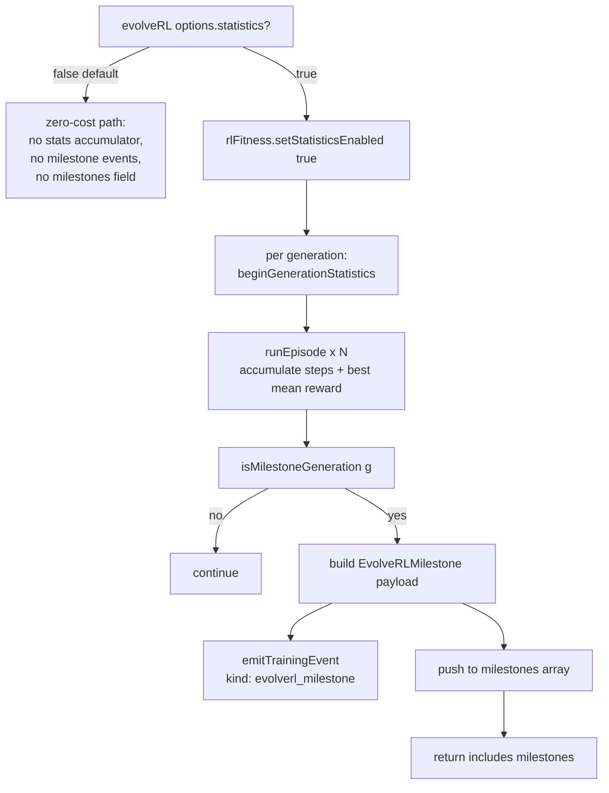

## Summary

Adds an opt-in milestone-statistics surface to `Creature.evolveRL()` so the
example dashboards (lunar lander, snake, etc.) can chart per-generation
progress without forcing every run to pay for the collection cost. New
`src/creature/EvolveRLStatistics.ts` exports `isMilestoneGeneration()` and the
`EvolveRLMilestone` payload; the geometric schedule is
`1, 2, 5, 10, 20, 50, 100, 200, 500, 1000` and continues with powers of ten
beyond `1000`. When `EvolveRLOptions.statistics === true`, `evolveRL()`
collects best-creature score/topology, mean episode steps, and generation
wall-clock at each milestone, emits the payload on the existing
`onTrainingEvent` emitter as a new `evolverl_milestone` event, and returns a
`milestones: EvolveRLMilestone[]` field on the run summary. When statistics
are off (the default), the collection is skipped entirely on the hot path and
the `milestones` field is omitted, preserving the #2628 return shape.
Closes #2629.

## Design

- `src/creature/EvolveRLStatistics.ts` — `isMilestoneGeneration(g)` reduces
  `g` by repeated division-by-ten and inspects the residue. For `g <= 1000`
  the residue must be in `{1, 2, 5}`; for `g > 1000` the residue must be `1`
  (i.e. `g` is a power of ten). O(log₁₀ g), zero allocation. `EvolveRLMilestone`
  is the per-milestone payload (`generation`, `bestScore`, `bestNeurons`,
  `bestSynapses`, `meanEpisodeSteps`, `generationWallClockMs`).
- `src/creature/RLEpisodeFitness.ts` — adds `setStatisticsEnabled`,
  `beginGenerationStatistics`, and `consumeGenerationStatistics`. When stats
  are on, the inner rollout loop accumulates per-episode step counts and the
  best mean return per generation, and tags `meanReward` on each scored
  creature so elites that survive across generations still report a sensible
  `bestScore`. When stats are off, every accumulator branch is gated and
  skipped entirely.
- `src/creature/CreatureTraining.ts` — `EvolveRLOptions.statistics` doc
  updated; `evolveRL()` captures `generationStartMs` per generation, builds
  and emits the milestone payload at each milestone generation, and includes
  the `milestones` array in the return only when statistics were enabled.
- `src/config/TrainingEvent.ts` — adds the `EvolveRLMilestoneEvent` variant
  to the `TrainingEvent` discriminated union so consumers receive it through
  the same `onTrainingEvent` callback they already register.
- `src/Creature.ts` — `Creature.evolveRL()` return type widened with an
  optional `milestones` field.

## Evidence

- Targeted test run (3 tests, all pass):
  `deno test test/creature/EvolveRLStatistics_test.ts` →
  `ok | 3 passed | 0 failed`.
- Adjacent RL tests still pass:
  `test/creature/evolveRL_test.ts`, `test/creature/EpisodeRunner_test.ts`,
  `test/creature/EpisodeAdapter_test.ts` → `ok | 33 passed | 0 failed`.
- `./quality.sh` lint, format, type-check, and bash gates all green.
- Backend / library change with no UI surface, so no Playwright screenshot —
  the milestone payload is consumed programmatically by the example
  dashboards.

## Test Plan

Tests live in `test/creature/EvolveRLStatistics_test.ts` and cover the five
scenarios from the issue:

- **Predicate** — `isMilestoneGeneration` matches the schedule, including
  `1, 2, 5, 10, 20, 50, 100, 200, 500, 1000` (true), the listed neighbours
  (`3, 11, 99, 150` → false), the explicit `2000 → false` and
  `10_000 → true` decisions for the post-1000 continuation, and invalid
  inputs (negative, non-integer, NaN, Infinity → false).
- **Default off** — across 50 generations with `onTrainingEvent` registered,
  zero `evolverl_milestone` events fire and the return value does not carry
  a `milestones` field (preserving the #2628 shape).
- **Statistics on** — across 50 generations the events fire exactly at
  `[1, 2, 5, 10, 20, 50]` and at no other generation.
- **Payload shape** — every field is present with the expected type;
  `bestNeurons >= 2`, `meanEpisodeSteps === 1` (single-tick adapter),
  `generationWallClockMs` finite and non-negative, `bestScore` finite.
- **Returned array matches events** — `result.milestones.length` equals the
  count of emitted events and each element matches the event field-for-field.
