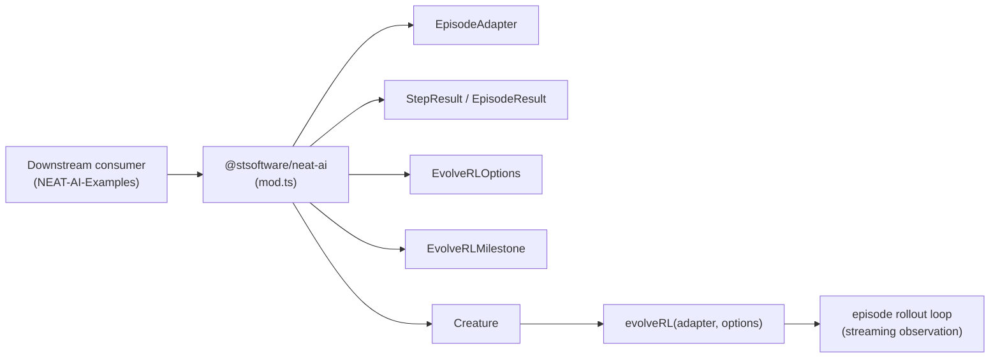

# Bump library major version + finalise evolveRL API docs / cross-references

## Summary

Final release-readiness change for milestone #2624: bump `@stsoftware/neat-ai`
to **5.0.0**, re-export the reinforcement-learning surface from `mod.ts`, and
complete the docs/cross-reference work so downstream consumers (notably
NEAT-AI-Examples) can discover `Creature.evolveRL` and `EpisodeAdapter` from the
canonical entry points. No runtime behaviour changes — this is purely an
additive public-API surface and documentation pass. Closes #2630.

## Changes

- **`deno.json`** — version bumped `4.1.4 → 5.0.0`. The change is additive;
  UUID-stability and semantic-version-stability invariants from `AGENTS.md` are
  unaffected.
- **`mod.ts`** — re-exports `EpisodeResult`, `TruncationReason`,
  `EvolveRLOptions`, and `EvolveRLMilestone` alongside the previously exported
  `EpisodeAdapter`, `StepResult`, `DEFAULT_MAX_STEPS`, and
  `DEFAULT_WALL_CLOCK_MS`. Downstream consumers no longer need to reach into
  `src/`.
- **`docs/REINFORCEMENT_LEARNING.md`** — adds a "Driving evolution with
  `evolveRL`" section with a 15-line `CountingAdapter` worked example and a
  cross-link to `event-driven-evolution.md` for the full contract.
- **`docs/API_REFERENCE.md`** — adds a `Creature.evolveRL()` subsection in §6
  (Evolution API) alongside `evolveDir`, documenting the `EvolveRLOptions`
  extension fields, the `EpisodeAdapter` contract, and the `StepResult` shape.
- **`docs/README.md`** — index entry for `REINFORCEMENT_LEARNING.md` updated to
  mention the `CountingAdapter` + `Creature.evolveRL` worked example.
- **`CHANGELOG.md`** — `## [5.0.0]` section listing the reinforcement-learning
  surface (evolveRL, EpisodeAdapter, default guards, 3-episodes-per-creature
  averaging, opt-in geometric milestone statistics, public re-exports), plus a
  `### Changed` entry recording the version bump.
- **NEAT-AI-Examples issues #236–#240** — titles and bodies updated from
  `Creature.evolveEnv()` → `Creature.evolveRL()`, with acceptance-criteria
  entries that name the `EpisodeAdapter` subclassing contract and the
  `EvolveRLOptions.episodesPerCreature` replacement for the legacy
  `trialsPerScore`.
- **`test/PublicExports_RL_test.ts`** — new test that compiles + runs the five
  re-exported symbols (`EpisodeAdapter`, `StepResult`, `EpisodeResult`,
  `EvolveRLOptions`, `EvolveRLMilestone`) through `mod.ts`, plus a runtime
  assertion that `Creature#evolveRL` is exposed.

## Evidence

CLI / docs change — no UI to screenshot. Evidence comes from:

- The new test (`test/PublicExports_RL_test.ts`) passes locally:

  ```text
  ok | 3 passed | 0 failed (10ms)
  ```

- `deno check mod.ts` is clean after the new re-exports.
- `./quality.sh --lint-only` is clean (format, lint, bash-check).



The `quality.sh` full-test run reproduces a pre-existing FFI library leak in
`test/ErrorGuidedStructuralEvolution/DiscoveryTimeout.ts`
(`A dynamic library was loaded during the test, but not unloaded`). That test is
unchanged by this PR and the leak reproduces on
`milestone/reinforcement-learning` without any of these edits applied — it is
not a regression introduced here.

## Test Plan

- [x] `test/PublicExports_RL_test.ts` — verifies all five re-exports load
      through `mod.ts` and that `Creature#evolveRL` exists at the public
      surface.
- [x] `deno check mod.ts` — type-check of the new re-exports.
- [x] `deno fmt` clean after the docs / changelog edits.
- [x] `deno lint` clean.
- [x] Existing `test/creature/EpisodeAdapter_test.ts`, `EpisodeRunner_test.ts`,
      `evolveRL_test.ts`, `evolveRL_parallel_test.ts`, and
      `EvolveRLStatistics_test.ts` continue to pass (no behaviour changes in
      `src/`).
