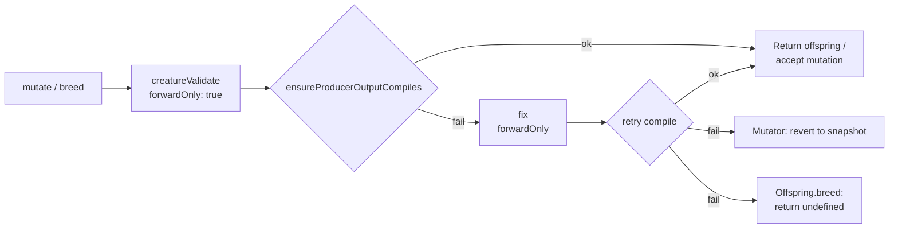

# PR summary — Issue #2636

## Summary

The GRQ-3 scorer log recorded two creatures with shape
`neurons=2156, inputs=2054, outputs=3` that trap inside `CompiledNetwork::new`
with `RuntimeError: unreachable`. The call-site recovery added in #2482 / #2483
keeps the worker alive, but the offending genome should never have left the
producer. This PR adds a **producer-side WASM compile gate** that runs
immediately after mutation and breeding, so a topology that would trap the WASM
constructor is either repaired in place or dropped at the producer rather than
contaminating training. Closes #2636.

## Approach

1. **New helper `src/wasm/ProducerCompileGuard.ts`** —
   `ensureProducerOutputCompiles(creature)` attempts a real WASM compile via the
   existing cache, surfaces the trap message recorded by
   `WasmCreatureActivation.create`, and on failure runs one repair pass
   (`creature.fix({ forwardOnly })`) before retrying. Any thrown error from the
   cache (e.g. malformed header) is observationally identical to the trap and is
   surfaced through the same boolean result.

2. **`Offspring.breed`** — after all existing repair / validation, calls the
   gate. On failure the offspring is dropped (`return undefined`), so existing
   breeding callers that already handle `undefined` work unchanged. A
   diagnostics file is written and a single line is logged per dropped
   offspring.

3. **`Mutator.repairAfterMutation`** — now returns `boolean`. When the post-fix
   creature fails the gate, `mutate()` reverts the creature to its pre-mutation
   snapshot (the same path MCMC rejection already uses) and counts the round as
   `changed = false`. Existing callers that ignore the return value retain their
   previous behaviour.

4. **Regression tests** (`test/wasm/ProducerCompileGuard.ts`) exercise:
   - A creature with the GRQ-3 shape (2054 inputs, 99 hidden, 3 outputs) emitted
     via `AddNeuron` compiles cleanly to WASM.
   - A creature whose header makes `num_inputs > num_neurons` (the same trap
     vector exercised by the #2483 diagnostic) is rejected by the gate.
   - `Offspring.breed` returns `undefined` on compile failure (and a healthy
     breed still passes).
   - `Mutator.repairAfterMutation` returns `true` for valid creatures and
     `false` when the post-repair creature fails the compile probe.

## Evidence

This is a backend/CLI change with no UI to screenshot. Tests verify the new gate
end-to-end:

```
deno test --no-check test/wasm/ProducerCompileGuard.ts
running 5 tests from ./test/wasm/ProducerCompileGuard.ts
Issue #2636: GRQ-3-shaped creature emitted by AddNeuron compiles to WASM ... ok
Issue #2636: ensureProducerOutputCompiles rejects a creature whose header makes num_inputs > num_neurons ... ok
Issue #2636: Offspring.breed returns undefined when the bred topology cannot be compiled ... ok
Issue #2636: Mutator.repairAfterMutation returns true for valid creatures ... ok
Issue #2636: Mutator.repairAfterMutation reverts when the post-repair creature fails WASM compile ... ok
ok | 5 passed | 0 failed
```

All existing mutator/breeding/lifecycle tests continue to pass (`test/NEAT/`,
`test/mutate/`, `test/breed/`, `test/lifecycle/`, `test/feedForward/`,
`test/architecture/Offspring*`).

### Producer → compile → drop flow (post-fix)



## Test Plan

- Added `test/wasm/ProducerCompileGuard.ts` (5 tests covering happy path, trap
  rejection, breed drop, and mutator revert).
- Ran the full WASM test suite, mutator/breed/feedForward/lifecycle suites — no
  regressions.
- `deno fmt`, `deno lint`, and `deno check` all clean on the touched files.

## Files touched

- `src/wasm/ProducerCompileGuard.ts` _(new)_
- `src/wasm/mod.ts` — export the new helper
- `src/architecture/Offspring.ts` — wire the gate at the breed return point;
  drop offspring on compile failure
- `src/NEAT/Mutator.ts` — `repairAfterMutation` returns `boolean`; `mutate()`
  reverts to snapshot when the gate fails
- `test/wasm/ProducerCompileGuard.ts` _(new)_ — regression tests
- `docs/pr-summary-2636.md` _(this file)_
