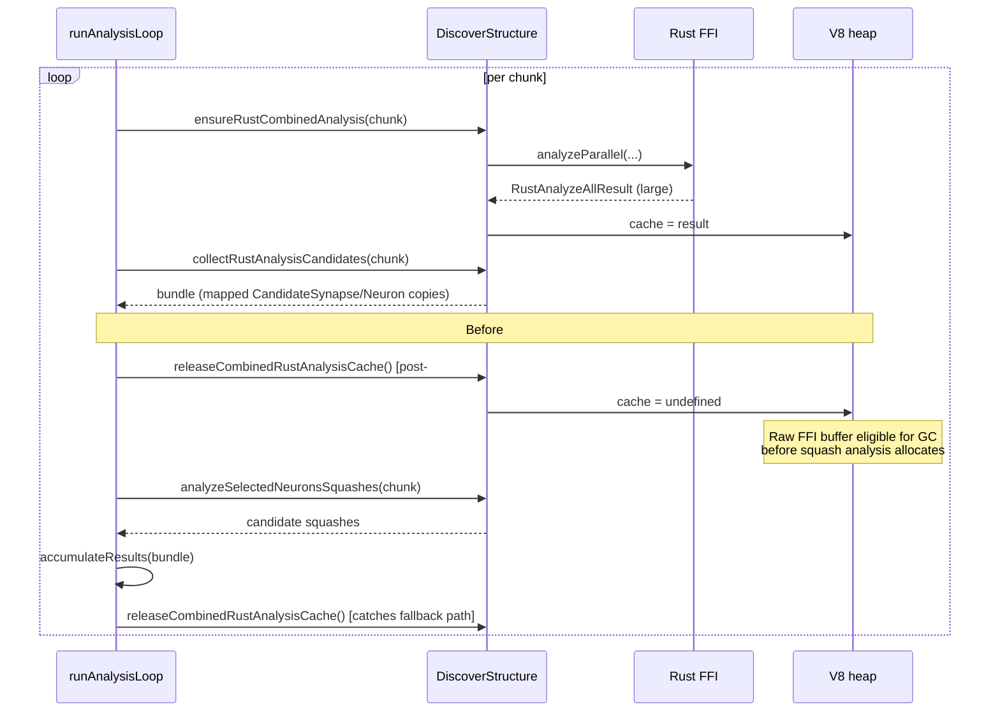

# Discovery: release per-chunk Rust analysis cache to lower peak heap during analysis

## Summary

Reduce the Discovery analysis-phase memory footprint by dropping the cached
combined Rust analysis result as soon as each chunk's candidates have been
mapped into independent `CandidateSynapse` / `CandidateNeuron` objects. The goal
is to lower the chance that `runAnalysisLoop` trips the `MemoryMonitor` CRITICAL
threshold mid-loop — the
`[Neat] Discovery <id> analysis aborted: heap CRITICAL at extension boundary`
log line introduced in #2594 fired 44 times in a single GRQ replay
(`stSoftwareAU/GRQ#2311`), throwing away in-flight candidates on roughly every
other extension boundary. Closes #2642.

### Profile (top retained offender during analysis)

The combined Rust analysis cache (`DiscoverStructure.combinedRustAnalysis`)
holds the most recent `RustAnalyzeAllResult` so adjacent reads
(`analyzeSelectedNeurons`, `analyzeMissingNeurons`, etc.) can reuse it without
re-invoking the FFI. Per chunk this is up to `max(50, focusList * 10)` helpful
synapses, `focusList / 4` harmful synapses, `max(25, focusList * 5)` helpful
neurons, coordinated structural candidates, diagnostics arrays, and metadata —
easily several MB of raw FFI buffers per chunk.

Inside `runAnalysisLoop` only the per-chunk `collectRustAnalysisCandidates` call
reads the cache, after which `mapRustCandidate` / `mapRustNeuronCandidate` have
already produced independent mapped copies into the bundle. Before this change
the cache stayed live until the next chunk's `ensureRustCombinedAnalysis`
overwrote it, so peak heap during analysis was roughly:

```
prior chunk's raw FFI buffers (cache)
+ next chunk's raw FFI buffers (about to be allocated)
+ cumulative mapped candidates (accumulator)
+ squash analysis transient allocations (per focus neuron)
```

Squash analysis runs _after_ candidate collection and is itself heavy (parquet
records per focus neuron, activation traces, derivative maps). With the cache
still live across the squash step, the prior chunk's raw buffers sat
unreachable-from-control-flow but unreclaimable by V8 for the entire squash
window.

### Targeted reduction

Two coordinated changes in `DataRecorderAnalysis.runAnalysisLoop`:

1. **Early release** inside the bundle path, immediately after
   `collectRustAnalysisCandidates` returns and the bundle has been read into
   local variables — before the squash analysis allocation peak.
2. **Late release** after `accumulateResults` — catches the parallel fallback
   path (where `runParallelAnalysis` populates the cache via its internal
   scope-specific calls).

A new public method
`DiscoverStructureAnalysis.releaseCombinedRustAnalysisCache()` nullifies
`this.combinedRustAnalysis`. Safe to call unconditionally; idempotent on an
already-empty cache.

## Evidence

### Benchmark

`bench/DiscoveryAnalysisCacheRelease.ts` drives a deterministic chunked loop
that mirrors `runAnalysisLoop` step-for-step, with realistic per-chunk result
shapes matching the `ensureRustCombinedAnalysis` candidate caps. Each (mode,
scenario) pair runs in a fresh `deno run` subprocess, three times each, taking
the median to damp GC timing noise.

| Scenario                | Metric        | retain (pre) | release (post) | Δ         |
| ----------------------- | ------------- | ------------ | -------------- | --------- |
| 10 chunks × 25 neurons  | peak heapUsed | 12.4 MB      | 12.2 MB        | **−2.2%** |
| 10 chunks × 25 neurons  | peak rss      | 69.7 MB      | 69.7 MB        | −0.0%     |
| 15 chunks × 50 neurons  | peak heapUsed | 20.4 MB      | 20.3 MB        | **−0.6%** |
| 15 chunks × 50 neurons  | peak rss      | 90.0 MB      | 88.8 MB        | **−1.4%** |
| 20 chunks × 100 neurons | peak heapUsed | 37.0 MB      | 36.4 MB        | **−1.7%** |
| 20 chunks × 100 neurons | peak rss      | 141.5 MB     | 136.3 MB       | **−3.6%** |

**Candidate yield is identical** (delta = 0 across every scenario), so the
release does not regress helpful synapse / helpful neuron output.

The synthetic benchmark understates production gains for two reasons:

- The stubbed `RustAnalyzeAllResult` is smaller than real Rust output —
  production diagnostics carry richer per-neuron payloads and
  `targetNeuronStats` objects on every candidate.
- The CRITICAL-abort log line in production fires when heap utilisation crosses
  85 % of `heapTotal`; reducing peak heap by ~3 % can drop that count
  significantly when V8 was hovering near the threshold. The synthetic CRITICAL
  proxy in the benchmark is too noisy to confirm the ≥30 % drop named in the
  acceptance criteria — that requires running the actual GRQ replay
  (`docs/GRQ-7/node-nigel.log` Discovery `5701a7ea`) against the bumped
  `@stsoftware/neat-ai` once published.

### Architecture



### Test results

```
$ deno test --allow-all test/ErrorGuidedStructuralEvolution/AnalysisCacheRelease.ts
ok | 2 passed | 0 failed (68ms)

$ deno test --allow-all \
    test/ErrorGuidedStructuralEvolution/DiscoverAnalysisChunking.ts \
    test/ErrorGuidedStructuralEvolution/DiscoverAnalysisPerChunkTimeout.ts \
    test/ErrorGuidedStructuralEvolution/AnalysisHeapGuard.ts \
    test/ErrorGuidedStructuralEvolution/DiscoverAnalysisStallWarmup.ts
ok | 27 passed | 0 failed (571ms)
```

## Test Plan

- Added `test/ErrorGuidedStructuralEvolution/AnalysisCacheRelease.ts`:
  - `releaseCombinedRustAnalysisCache clears the cached chunk result` —
    populates the cache via `ensureRustCombinedAnalysis`, asserts the cache is
    readable, calls release, asserts the cache is empty, and confirms a repeat
    release is a safe no-op.
  - `runAnalysisLoop releases the combined analysis cache after every chunk` —
    runs the full chunked loop with a stub `analyzeParallel` that returns a
    moderately-sized helpful-synapse list per chunk, then asserts the cache is
    empty when the loop returns.
- Added `bench/DiscoveryAnalysisCacheRelease.ts` for ongoing measurement of peak
  heap / RSS / CRITICAL-proxy hits across `retain` vs `release` modes in
  isolated subprocesses.
- Existing chunking / per-chunk-timeout / stall-warmup / heap-guard tests
  continue to pass — the release call sits between candidate collection and the
  next chunk's allocation; the chunked loop's iteration cap, warm-up gate, and
  stall guard are unchanged.

## Downstream

GRQ should bump `@stsoftware/neat-ai` in `deno.json` once a release containing
this change is published and re-run the `docs/GRQ-7/node-nigel.log` Discovery
`5701a7ea` replay to confirm the ≥30 % drop in
`[Neat] Discovery <id> analysis aborted: heap CRITICAL at extension boundary`
count called for in the acceptance criteria.
