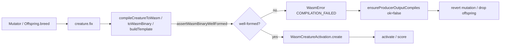

# Issue #2643 — Producer-side rejection of malformed WASM creature blobs

## Summary

Fixes #2643. GRQ-7 logs (NEAT-AI 5.0.1) recorded 1056 strikes of
`Data too short for neuron` during evolve at the constant shape
`inputs=2054, outputs=3` with varying neuron counts (2106, 2122, 2141, 2155,
2194, 2214, 2234, 2273, …). The downstream call-site recovery (#2483)
dropped the offspring, but the producer had already spent compute on a
genome the WASM constructor cannot decode.

The fix adds a producer-side byte-walk that mirrors the NEAT-AI-core decoder
in `neat-core/src/network.rs::CompiledNetwork::new`. Any blob that would
trip `Data too short for header`, `Data too short for neuron`,
`Data too short for synapse`, or the unsigned `num_non_inputs` underflow
(`num_inputs > num_neurons`) is rejected at serialise time before WASM ever
sees it. The existing producer compile gate (#2636) catches the throw and
reverts the offending mutation / drops the offspring.

Three serialiser entry points now run the check:

- `compileCreatureToWasm` (`src/wasm/CompileToWasm.ts`) — object-based path.
- `TypedTopology.toWasmBinary` (`src/architecture/TypedTopology.ts`) — typed-array path.
- `WasmCompilationCacheImpl.buildTemplate` (`src/wasm/WasmCompilationCache.ts`) — cache template path.

A header-drift fast-path also rejects `num_inputs > num_neurons` up-front so
the producer surfaces a typed `WasmError` instead of a `RangeError` from a
negative `ArrayBuffer` size.

## Evidence

This is a backend / library change — no UI. Acceptance criteria are covered
by `test/wasm/WasmBinaryValidator.ts`:

1. **Strike-shape regression** — builds a creature matching the canonical
   GRQ-7 strike shape (`neurons=2106, inputs=2054, outputs=3`) via the real
   producer path (`AddNeuron.mutate()`), then asserts the blob round-trips
   through `compileCreatureToWasm` → `WasmCreatureActivation.create` AND
   through the producer compile gate (`ensureProducerOutputCompiles`).
2. **Header-drift rejection** — corrupts `creature.input` so it exceeds
   `creature.neurons.length` and asserts `compileCreatureToWasm` throws a
   typed `WasmError(COMPILATION_FAILED)` *before* the bytes reach WASM.
3. **Byte-level validator unit tests** — direct probes against every Rust
   decoder failure mode: short header, `num_inputs > num_neurons`, short
   body, over-declared `num_synapses`, and trailing bytes. Plus a control
   that an out-of-range `from_index` is *not* pre-empted, so the existing
   `ACTIVATION_FAILED` recovery (#2146 / #2484) keeps working.

Producer / consumer flow after the fix:



Targeted test run:

```text
running 10 tests from ./test/wasm/WasmBinaryValidator.ts
... 10 passed | 0 failed (374ms)

running 6 tests from ./test/wasm/WasmCompileFailureRecovery.ts
running 2 tests from ./test/wasm/WasmInstantiationFailure.ts
running 3 tests from ./test/wasm/WasmCreatureActivationTrapGuard.ts
21 passed | 0 failed (417ms)

deno test test/wasm/*.ts → 504 passed | 0 failed | 1 ignored (6s)
```

Full suite: `6662 passed | 2 failed | 4 ignored` — the two failures are
pre-existing `DiscoveryTimeout` dynamic-library-leak tests, unrelated to
this change (verified by re-running them against `origin/Develop` before
applying the diff).

## Test Plan

- New `test/wasm/WasmBinaryValidator.ts` (10 tests):
  - GRQ-7 strike-shape round-trip through `compileCreatureToWasm`.
  - GRQ-7 strike-shape round-trip through `ensureProducerOutputCompiles`.
  - Header-drift rejection by `compileCreatureToWasm`.
  - 7 byte-level validator probes covering every decoder failure mode.
- Existing recovery tests still pass unchanged
  (`WasmCompileFailureRecovery.ts`, `WasmInstantiationFailure.ts`,
  `WasmCreatureActivationTrapGuard.ts`, `ProducerCompileGuard.ts`).
