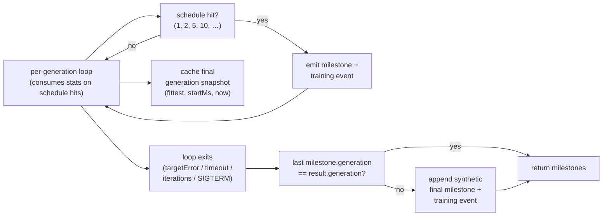

## Summary

`Creature.evolveRL()` (with `statistics: true`) now appends a synthetic
final-generation milestone whenever a run terminates between two scheduled
milestones (e.g. `targetError` met at generation 47, or `iterations = 7`). The
synthetic milestone carries the same payload shape as the scheduled ones — no
new fields — so callers, charts, and resume helpers can rely on
`result.milestones[result.milestones.length - 1].generation === result.generation`.
Closes #2647.

## Evidence

Backend-only change with no UI. Verified by two new unit tests under
`test/creature/EvolveRLStatistics_test.ts`:

- `iterations = 7` → milestones at generations `[1, 2, 5, 7]` (synthetic final
  milestone appended).
- `iterations = 10` → milestones at `[1, 2, 5, 10]` (terminal generation already
  on the schedule — no duplicate appended).

## Test Plan

- `test/creature/EvolveRLStatistics_test.ts` — added:
  - `EvolveRLStatistics: on — synthetic final milestone when termination
    falls between schedule entries`
    — drives `iterations = 7`, asserts the milestone sequence is `[1, 2, 5, 7]`,
    the final milestone's `generation` equals `result.generation`, and the
    payload shape is intact (`bestNeurons ≥ 2`, finite `bestScore`,
    `meanEpisodeSteps = 1`, finite non-negative `generationWallClockMs`). Also
    asserts the synthetic milestone is emitted as an `evolverl_milestone`
    training event with values matching the returned array entry.
  - `EvolveRLStatistics: on — no duplicate milestone when termination
    lands on a schedule entry`
    — drives `iterations = 10`, asserts the schedule entries `[1, 2, 5, 10]` are
    emitted exactly once and no duplicate synthetic milestone is appended.
- Existing tests under `test/creature/EvolveRLStatistics_test.ts`,
  `test/creature/evolveRL_test.ts`, and
  `test/creature/evolveRL_parallel_test.ts` continue to pass (22 passed, 0
  failed in the evolveRL suites).
