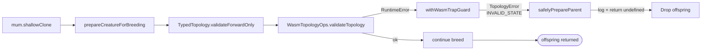

# PR Summary — Issue #2648

## Summary

Stop a long `Creature.evolveRL()` run from aborting when an evolved creature
trips a WASM topology-validator trap
(`RuntimeError: memory
access out of bounds` inside `validate_topology`). Closes
#2648.

Two-layer fix:

1. **`src/wasm/WasmTopologyOps.ts`** — wrap every WASM topology call in a new
   `withWasmTrapGuard(opName, run)` helper that catches any non-typed throw (the
   WASM `RuntimeError`, plus the occasional `unreachable` trap) and re-throws it
   as a typed `TopologyError` with `reason: "INVALID_STATE"`. Existing
   `TopologyError` throws from the production code path pass through unchanged.
2. **`src/architecture/Offspring.ts`** — wrap the
   `prepareCreatureForBreeding(parent.shallowClone())` calls in a new
   `safelyPrepareParent` helper. If the parent's topology is too broken to
   validate (typed `TopologyError` or `ValidationError`), the offspring is
   dropped (`return undefined`) with a warning that mirrors the existing
   producer-side compile-guard pattern. Other errors still propagate.

Together these mean a malformed parent surfaces as a dropped offspring (plus a
`[Offspring] dropping offspring with corrupt mother` / `father` warn line)
instead of an uncaught error terminating `evolveRL()`.

## Evidence

This is a backend/CLI fix — no UI to screenshot. Behaviour is covered by unit
tests below.

### Recovery flow



Previously the path went straight from `validate_topology` to the uncaught WASM
trap that terminated the evolution loop.

### Test results

- `test/wasm/WasmTopologyOpsTrapGuard.ts` — 5 tests, all pass.
- `test/breed/OffspringDropsCorruptParent.ts` — 2 tests, all pass.
- `test/wasm/WasmTopologyOps.ts` — pre-existing 14 tests, all pass.
- `test/breed/OffspringBreed.ts` — pre-existing 5 tests, all pass.

```text
ok | 14 passed | 0 failed (6ms)   # WasmTopologyOps.ts
ok | 5 passed | 0 failed (74ms)   # OffspringBreed.ts
ok | 5 passed | 0 failed (1ms)    # WasmTopologyOpsTrapGuard.ts
ok | 2 passed | 0 failed (7ms)    # OffspringDropsCorruptParent.ts
```

Full `./quality.sh --skip-discovery --skip-wasm` reports
`6670 passed | 2 failed | 4 ignored`. The two remaining failures are
pre-existing flakes in `test/ErrorGuidedStructuralEvolution/DiscoveryTimeout.ts`
(FFI dynamic-library leak detection between parallel tests) and are unrelated to
this change — these tests do not exercise topology validation or breeding.

## Test Plan

New tests:

- `test/wasm/WasmTopologyOpsTrapGuard.ts`
  - `returns inner result on success`
  - `wraps RuntimeError as TopologyError` — the regression case that mirrors the
    issue's stack trace.
  - `includes op name in wrapped error`
  - `re-throws TopologyError untouched`
  - `wraps non-Error throwables`
- `test/breed/OffspringDropsCorruptParent.ts`
  - `Offspring.breed drops offspring when mother fails forward-only validation`
  - `Offspring.breed drops offspring when father fails forward-only validation`

Both files exercise real code paths — `withWasmTrapGuard` is called directly,
and the breed-drop tests build a forward-only creature, inject a backward
synapse to corrupt it post-construction, then run `Offspring.breed` and assert
it returns `undefined` without throwing.
