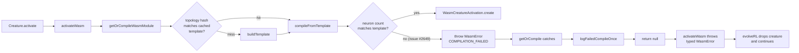

# WASM compilation cache: turn TypeError into typed failed compile

## Summary

`Creature.evolveRL()` could crash with an unhandled `TypeError: Cannot read
properties of undefined (reading 'bias')` when a malformed offspring reached
`WasmCompilationCacheImpl.compileFromTemplate`. The cache assumed the creature
still had at least `template.neurons.length` non-input neurons and read
`creature.neurons[neuronIdx].bias` without checking. After structural
mutation/breeding produced a truncated topology (or a stale cached
`topologyHash` resolved to the wrong template), the lookup returned
`undefined` and the resulting `TypeError` propagated up through
`activateWasm` → `runEpisode` → `evolveRL`, terminating the whole RL run.

The fix validates the creature's neuron count against the template, surfaces
the mismatch as a typed `WasmError("COMPILATION_FAILED")`, and has
`getOrCompile` catch any `WasmError` thrown during template build or fill, log
one deduplicated `WASM compile failed ...` line via `logFailedCompileOnce`,
and return `null` — the same "drop the creature or repair its topology"
contract that Issue #2483 established for runtime traps. evolveRL now treats
the bad offspring as a failed compile and keeps going.

Closes #2649.

## Evidence

Backend-only change — no UI. Verified via TDD:

1. Added `Issue #2649: stale topology hash with missing neuron returns null
   instead of throwing TypeError` in `test/wasm/WasmCompilationCache.ts`. It
   compiles a valid creature, truncates `creature.neurons` while keeping the
   stale `topologyHash` so the cache hit resolves to the original template,
   then asserts `getOrCompileWasmModule` returns `null` without throwing.
   Pre-fix: fails with the exact stack from the issue. Post-fix: passes.
2. Added `Issue #2649: short neuron array on first compile is rejected
   without crashing` covering the cache-miss path (template build over a
   truncated creature).
3. The pre-existing `Issue #2483` recovery suite
   (`test/wasm/WasmCompileFailureRecovery.ts`) still passes, confirming the
   runtime-trap recovery path is unchanged.

### Failed-compile flow (Issue #2649)

## Test Plan

- `deno test --allow-all test/wasm/WasmCompilationCache.ts
  test/wasm/WasmCompileFailureRecovery.ts` — 20 / 20 pass.
- `./quality.sh --skip-discovery` — 6667 unit tests pass. The two failures
  in `test/ErrorGuidedStructuralEvolution/DiscoveryTimeout.ts` are a
  pre-existing FFI dynamic-library leak that reproduces on `Develop` with
  this branch stashed; unrelated to this change.
