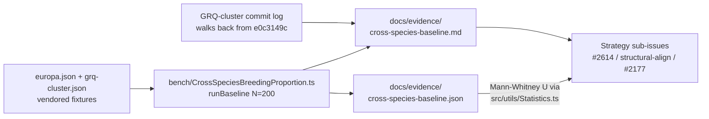

# Cross-species breeding baseline — Issue #2654

## Summary

Establish the shared baseline for the cross-species breeding improvement track
(Issue #2653) so each downstream strategy sub-issue can report a strict
before/after run against the same harness. Closes #2654.

This PR adds:

1. **Shared statistics helper** —
   [`src/utils/Statistics.ts`](../src/utils/Statistics.ts) with `describe()` and
   a two-sample Mann–Whitney U test (normal approximation, tie correction,
   continuity correction). Twelve unit tests covering the happy path and
   degenerate inputs (empty / single-element / constant samples — never `NaN`).
2. **Reproducible benchmark harness** —
   [`bench/CrossSpeciesBreedingProportion.ts`](../bench/CrossSpeciesBreedingProportion.ts)
   loads a low-compatibility parent pair from vendored fixtures, runs
   `Offspring.breed()` (which exercises `createCompatibleFather`) N=200 times,
   and emits a stable JSON summary with per-run shared-neuron proportions vs.
   each parent plus `min(both)`. Exports `runBaseline()` and
   `sharedNeuronProportion()` so the strategy sub-issues can reuse the harness
   for their own before/after runs.
3. **Vendored fixtures** —
   [`test/fixtures/cross-species/europa.json`](../test/fixtures/cross-species/europa.json)
   and
   [`test/fixtures/cross-species/grq-cluster.json`](../test/fixtures/cross-species/grq-cluster.json)
   (≈ 6.5 KB each) with identical `input=4, output=2` shape and fully disjoint
   hidden-neuron UUIDs, so `geneticCompatibility = 0`.
4. **Evidence doc** —
   [`docs/evidence/cross-species-baseline.md`](evidence/cross-species-baseline.md)
   with (a) the GRQ-cluster commit-log trend table walking back from `e0c3149c`,
   (b) the freshly-measured baseline numbers from the new bench, and (c) the
   statistical protocol downstream strategies must follow (Mann–Whitney U, N =
   200, α = 0.05).
5. **Baseline numbers checked in** —
   [`docs/evidence/cross-species-baseline.json`](evidence/cross-species-baseline.json)
   so downstream strategy PRs can `git diff` their distribution against today's
   `main`.

## Evidence

### Baseline numbers (N = 200, today's `main`)

| Axis           | n   | mean   | stddev | min    | max    |
| -------------- | --- | ------ | ------ | ------ | ------ |
| **vs. mother** | 200 | 0.5000 | 0.0000 | 0.5000 | 0.5000 |
| **vs. father** | 200 | 0.5000 | 0.0000 | 0.5000 | 0.5000 |
| **min(both)**  | 200 | 0.5000 | 0.0000 | 0.5000 | 0.5000 |

Standard NEAT crossover on zero-compatibility parents allocates exactly half of
each offspring's hidden neurons to each parent's UUIDs — a knife-edge
distribution with zero variance. That is the bar each downstream strategy must
beat.

### GRQ-cluster commit-log trend (window: 2026-04-30 → 2026-05-14)

Mean shared-neuron proportion across 20 recent commits is **1.71%** (stddev
1.20%), median **2.39%**. Two clusters visible — 0–0.9% vs. 2.3–3.2% — with **no
monotonic trend in either direction**. Detailed table in
[`docs/evidence/cross-species-baseline.md`](evidence/cross-species-baseline.md).

### Architecture

## Test Plan

- New unit tests in [`test/utils/Statistics.ts`](../test/utils/Statistics.ts)
  (13 tests, all passing): happy path, single-element sample → stddev = 0, empty
  / non-finite rejection, Mann–Whitney with clearly separated, identical, tied,
  constant, and empty samples, plus a moderate effect-size sanity check against
  a known reference.
- Bench smoke-run at `N = 10` and full `N = 200` both produce stable JSON.
- `./quality.sh --skip-tests --skip-discovery --skip-wasm` passes (formatting +
  lint + bash + type-check). Targeted run of `test/breed/Father.ts`,
  `test/breed/GeneticCompatibility.ts`, and the new `test/utils/Statistics.ts` —
  **34 passed, 0 failed**.

## Acceptance criteria — status

- [x] `bench/CrossSpeciesBreedingProportion.ts` exists, runs to completion
      within the standard bench time budget, emits stable JSON output.
- [x] Vendored fixtures (`test/fixtures/cross-species/europa.json`,
      `test/fixtures/cross-species/grq-cluster.json`) exist so the benchmark is
      reproducible without network access.
- [x] `docs/evidence/cross-species-baseline.md` contains both the historical
      commit-log trend table and the freshly-measured baseline numbers.
- [x] Statistical protocol (Mann–Whitney U, N = 200, α = 0.05) documented in the
      bench file header and in the evidence doc.
- [x] Unit tests cover the new statistics helper — happy path plus degenerate
      inputs (empty / single-element / non-finite / ties / constant samples).
- [x] Quality gate (`./quality.sh`) — formatting, lint, bash, type-check, and
      the affected test files all pass.
