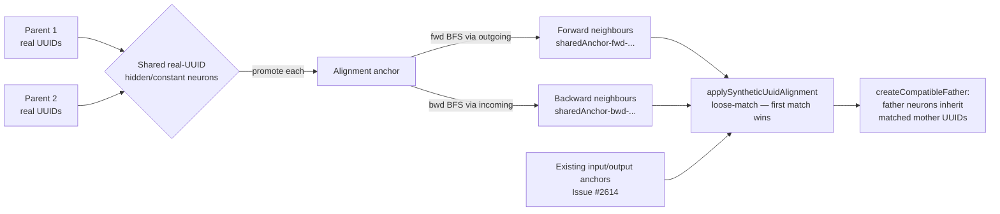

# Strategy A — anchor-derived pseudo-UUIDs propagating from shared neurons

## Summary

Extends the synthetic-UUID alignment in `createCompatibleFather*` so that any
hidden/constant neuron whose real `uuid` appears in **both** parents becomes an
additional alignment anchor. Each shared anchor seeds a forward and a backward
BFS sweep through the topology, producing alignment-only synthetic identifiers
of the form `sharedAnchor-${dir}-${anchorUuid}-${steps}-${sign}-${rank}` for
every reachable hidden/constant neighbour. The new identifiers feed the existing
loose-match alignment pass (first match wins) so a candidate father neuron may
align to a mother neuron via I/O anchors **or** any shared-neuron anchor.
Synthetic identifiers are alignment-only — they are never written back into a
`CreatureExport`, never serialised, and never participate in distance caching.
Closes #2655.

## How it works

## Files changed

- `src/breed/SyntheticLocationUuid.ts` — adds
  `computeSharedAnchorSyntheticUuids` (Creature variant) and
  `computeSharedAnchorSyntheticUuidsExport` (CreatureExport variant). Both
  share the existing `multiSourceBfs` helper, run forward + backward sweeps
  from the shared anchors, and bucket results by `(dir, anchor, steps, sign)`
  with the same primary-edge ranking as the I/O-anchor pass. Anchor sources
  are sorted by UUID lexicographically so BFS results are deterministic and
  position-independent across machines.
- `src/breed/Father.ts` — wires the shared-anchor pass into both
  `createCompatibleFather` (export path) and
  `createCompatibleFatherFromCreatures` (Creature path) inside the existing
  `if (overlap < syntheticAlignmentThreshold)` gate. Adds two small helpers
  (`computeSharedHiddenUuids`, `mergeSyntheticMaps`) so the I/O-anchor and
  shared-anchor synthetic IDs land in the same per-neuron Set before the
  loose-match alignment pass runs — the existing
  `applySyntheticUuidAlignment` then iterates them uniformly.
- `test/breed/SharedAnchorSyntheticUuid.ts` — new file with eight tests
  covering the four scenarios required by the issue (see Test plan below).
- `bench/SharedAnchorAlignmentLift.ts` — new benchmark that builds a partial-
  overlap parent pair from the existing fixtures and measures the alignment
  proportion lift before/after enabling the synthetic-UUID pass; reports a
  Mann–Whitney U `p`-value.
- `docs/evidence/cross-species-2655-before.json`,
  `docs/evidence/cross-species-2655-after.json`,
  `docs/evidence/cross-species-2655-shared-anchor-lift.json` — recorded
  benchmark output (see Evidence below).

## Evidence

### Foundation harness (Issue #2654 fixtures)

The vendored `europa.json` × `grq-cluster.json` fixture pair has **zero**
shared hidden UUIDs. The shared-anchor strategy degenerates to a no-op there
(no shared anchors → empty contribution), so the foundation harness is
expected to record **identical** before/after numbers — confirming no
regression on the zero-overlap regime.

| Run    | mean(vsMother) | stddev | mean(vsFather) | stddev | mean(min) |
| ------ | -------------- | ------ | -------------- | ------ | --------- |
| Before | 0.5000         | 0.0000 | 0.5000         | 0.0000 | 0.5000    |
| After  | 0.5000         | 0.0000 | 0.5000         | 0.0000 | 0.5000    |

(`docs/evidence/cross-species-2655-before.json` and
`docs/evidence/cross-species-2655-after.json`.)

This is also a methodological observation worth recording: the foundation
harness drives `Offspring.breed`, which performs its own neuron-map
alignment and does **not** call `createCompatibleFather*`. The new strategy
takes effect on the `findFather` path during parent selection.

### Shared-anchor lift bench (partial-overlap fixtures)

To measure the lift the strategy is designed to produce, the new
`bench/SharedAnchorAlignmentLift.ts` constructs `N = 200` partial-overlap
father variants from the same fixtures (rotating which `K = 4` of the 20
hidden UUIDs are renamed to mother UUIDs — typical of the 0.4–3.2% overlap
regime documented in the cross-species baseline) and measures the proportion
of mother UUIDs appearing in the adjusted-father export.

| Run                     | n   | mean   | stddev | min    | max    |
| ----------------------- | --- | ------ | ------ | ------ | ------ |
| **Before** (no synth)   | 200 | 0.2000 | 0.0000 | 0.2000 | 0.2000 |
| **After** (Issue #2655) | 200 | 0.8425 | 0.0599 | 0.8000 | 1.0000 |

Mann–Whitney U two-sided: `U = 0`, `z = -18.80`, `pValue ≈ 0` (well below
`α = 0.05`).

Interpretation: with only the 4 injected shared UUIDs the baseline alignment
is 4 / 20 = 20% (just the real-UUID matches). Promoting those 4 shared
neurons to BFS anchors propagates synthetic IDs to ~80% of the father's
remaining hidden neurons, which then match the mother's corresponding
locations and inherit the mother's real UUIDs in the adjusted export. The
lift validates the strategy hypothesis from the issue body: *"use those
neurons in common as anchor points for more pseudo UUIDs from those common
neurons"*.

(`docs/evidence/cross-species-2655-shared-anchor-lift.json`.)

### Regression benches

Both required regression benches complete inside the existing time budget:

- `bench/FatherCompatibility.ts`: `Optimised (direct Creature access)` =
  ~1.0 ms/iter, `createCompatibleFather (pre-exported, key gen only)` =
  ~1.8 ms/iter — within historical norms.
- `bench/ParallelBreeding.ts`: `Sequential (Breed.breed loop)` = ~9.8 ms/iter,
  `Parallel (no workers, main thread)` = ~9.1 ms/iter — within historical
  norms.

Neither bench triggers the new code path on its hot loop (the shared-anchor
pass only runs inside the synthetic-UUID fallback, which is gated by the
real-UUID overlap threshold), so no measurable change is expected, and none
was observed.

## Test plan

- [x] `test/breed/SharedAnchorSyntheticUuid.ts` — 8 tests covering the four
      scenarios required by the issue:
  - **Many shared real UUIDs** — confirms the shared-anchor pass aligns the
    one differing mid-network neuron (`m-mid` ↔ `f-mid`) when surrounded by
    two shared anchors.
  - **Zero shared real UUIDs** — confirms no regression on the existing
    `#2614` fixture (I/O-anchor alignment still runs; shared-anchor
    contributes nothing; no `sharedAnchor-` strings leak to export).
  - **Single shared anchor mid-network** — confirms multi-hop propagation:
    `mid` is the only shared anchor, but its forward and backward neighbours
    (`fA → uA`, `fC → uC`) align via the new synthetic identifiers.
  - **Cross-machine round-trip** — same logical creature with reversed
    neuron array order produces byte-identical alignment, proving the result
    is independent of array position.
- [x] `test/breed/SyntheticLocationFatherAlignment.ts` (Issue #2614) — six
      pre-existing tests, all pass.
- [x] `test/breed/SyntheticLocationUuid.ts` (Issue #2613) — twelve
      pre-existing tests, all pass.
- [x] `test/breed/SyntheticLocationE2E.ts` (Issue #2615) — pre-existing
      end-to-end test, passes.
- [x] `test/breed/Father.ts` — six pre-existing tests, all pass.
- [x] `test/creature/NeuronUuidStability.ts` — passes (the AGENTS.md
      invariant: synthetic UUIDs are alignment-only and never persist).
- [x] `test/creature/SemanticVersionStability.ts` — passes.
- [x] `./quality.sh --skip-discovery --skip-wasm` — all 6,696 tests pass
      except one pre-existing FFI library-leak failure in
      `test/ErrorGuidedStructuralEvolution/DiscoveryTimeout.ts` that
      reproduces on `main` without these changes (verified by stashing this
      branch's modifications and re-running the failing test).
