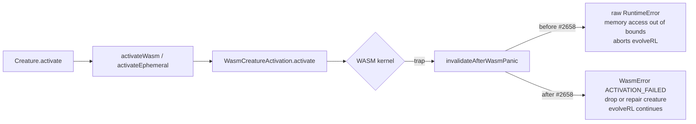

# PR Summary — Issue #2658

## Summary

Closes #2658.

Long `Creature.evolveRL()` runs could still abort with a raw
`RuntimeError: memory access out of bounds` after #2650 because the **topology**
trap guard landed in `WasmTopologyOps.ts` did not cover the **activation** entry
point. Calls into `WasmCreatureActivation.activate`, `activate_view`,
`activate_into`, `activate_and_trace`, and the batch loss kernels sit behind
`invalidateAfterWasmPanic`, which previously re-threw the raw WASM trap
verbatim. That trap then propagated out of
`creature.activate(observation, true)` inside the lunar-lander overnight
driver's episode rollout, killing the whole `evolveRL` attempt instead of the
single offending creature.

This PR pushes the same trap-guard pattern down into `invalidateAfterWasmPanic`:
a non-`WasmError` throwable is now converted into a typed
`WasmError("ACTIVATION_FAILED")` with the original trap attached via
`Error.cause`. Pre-existing `WasmError`s (the `freed` check, input/output length
checks) still propagate untouched, so the existing recovery paths in
`activateWasm` / `activateAndTraceWasm` (Issue #2146) keep their fine-grained
messages. The wrapper means `activateEphemeral` and any other caller that talks
to `WasmCreatureActivation` directly is now also protected — defence in depth at
the WASM boundary.

The `WasmError` constructor was widened to accept the standard `ErrorOptions`
(specifically `cause`) so diagnostics can still inspect the underlying
`RuntimeError`.

## Evidence

Backend / library change — no UI to screenshot. Verified by:

- 8 new TDD tests in `test/wasm/WasmActivationTrapGuardIssue2658.ts` exercising
  the trap surface for each public `WasmCreatureActivation` entry point plus the
  `activateEphemeral` wrapper. Pre-fix, all 7 trap cases failed with
  `Expected error to be instance of "WasmError", but
  was "RuntimeError"`;
  post-fix, all 8 pass.
- 528 tests across `test/wasm/` and 391 tests across `test/breed/` +
  `test/errors/` continue to pass with the change in place, confirming no
  regression to existing `WasmError` surfaces (`freed`, input-length,
  output-length, MODULE_NOT_LOADED).
- `./quality.sh --lint-only` and `./quality.sh --check-only` both pass.

Trap-flow before / after:

## Test Plan

- Added `test/wasm/WasmActivationTrapGuardIssue2658.ts` with the following
  tests, each driving a real WASM trap via a creature whose synapses point at a
  non-existent `from` neuron index:
  - `activate() surfaces WASM trap as typed WasmError`
  - `activateView() surfaces WASM trap as typed WasmError`
  - `activateInto() surfaces WASM trap as typed WasmError`
  - `activateWithState() surfaces WASM trap as typed WasmError`
  - `activateAndTrace() surfaces WASM trap as typed WasmError`
  - `wrapped WasmError preserves the original trap via Error.cause`
  - `input-length WasmError still propagates with original reason` (regression
    guard: pre-flight `WasmError`s must not be re-wrapped)
  - `activateEphemeral surfaces WASM trap as typed WasmError` (covers the
    higher-level wrapper that previously bypassed the `activateWasm` try/catch)
- Existing `test/wasm/WasmActivationErrors.ts`,
  `test/wasm/EphemeralActivation.ts`, and
  `test/wasm/WasmCompileFailureRecovery.ts` continue to pass — `freed` /
  length-mismatch `WasmError`s are preserved.
