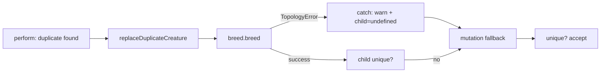

# Issue #2664 — DeDuplicator: tolerate TopologyError from Breed.breed

## Summary

`DeDuplicator.replaceDuplicateCreature` calls `Breed.breed()`, which can throw a
`TopologyError` (or `ValidationError`) when the bred offspring fails
`creatureValidate` — for example with `duplicate neuron id: ...`. Previously
that error escaped the dedup pass and aborted the whole `evolve()` run.

The fix wraps the `this.breed.breed()` call in a `try/catch` that swallows
`TopologyError` and `ValidationError`, logs a warning, and treats the failed
breed attempt as if `breed()` had returned `undefined`. Control then falls
through to the existing mutation fallback inside the same retry iteration, so
the population is preserved instead of the exception propagating to the caller.

Closes #2664.

## Evidence

CLI/backend change — no UI to screenshot. Verified by a new unit test that
constructs a `Breed` subclass whose `breed()` always throws a `TopologyError`
mirroring the production stack
(`[Offspring] Forward-only offspring failed creatureValidate after breed:
564544998) duplicate neuron id: 564544998`).

Before the fix, `DeDuplicator.perform()` re-throws that error. After the fix,
`perform()` completes, every creature has a UUID, and the population size is
preserved.

## Test Plan

- Added `test/NEAT/DeDuplicatorBreedTopologyError.ts`:
  - `DeDuplicator recovers when Breed.breed throws TopologyError (Issue #2664)`
    — fails on Develop, passes with this PR. Asserts `perform()` does not throw,
    the test-double breed is invoked, the population is preserved at 10, and
    every creature has a UUID.
- All 35 existing DeDuplicator tests continue to pass
  (`test/NEAT/DeDuplicate*.ts`, `test/NEAT/SinglePassDeDuplication.ts`,
  `test/NEAT/EarlyDeDuplication.ts`, `test/NEAT/BloomFilterDeDuplication.ts`,
  `test/architecture/DeDuplicator.ts`).
- `deno fmt`, `deno lint`, and `deno check` pass on the changed files.
