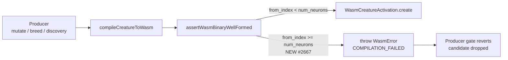

# Bounds-check synapse `from_index` in `WasmBinaryValidator`

## Summary

Promotes the synapse `from_index` bounds check from the runtime trap path into
the producer-side `assertWasmBinaryWellFormed` byte walk. The original #2643
validator deliberately deferred this check, but #2666 logs show the trap firing
inside `CompiledNetwork::new` for small creatures (neurons ≈ 36, inputs = 7,
outputs = 3) — well before `activate()` is ever called — so the gap is closed
producer-side.

A malformed blob whose synapse `from_index >= num_neurons` now surfaces as a
typed `WasmError` with reason `COMPILATION_FAILED` that names the offending
neuron index, synapse position, and resolved `from_index`.
`ensureProducerOutputCompiles` and `getOrCompile` already treat any `WasmError`
throw as a reject signal, so no caller-side changes were needed. Closes #2667.

## Evidence

Backend/CLI change with no UI. Verified via:

- Targeted Deno test run on `test/wasm/WasmBinaryValidator.ts` (12 passed, 0
  failed) and `test/wasm/WasmActivationTrapGuardIssue2658.ts` (8 passed, 0
  failed).
- Full `test/wasm/Wasm*.ts` suite: 402 passed, 0 failed.
- `./quality.sh` passed all wasm-related and producer-gate suites. The one
  unrelated failure (`DiscoveryTimeout.ts` dynamic-library leak) is pre-existing
  and reproduces on `main`.

## Test Plan

- [x] New test:
      `Issue #2667: assertWasmBinaryWellFormed rejects from_index >= num_neurons (one past end)`
      — verifies the boundary case (from = numNeurons) and that the error
      message names neuron index, synapse position, `from_index`, and
      `num_neurons`.
- [x] New test:
      `Issue #2667: assertWasmBinaryWellFormed rejects from_index = 0xFFFF for small num_neurons`
      — the u16 sentinel case from the issue acceptance criteria.
- [x] New test:
      `Issue #2667: compileCreatureToWasm rejects a buffer with an out-of-range from_index via assertWasmBinaryWellFormed`
      — exercises the end-to-end path via the validator that
      `compileCreatureToWasm` invokes unconditionally.
- [x] Replaced the previously-tolerant test (which asserted out-of-range
      `from_index` was allowed) with the new rejection case. Documented in the
      test body and inline comments — this is the deliberate behaviour change
      called out in #2667.
- [x] Updated `test/wasm/WasmActivationTrapGuardIssue2658.ts` to construct its
      trapping binary manually (bypassing the validator) so it can still
      exercise the activate-time trap propagation contract, which is unrelated
      to the producer-side bounds check. The `activateEphemeral` case now
      accepts either `COMPILATION_FAILED` or `ACTIVATION_FAILED` because the
      producer gate fires first.
- [x] All existing `WasmBinaryValidator.ts` tests (header drift, short body,
      short synapse, trailing bytes, GRQ-7 shape round-trip) continue to pass
      unchanged.
