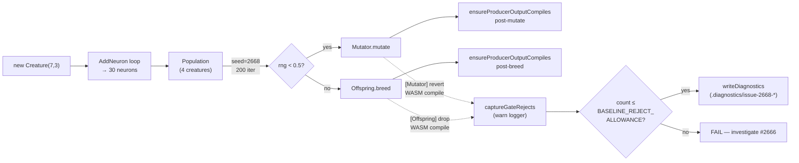

# Reproducer test for lunar_lander-shape WASM compile trap

## Summary

Adds an in-tree, deterministic regression test that drives `Mutator.mutate` and
`Offspring.breed` against a population of lunar_lander-shaped creatures (7
inputs, 3 outputs, seeded to 30 neurons) and asserts the producer-side WASM
compile gate fires no more often than a small baseline allowance.

The test is the gate that the diagnose-and-fix work in #2666 must clear: today
the seeded loop records exactly **1 producer-gate reject** on a 37-neuron
offspring (shape `inputs=7, outputs=3` — the exact shape from the production
warnings in the bug report); once #2666 lands the count should drop to zero and
the allowance can be tightened to 0.

The reproducer:

1. Builds `POPULATION_SIZE=4` lunar_lander-shaped creatures and grows each to 30
   total neurons via `AddNeuron`.
2. Runs a fixed-seed (`seed=2668`), 200-iteration mutate/breed loop.
3. Hooks the global logger to count every `[Mutator]` and `[Offspring]` warn
   line whose body contains `WASM compile` (the two producer-gate reject
   messages emitted by `Mutator.repairAfterMutation` and `Offspring.breed`).
4. Calls `ensureProducerOutputCompiles` on every post-mutate creature and every
   successful offspring as a gate-escape guard rail.
5. Writes the first offending creature and reject context to
   `.diagnostics/issue-2668-lunar-lander-shape-*` via the existing
   `writeDiagnostics` path so the diagnosis sub-issue has an artefact.
6. Asserts `count <= BASELINE_REJECT_ALLOWANCE` (5 today, 0 once #2666 lands).

A second test runs the entire reproducer three times back-to-back at the same
seed and asserts both the reject count and the reject-source sequence match
across all three runs — pinning the determinism requirement called out in the
issue.

Closes #2668.

## Evidence

Backend-only change — no UI surface to screenshot. Test results:

```text
running 2 tests from ./test/wasm/LunarLanderShapeProducerGate.ts
Issue #2668: lunar_lander-shape mutation/breed loop keeps producer-gate
  rejects under the baseline ... ok (111ms)
Issue #2668: reproducer is deterministic across three consecutive runs
  at the same seed ... ok (249ms)

ok | 2 passed | 0 failed (381ms)
```

Recorded baseline in
`.diagnostics/issue-2668-lunar-lander-shape-context-*.json`:

```json
{
  "seed": 2668,
  "iterations": 200,
  "populationSize": 4,
  "lunarInputs": 7,
  "lunarOutputs": 3,
  "lunarSeedNeurons": 30,
  "rejectCount": 1,
  "mutatorRejects": 0,
  "offspringRejects": 1,
  "firstFiveMessages": [
    "[Offspring] dropping offspring that fails WASM compile (neurons=37, inputs=7, outputs=3): unreachable"
  ]
}
```

The captured shape (`neurons=37, inputs=7, outputs=3, trap=unreachable`) is
exactly one of the three warnings the bug report quotes from the lunar_lander
overnight run.

Full `test/wasm/` suite still passes:

```text
ok | 539 passed | 0 failed | 1 ignored (16s)
```



## Test Plan

Added test file: `test/wasm/LunarLanderShapeProducerGate.ts`.

Tests verify:

- **Baseline reject count is bounded.** Running the seeded mutate/breed loop
  produces at most `BASELINE_REJECT_ALLOWANCE` (5) producer-gate rejects, and
  writes the offending creature context to `.diagnostics/` for the diagnosis
  sub-issue.
- **Gate escape guard rail.** Every post-mutate creature and every returned
  offspring still passes `ensureProducerOutputCompiles`. If any creature ever
  escapes the gate with a compile failure, the test fails immediately with the
  offending iteration.
- **Determinism.** Three back-to-back runs at the same seed produce the same
  reject count AND the same sequence of reject sources (mutator vs offspring). A
  drift in either pins a non-determinism bug rather than a gate-fire bug.

The test runs in ~400 ms total — well under the 30-second budget from the
issue's acceptance criteria.
