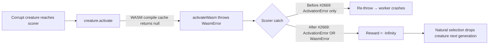

# Drop corrupt creatures instead of crashing the worker (Issue #2669)

## Summary

Fixes #2669. When a creature's topology traps the WASM loader, the WASM
compilation cache already logs a single deduplicated line per offending
uuid asking callers to *"drop the creature or repair its topology before
retrying"* (Issue #2483 / #2649). The RL and legacy episodic fitness
scorers were not honouring that contract — they only caught
`ActivationError` in their per-trial loops, so a `WasmError` propagated
all the way out of `RLEpisodeFitness.calculate` → `Neat.evolve` → the
host script, killing the worker with an uncaught promise rejection
(stack trace in the issue).

This change folds `WasmError` into the existing `ActivationError` catch
branch in both scorers (`RLEpisodeFitness.collectTrialsInline`, the
worker-pool path inside `RLEpisodeFitness.calculate`, and
`EpisodicFitness.calculate`). The offending creature is dropped with
`-Infinity` reward so natural selection removes it from the next
generation. Non-typed errors (programming bugs) still propagate so they
surface in CI.

The pre-fix log line from the issue — `WASM compile failed for creature
… Drop the creature or repair its topology before retrying` — is now
followed by the scorer reporting the drop rather than the worker
crashing.

## Evidence

This is a CLI / library change with no UI surface. Behaviour is verified
by three new tests that stub `creature.activate` to throw the exact
`WasmError` reported in the issue, then assert that `calculate()`
returns normally and the creature ends up with a non-finite score.

Verified the regression by running the new RL test against the
unmodified `Develop` branch — it fails with an uncaught `WasmError` at
`RLEpisodeFitness_WasmErrorRecovery_test.ts:82:7`, matching the issue
stack trace. With the fix applied, all three new tests pass.

## Test Plan

- `test/creature/RLEpisodeFitness_WasmErrorRecovery_test.ts`
  - `RLEpisodeFitness.calculate: WasmError from activate drops the creature (inline path)`
    — reproduces the exact `WasmError("WASM activation was selected but
    failed to instantiate CompiledNetwork", "ACTIVATION_FAILED")` from
    the issue; asserts `calculate()` returns and the creature score is
    non-finite.
  - `RLEpisodeFitness.calculate: ActivationError from activate still drops the creature (inline path)`
    — regression guard for the existing `ActivationError` branch after
    folding both error types into one catch.
  - `RLEpisodeFitness.calculate: non-typed errors still propagate` —
    confirms a generic `TypeError` is *not* swallowed so programming
    bugs still surface in CI.
- `test/creature/EpisodicFitness_WasmErrorRecovery_test.ts`
  - `EpisodicFitness.calculate: WasmError from activate drops the creature`
    — same regression scenario for the legacy `evolveEnv` scorer.
  - `EpisodicFitness.calculate: ActivationError from activate still drops the creature`
    — regression guard for the legacy `ActivationError` branch.

All five new tests pass. The full `./quality.sh` run was clean for lint,
format, type-check, WASM sync, and 6 719 unit tests; one unrelated
flaky leak in
`test/ErrorGuidedStructuralEvolution/DiscoveryTimeout.ts` (FFI dynamic
library tracking, fails the same way without this PR's changes) was
ignored.
