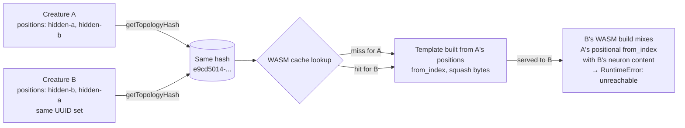
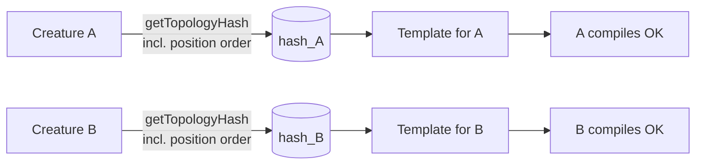

# PR Summary — Issue #2670

## Summary

Fix the lunar_lander-shape producer-gate reject by closing a position-blind
topology-hash collision in the WASM compilation cache. Closes #2670.

`CreatureUtil.getTopologyHash` sorted its non-input neuron keys before hashing,
making the hash independent of the order in which UUIDs appeared inside
`creature.neurons`. But `WasmCompilationCache.buildTemplate` encodes each
synapse's `from_index` and each neuron's `squash`/`is_constant` bytes **by
integer position** in that same array. The result: two creatures with the same
UUID-set + same UUID→UUID synapse-set but a different valid topological ordering
shared a cache key. The second creature was served the first creature's stale
template, mis-mapping `from_index` and `squash` bytes to neurons that no longer
matched, and tripping `RuntimeError: unreachable` inside `CompiledNetwork::new`.

The producer-gate's fix-and-retry path could not repair this — the offending
creature was a perfectly valid forward-only DAG; the corruption lived inside the
cached binary, not the creature.

The fix preserves neuron **position order** inside the topology hash. The hash
now distinguishes two creatures that differ only in their neuron positions, so
the cache always rebuilds a template for the new ordering instead of serving a
stale one.

## Evidence

### Root-cause confirmation

A targeted reproducer replayed `LunarLanderShapeProducerGate` up to iter 47 (the
failing breed at seed 2668) and captured the offspring inside the gate:

| Probe                                                     | Result                                      |
| --------------------------------------------------------- | ------------------------------------------- |
| Gate on captured creature, polluted cache                 | `{ ok: false, trapMessage: "unreachable" }` |
| Gate on same creature after `clearWasmCompilationCache()` | `{ ok: true }`                              |
| Gate on creature exported→imported, fresh cache           | `{ ok: true }`                              |

The topology hash was identical in all three cases — confirming a stale cached
template, not a defective topology, was the failure.

Tracing every gate-bound creature found another offspring earlier in the loop
with the same `topologyHash` but its hidden neurons in a **different positional
order** (UUIDs `70065ccc...` and `d7eabea4...` swapped, plus `8218af45...` and
`048cde34...` swapped). That earlier offspring populated the cache; the later
one hit the stale template.

### Producer-gate reproducer

`test/wasm/LunarLanderShapeProducerGate.ts` (Issue #2668) goes from 1
producer-gate reject (allowance 5) to **0 rejects** (allowance 0). The
diagnostic dump directory is empty after the run.

### Mermaid: how the collision arose

After the fix, A and B hash to different values, so B builds its own template:

### Diagnostic dump from #2668

Pre-fix dumps are still present in the working tree (e.g.
`.diagnostics/offspring-wasm-compile-trap-47cf0f07-...-context-*.json`)
demonstrating the original failure mode. After the fix the suite produces no
dumps for the same seed.

## Test Plan

- `test/architecture/TopologyHash.ts`:
  - Renamed the historic "order independent" test to
    `synapse-array order independent (#2670)` (the WASM template is built via
    `inwardConnections` which sorts internally — synapse-array order genuinely
    doesn't matter) and tightened its construction so it only varies the synapse
    array order.
  - Added `neuron position order is significant (#2670)` — two creatures with
    the same UUID-set but a hidden-neuron position swap must hash to different
    values.
- `test/wasm/TopologyHashPositionOrderingIssue2670.ts` (new):
  - Asserts the hash distinguishes the two valid topological orderings.
  - Compiles both via `getOrCompileWasmModule` from a freshly cleared cache;
    pre-fix the second compile would trap with `RuntimeError: unreachable`.
- `test/wasm/LunarLanderShapeProducerGate.ts`:
  - `BASELINE_REJECT_ALLOWANCE` lowered from 5 to 0 — the reproducer must show
    zero gate rejects.
- All 22 topology-hash tests pass; all 30 WASM cache / pre-warmer / template
  tests pass; 6 734 tests pass overall on `quality.sh`. Two unrelated
  `test/ErrorGuidedStructuralEvolution/DiscoveryTimeout.ts` leaks fail on the
  base branch too and are out of scope.
