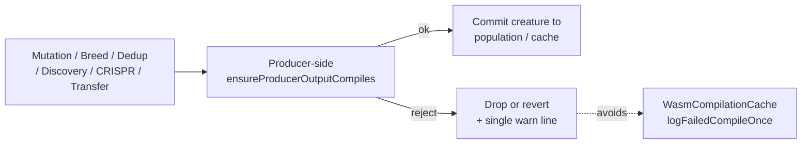

# Wire `ensureProducerOutputCompiles` into the remaining producer paths

## Summary

Extends the producer-side WASM compile gate to the producer paths that
previously bypassed it. `Mutator.repairAfterMutation` and `Offspring.breed`
already invoked `ensureProducerOutputCompiles`; this change adds the gate to
**DeDuplicator** (breed/mutate/fallback commit seam), **Discovery's
coordinated structural candidate apply**, **CRISPR injection**, and the
**transfer-learning import** path (both `Checkpoint.importCheckpoint` and
`PopulationSeeding.createSeededPopulation`). On gate failure each producer
drops or reverts its candidate so a bad topology never reaches the WASM
cache where `WasmCompilationCache.logFailedCompileOnce` would surface the
`WASM compile failed for creature ...` warning. Closes #2671.

A small shared helper `passesProducerCompileGate(creature, producerName)`
lives in `src/wasm/ProducerCompileGuard.ts` so every new call site emits a
single, consistently-formatted warn line tagged with the producer name. A
narrow test seam (`__setProducerCompileGateProbeForTesting`) lets regression
tests deterministically force a gate failure without engineering a
WASM-tripping topology.

## Evidence

Backend / CLI change — no UI to screenshot. Verified via:

- New regression suite `test/wasm/ProducerCompileGateWiring.ts` (7 tests, all
  passing). Each test runs the producer path against a healthy creature
  with the gate stubbed to always reject, then asserts the producer drops or
  reverts and emits a warn line tagged with the producer name.
- Existing producer regression suite `test/wasm/ProducerCompileGuard.ts`
  (5 tests) still passes — the existing gate behaviour for
  `Mutator.repairAfterMutation` and `Offspring.breed` is unchanged.
- Full `./quality.sh --skip-discovery --skip-wasm` run: 6727 passed,
  0 failed, 4 ignored.

## Test plan

New tests in `test/wasm/ProducerCompileGateWiring.ts`:

- `passesProducerCompileGate emits a warn line tagged with the producer
  name on rejection` — verifies the shared helper formats its warn line
  with the producer tag and surfaces the reject as `false`.
- `passesProducerCompileGate accepts a healthy creature against the real
  probe` — sanity check that the real probe still accepts healthy
  creatures.
- `applyCoordinatedStructuralCandidate reverts when the gate rejects the
  post-apply creature` — confirms Discovery returns the pre-application
  creature on gate failure and emits the `Discovery/applyCoordinatedStructural`
  warn line.
- `CRISPR.cleaveDNA returns the original creature when the gate rejects
  the modified topology` — confirms CRISPR's revert behaviour and tagged
  warn line.
- `importCheckpoint throws TopologyError when the gate rejects the
  imported creature` — confirms transfer-learning import surfaces a typed
  error rather than handing a bad topology to the caller.
- `createSeededPopulation drops a seed that fails the gate and backfills
  with a random creature` — confirms seeds are dropped, population size is
  preserved, and a `PopulationSeeding` warn line is emitted.
- `DeDuplicator culls a duplicate slot when every replacement fails the
  gate` — confirms the dedup pass culls a duplicate when every replacement
  candidate is rejected, with `DeDuplicator/breed`, `DeDuplicator/mutate`,
  or `DeDuplicator/fallback` warn lines.

Regression coverage preserved:

- `test/wasm/ProducerCompileGuard.ts` — unchanged, still passes.
- `test/architecture/DeDuplicator.ts` — happy path / idempotence /
  large-input still pass.
- `test/transfer/Checkpoint.ts`, `test/transfer/PopulationSeeding.ts` —
  all 24 tests still pass.
- `test/discovery/CoordinatedStructural*.ts`,
  `test/lifecycle/ForwardOnlyApplyChangeLifecycle.ts` — all 30 tests still
  pass.

## Pre-PR Security Self-Check

- [x] No new external input; gate operates on internal `Creature`
      instances.
- [x] No secrets staged. `.config*.json`, `.env`, etc. unchanged.
- [x] No injection surface introduced. Producers continue to use existing
      typed APIs; the new helper only logs.
- [x] Output encoding — the warn line embeds the producer name (a
      compile-time string literal) and the existing trap message; no
      user-supplied data reaches the log sink.
- [x] Authentication / authorisation — N/A (in-process library code).
- [x] Error handling — `gateImportedCheckpoint` throws a typed
      `TopologyError`; other producers return `undefined`, revert to a
      snapshot, or fall back to the original creature.
- [x] Dependencies — no new dependencies.
