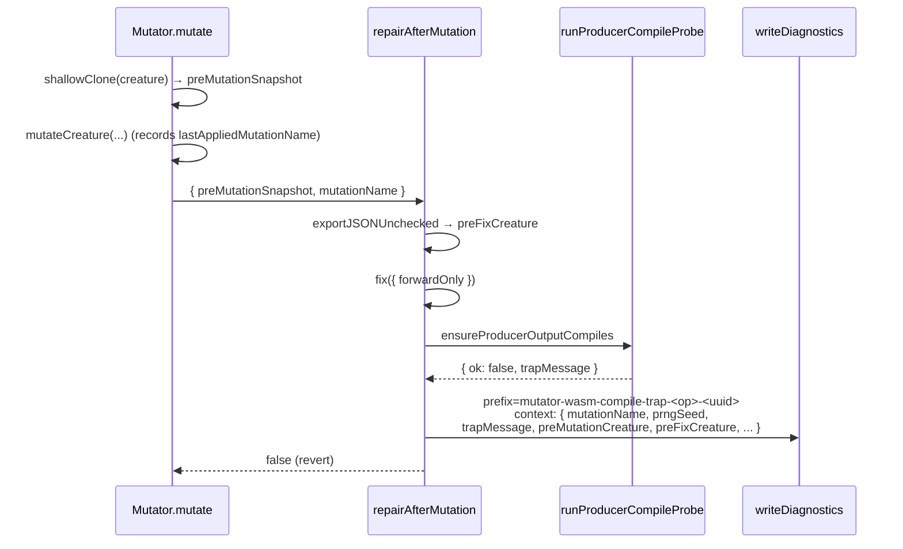

# PR Summary — Issue #2672

## Summary

Enriches the producer-gate diagnostic dumps written by `Offspring.breed` and
`Mutator.repairAfterMutation` so a WASM-compile rejection can be replayed
offline. Each dump now carries the active PRNG seed, the trap message from
`WasmBinaryValidator`, the post-splice/pre-fix snapshot, and (for the mutator
path) the pre-mutation creature plus the operator name. Dump filenames are
standardised so post-mortem tooling can grep `.diagnostics/` for
`offspring-wasm-compile-trap-<uuid>-*` and
`mutator-wasm-compile-trap-<operator>-<uuid>-*`. Closes #2672.

## Changes

- `src/utils/RandomNumberGenerator.ts` — adds a `seed: number | null` property
  to `RandomNumberGenerator` (and the seeded/unseeded implementations) so the
  diagnostic dump can record the exact value needed to reconstruct the RNG.
- `src/wasm/ProducerCompileGuard.ts` — adds `runProducerCompileProbe()`, a
  test-seam-aware delegate over `producerCompileProbe`. Direct producer callers
  (`Offspring.breed` and `Mutator.repairAfterMutation`) now go through this
  helper so the existing `__setProducerCompileGateProbeForTesting` mechanism can
  deterministically force a rejection.
- `src/architecture/Offspring.ts` — captures the post-splice/pre-fix offspring
  via `exportJSONUnchecked`, then on producer-gate rejection writes a diagnostic
  dump with the standardised `offspring-wasm-compile-trap-<childUuid>` prefix
  and a `context` block containing `motherUuid`, `fatherUuid`, `offspringUuid`,
  `breedSeed`, `prngSeeded`, `trapMessage`, `preFixOffspring`, and shape
  metadata.
- `src/NEAT/Mutator.ts` — extends `repairAfterMutation` with an optional
  diagnostic context (`{ preMutationSnapshot, mutationName }`). The caller
  (`Mutator.mutate`) takes a `shallowClone` of the creature before applying the
  mutation batch and threads the last applied operator name into the diagnostic
  context. On producer-gate rejection the dump now lands as
  `mutator-wasm-compile-trap-<operator>-<creatureUuid>-*` with the operator
  name, PRNG seed, trap message, pre-mutation snapshot, and pre-fix snapshot
  embedded in `context`.
- `docs/troubleshooting/WASM.md` — adds the new section
  `🧪 Producer-gate WASM compile rejects (Issue #2672)` documenting dump
  locations, the context fields, and a step-by-step offline replay recipe.
- `docs/TROUBLESHOOTING.md` — adds a top-level FAQ entry pointing at the new
  section.

## Evidence

Backend/CLI change with no UI surface.

- New test file `test/wasm/ProducerGateDiagnosticDumps.ts` exercises both paths
  against a stubbed reject probe and asserts the standardised filename prefix is
  used and that the new context fields are present.
- `quality.sh --skip-discovery` — 6363 passed, 0 failed, 4 ignored (53 s test
  step).

## Test Plan

- [x] New:
      `test/wasm/ProducerGateDiagnosticDumps.ts::Issue #2672:
  Offspring.breed dump uses standardised prefix and embeds replay metadata`
- [x] New:
      `test/wasm/ProducerGateDiagnosticDumps.ts::Issue #2672:
  Mutator.repairAfterMutation dump uses standardised prefix and embeds
  replay metadata`
- [x] Regression: existing `test/wasm/ProducerCompileGuard.ts`,
      `test/wasm/ProducerCompileGateWiring.ts`,
      `test/feedForward/ForwardOnlyRepairAfterMutation.ts`,
      `test/feedForward/ForwardOnlySemanticVersion.ts`,
      `test/feedForward/ForwardOnlyViolationLogging.ts`,
      `test/utils/RandomNumberGenerator.ts`, `test/utils/Diagnostics.ts` — all
      pass unchanged.
- [x] Full `quality.sh --skip-discovery` clean.
