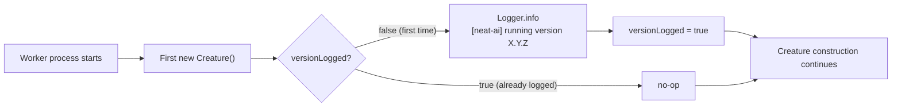

# Verify GRQ workers run a neat-ai version that includes the topology-hash fix

## Summary

Every NEAT-AI worker now emits a single `[neat-ai] running version X.Y.Z` line
at startup so the actually-loaded `@stsoftware/neat-ai` version is always
visible. No more reverse-engineering the running version out of a stack trace
when a worker traps inside `Offspring.breed`. The line goes through the project
Logger (`src/utils/Logger.ts`), so hosts that inject their own logger see it via
their own sink.

The line fires once per worker process. The `Creature` constructor is the
trigger; the idempotent flag in `src/utils/Version.ts` ensures sibling entry
points stay quiet. The version is read from the JSR module URL when running over
JSR, with a `FALLBACK_NEAT_AI_VERSION` constant for local `file://` loads. The
fallback constant is kept in sync with `deno.json` `version` by a sync test —
drift fails `quality.sh`.

Closes #2682.

### GRQ-side action

GRQ workers and sibling consumers (`GRQ-shareprices2025Q3`,
`GRQ-companyreports`) must refresh their `@stsoftware/neat-ai` pin to ≥ `5.0.14`
so they pick up the topology-hash position-order fix from PR #2678. After the
restart, verify each worker's log starts with `[neat-ai] running version 5.0.14`
(or newer). This is a follow-up operational step in the GRQ repo and is out of
scope of this NEAT-AI PR.

## Evidence

This is a CLI/library change — no UI to screenshot. The behaviour is verified by
unit tests under `test/creature/VersionStartupLog.ts`:

- `getNeatAiVersion()` returns a valid semver string.
- `FALLBACK_NEAT_AI_VERSION` matches `deno.json` `version`.
- `logNeatAiVersionOnce()` emits exactly once across repeated direct calls.
- Constructing many `Creature` instances logs the line exactly once and the
  message matches `[neat-ai] running version X.Y.Z`.

All four tests pass locally:

```
running 4 tests from ./test/creature/VersionStartupLog.ts
Version: getNeatAiVersion returns a valid semver string ... ok (0ms)
Version: FALLBACK_NEAT_AI_VERSION matches deno.json version ... ok (0ms)
Version: logNeatAiVersionOnce emits exactly once per process ... ok (0ms)
Version: first Creature construction logs version, subsequent do not ... ok (3ms)
ok | 4 passed | 0 failed (8ms)
```

The full `./quality.sh --skip-discovery --skip-wasm` run shows **6738 tests
passed, 2 failed**. The two failures are in
`test/ErrorGuidedStructuralEvolution/DiscoveryTimeout.ts` (Rust FFI dylib
lifecycle leak warnings) and are **pre-existing on `Develop`** — they reproduce
on the unmodified base branch and are unrelated to this change.

### Flow



## Test Plan

Added `test/creature/VersionStartupLog.ts` (four cases):

- [x] `getNeatAiVersion()` returns a valid semver string.
- [x] `FALLBACK_NEAT_AI_VERSION` matches `deno.json` `version` (drift fails
      `quality.sh`).
- [x] `logNeatAiVersionOnce()` is idempotent across repeated calls.
- [x] Constructing many `Creature` instances logs the line exactly once.

## Files Changed

- `src/utils/Version.ts` — new module owning the convention, the fallback
  constant, the version-derivation function, the once-per-process emit, and a
  test-only reset hook.
- `src/Creature.ts` — calls `logNeatAiVersionOnce()` as the first statement of
  the constructor.
- `test/creature/VersionStartupLog.ts` — four-case test suite covering semver
  shape, deno.json sync, idempotent emit, and Creature integration.
- `docs/VERSION_VISIBILITY.md` — new doc capturing the convention, rationale,
  implementation, and fleet-rollout note for GRQ.
- `docs/CORE_DEPENDENCY_POLICY.md` — adds the new doc to the related links
  section so anyone reading about the core dep policy lands on the
  version-visibility convention next.
- `docs/README.md` — adds the new doc to the governance index so it has a
  discoverable home.
