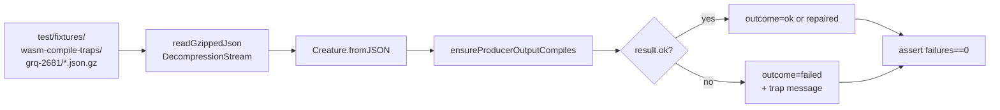

# Issue #2683 — Replay GRQ-logs WASM compile-trap samples as a regression test

## Summary

Pinned the nine captured GRQ-cluster offspring genomes from
`stSoftwareAU/GRQ-logs` (Develop branch, 2026-05-15) as an in-tree regression
test. The test loads each offspring via `Creature.fromJSON`, runs it through
`ensureProducerOutputCompiles`, and asserts the failure count is zero. On
current Develop (with #2678 merged) all nine fixtures now compile cleanly —
confirming that the position-blind topology-hash fix shipped for the
lunar_lander shape also resolves the GRQ-cluster shape (~1670 neurons, 2461
inputs, 1 output, forward-only).

Closes #2683.

## Evidence

Backend-only change — no UI surface. Test run output against the live fixtures
(full nine):

```text
[Grq2681TrapReplay] offspring-...T16-05-12-762Z.json.gz -> ok (neurons=4130, inputs=2461, outputs=1)
[Grq2681TrapReplay] offspring-...T16-16-41-314Z.json.gz -> ok (neurons=4140, inputs=2461, outputs=1)
[Grq2681TrapReplay] offspring-...T16-16-56-178Z.json.gz -> ok (neurons=4140, inputs=2461, outputs=1)
[Grq2681TrapReplay] offspring-...T16-17-08-257Z.json.gz -> ok (neurons=4140, inputs=2461, outputs=1)
[Grq2681TrapReplay] offspring-...T16-25-13-854Z.json.gz -> ok (neurons=4139, inputs=2461, outputs=1)
[Grq2681TrapReplay] offspring-...T16-25-34-400Z.json.gz -> ok (neurons=4139, inputs=2461, outputs=1)
[Grq2681TrapReplay] offspring-...T16-59-12-842Z.json.gz -> ok (neurons=4140, inputs=2461, outputs=1)
[Grq2681TrapReplay] offspring-...T16-59-12-870Z.json.gz -> ok (neurons=4140, inputs=2461, outputs=1)
[Grq2681TrapReplay] offspring-...T17-01-08-467Z.json.gz -> ok (neurons=4140, inputs=2461, outputs=1)
[Grq2681TrapReplay] summary: ok=9, repaired=0, failed=0, total=9
Issue #2683: ... ok (373ms)
```

Total run time: ~375 ms — comfortably under the 120 s budget.



## Test Plan

- New: `test/wasm/Grq2681TrapReplay.ts` — iterates every `*.json.gz` fixture,
  decompresses in-memory, loads via `Creature.fromJSON`, runs
  `ensureProducerOutputCompiles`, logs per-fixture outcomes, and fails the run
  if any fixture still traps. All nine fixtures pass.
- New fixtures: `test/fixtures/wasm-compile-traps/grq-2681/*.json.gz` (nine
  gzipped offspring genomes, ~415 KB each, ~3.6 MB total).
- Quality gate: `./quality.sh --lint-only` and `./quality.sh
  --check-only`
  both pass; new test runs under the same flags `quality.sh` uses for the test
  step.

## Notes

- Files are stored gzipped because the raw JSON is ~3.5 MB each (~32 MB total).
  Gzipped they fit in ~3.6 MB and decompress in-process via
  `DecompressionStream` — no extra dependency, no network access.
- The test is **not** marked `@slow`: the full nine-fixture replay completes in
  well under a second on a warm WASM cache.
- If a future regression re-introduces the trap, the test fails with a
  deterministic list of (`fixture`, `trapMessage`) pairs so #2684 can root-cause
  directly from CI output.
