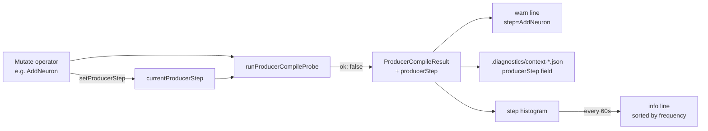

## Summary

Attribute producer-gate rejections to the originating mutate operator or breed
sub-step. Producers (`Mutator`, `Offspring.breed`, `DeDuplicator`, `CRISPR`,
`ApplyCoordinatedStructuralCandidate`) now set a `currentProducerStep` label
before applying a mutation; the gate captures it on rejection and threads it
through the diagnostic dump's `context` block, the single-line warning, and a
rate-limited histogram summary. Closes #2685.

The implementation follows the cheapest path the issue calls for: a module-local
string in `ProducerCompileGuard.ts` plus thin `setProducerStep` /
`withProducerStep` wrappers around the existing producer code paths. No per-call
argument plumbing.

## Evidence

This is a CLI/library change with no UI. The behaviour is verified by:

- New unit tests in `test/wasm/ProducerCompileGateAttribution.ts` that exercise
  the seven acceptance criteria:
  1. `setProducerStep` / `getProducerStep` / `withProducerStep` round-trip.
  2. `runProducerCompileProbe` surfaces the active step on rejection.
  3. `passesProducerCompileGate` emits `step=...` in the warn line and records
     the rejection in the histogram.
  4. The histogram falls back to the producer name when no step is set.
  5. `flushProducerStepHistogram` emits a sorted summary info line and clears
     the histogram.
  6. `Offspring.breed` diagnostic dump includes `producerStep` in the `context`
     block.
  7. `Mutator.repairAfterMutation` diagnostic dump includes `producerStep` in
     the `context` block.
- The full test suite passes (`./quality.sh --skip-discovery --skip-wasm` → 6743
  passed, 0 failed, 4 ignored).
- Existing producer-gate tests (`ProducerCompileGuard.ts`,
  `ProducerCompileGateWiring.ts`, `ProducerGateDiagnosticDumps.ts`) all continue
  to pass against the enriched warning format.

### Data flow

## Test Plan

- [x] `test/wasm/ProducerCompileGateAttribution.ts` — seven new tests covering
      the acceptance criteria.
- [x] `test/wasm/ProducerCompileGuard.ts` — existing tests unchanged and
      passing.
- [x] `test/wasm/ProducerCompileGateWiring.ts` — existing tests pass; the
      warning format change is backward compatible
      (`[<producer>] dropping
  output …` still matches when no step is set).
- [x] `test/wasm/ProducerGateDiagnosticDumps.ts` — existing tests pass
      unchanged; new `producerStep` field is additive.
- [x] `./quality.sh --skip-discovery --skip-wasm` clean: 6743 tests pass.
