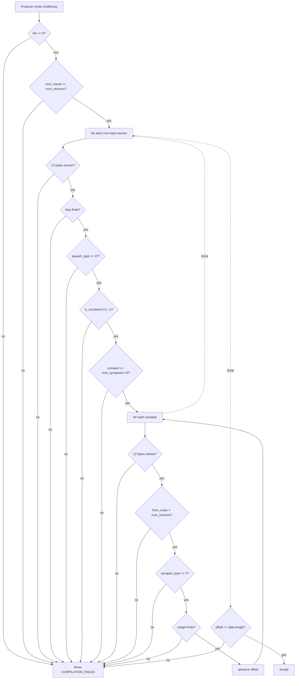

# Extend WasmBinaryValidator with Rust-constructor parity checks

## Summary

`assertWasmBinaryWellFormed` previously mirrored only the explicit
`return Err` arms of `neat-core/src/network.rs::CompiledNetwork::new`
(header underflow, neuron / synapse record underflow, `num_inputs >
num_neurons`, trailing bytes, plus the `from_index` bounds check added
in #2667). The GRQ-2681 traps reach `unreachable` despite passing the
existing checks, so the validator is extended with defensive parity
checks for the well-formedness invariants Rust silently coerces today
but a correct producer should never emit.

New invariants (every check costs O(1) per neuron / synapse, allocation-free):

- `squash_type` byte in `0..=37` — matches `SquashType.ts` and the
  enum in `neat-core/src/squash.rs`. Rust's `From<u8>` falls back to
  `Identity` for out-of-range, masking real producer bugs.
- `is_constant` byte strictly `0` or `1`. Rust accepts any non-zero as
  true (`data[offset+9] != 0`), so junk in this byte is silently lost.
- `synapse_type` byte in `0..=3` — matches `neat-core/src/synapse_type.rs`.
  Rust's `From<u8>` falls back to `Standard`.
- `f64 bias` and `f64 weight` are finite (no `NaN`, no `±Inf`).
- Constant neurons declare `num_synapses == 0` (constants are leaves;
  inward synapses are stored but never read).

The doc comment on `WasmBinaryValidator.ts` now enumerates every
invariant the validator mirrors, with `network.rs` / `squash.rs` /
`synapse_type.rs` line references pinned to the revision in
`wasm_activation/pkg/neat_core_rev.txt`
(`dfc59023a54c0f1883157f5e275d2d252c99f2f2`).

Closes #2686.

## Evidence

Backend-only change — no UI. Test results:

```
$ deno test --allow-all test/wasm/WasmBinaryValidatorParity.ts
ok | 18 passed | 0 failed (27ms)

$ deno test --allow-all test/wasm/WasmBinaryValidator.ts
ok | 12 passed | 0 failed (482ms)

$ deno test --allow-all 'test/wasm/*.ts'
ok | 568 passed | 0 failed | 1 ignored (26s)
```

Validator flow after this change:



## Test Plan

Added `test/wasm/WasmBinaryValidatorParity.ts` with 18 focused tests:

- **Control**: a real `compileCreatureToWasm` round-trip passes the
  extended validator (no false positives).
- **squash_type**: rejects `38` and `255`; accepts `37` (Mean).
- **is_constant**: rejects `2` and `255`; accepts `1` with zero synapses.
- **synapse_type**: rejects `4` and `255`; accepts `3` (Positive).
- **bias / weight**: rejects `NaN`, `+Inf`, `-Inf` for both; accepts
  near-zero and very large finite values.
- **constant leaves**: rejects constant neuron declaring one synapse;
  rejects constant neuron declaring three synapses.

Each test engineers a single defective byte buffer and asserts the
validator throws `WasmError("COMPILATION_FAILED")` with a message naming
the offending field. Existing `test/wasm/WasmBinaryValidator.ts` (12
tests) still passes unchanged. Broader `test/wasm/` suite (568 tests)
still passes.
