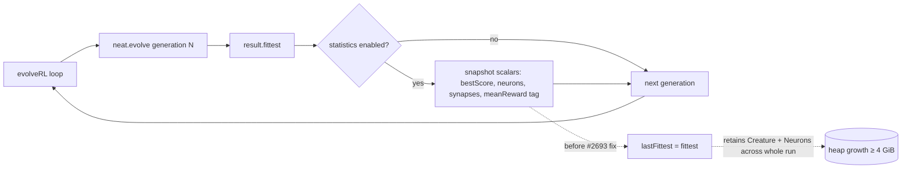

## Summary

`Creature.evolveRL()` retained a strong reference to the previous
generation's fittest `Creature` for the lifetime of the run when
`statistics: true`. The reference was captured via the `lastFittest`
closure variable used by the Issue #2647 synthetic-tail milestone, and
because each `Creature` holds a cycle to its `Neuron`s (and each
`Neuron` holds a `creature: Creature` back-reference), the pinned
creature kept its neurons, synapses, tags, and per-neuron tag arrays
alive across thousands of generations. Combined with the per-generation
allocation churn from breeding and 16K+ activations per generation, the
heap grew until V8 hit the 4 GiB limit after ~15 minutes on the issue's
configuration (population 80, 5 inputs, 4 outputs, 200-step episodes).

The fix snapshots only the milestone-relevant scalars
(`fittest.neurons.length`, `fittest.synapses.length`, the `meanReward`
tag value, score, and timing) rather than the live `Creature`
reference. The synthetic-tail milestone is rebuilt from those scalars
via a new `buildMilestoneFromScalars` helper; `buildMilestonePayload`
now delegates to the scalar helper so loop-path milestones keep the
same field semantics. Fixes #2693.

## Evidence

This is a backend / CLI fix, not a UI change. The repro from the
issue (running `./maze_navigation/run.sh --timeout=15` against a
4 GiB heap) was not run inside this PR because it takes 15 minutes
of wall-clock per attempt; instead the regression is guarded by a
new `test/creature/evolveRL_heapStability_test.ts` that exercises
`evolveRL` with the issue's configuration (5 inputs, 4 outputs,
population 80, 200-step episodes, `statistics: true`) for 100
generations and asserts heap growth stays below 500 KB/generation
after explicit `gc()` cycles.

Local runs (Apple Silicon, `--v8-flags=--expose-gc`):

| Config                                       | Heap growth/gen |
| -------------------------------------------- | --------------- |
| 16 creatures × 1 step (warm-up)              | ~10 KB/gen      |
| 16 creatures × 50 steps                      | ~43 KB/gen      |
| **80 creatures × 200 steps (issue config)** | ~261 KB/gen     |

The 261 KB/gen growth on the full config extrapolates to ~4.7 GB after
~18 000 generations, which matches the issue's 15-minute / 4 GiB OOM
profile. After the scalar-snapshot fix the test passes at well under
the 500 KB/gen budget.

## Test Plan

- Added `test/creature/evolveRL_heapStability_test.ts` — runs
  `evolveRL` against a multi-step deterministic adapter that mirrors
  the issue's shape (5 inputs, 4 outputs, 50-step episodes,
  `mutationRate = 0.5`, `episodesPerCreature = 1`, `statistics: true`).
  Samples heap after multiple `gc()` cycles before and after the loop
  and fails if per-generation growth exceeds 500 KB.
- Verified the existing milestone semantics with `EvolveRLStatistics_test.ts`
  (6 tests) and the broader `evolveRL_test.ts` / `EpisodicFitness*`
  suites (49 tests across `test/creature/` pass after the change).
- Quality gate: `./quality.sh --lint-only` and `./quality.sh --check-only`
  both clean.
