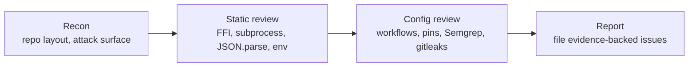

# Security-scan audit — Issue #2694

## Summary

Ran the four-phase security-in-depth audit against `stSoftwareAU/NEAT-AI` and
filed four evidence-backed findings as new issues. No code changes are shipped
under this PR — the audit's deliverables are the filed issues plus this audit
log. Closes #2694.

## Filed findings

| # | Severity | Issue                                                                                                                                                                     | Area                    |
| - | -------- | ------------------------------------------------------------------------------------------------------------------------------------------------------------------------- | ----------------------- |
| 1 | High     | [#2695](https://github.com/stSoftwareAU/NEAT-AI/issues/2695) — Pin `ludeeus/action-shellcheck` to a commit SHA instead of `@master`                                       | CI / supply chain       |
| 2 | Medium   | [#2696](https://github.com/stSoftwareAU/NEAT-AI/issues/2696) — Pin GitHub Actions in CI workflows to commit SHAs (not version tags)                                       | CI / supply chain       |
| 3 | Medium   | [#2697](https://github.com/stSoftwareAU/NEAT-AI/issues/2697) — `quality.yml` auto-runs `deno outdated --update --latest` and pushes — no quarantine on fresh dep versions | CI / dependency hygiene |
| 4 | Low      | [#2698](https://github.com/stSoftwareAU/NEAT-AI/issues/2698) — Strengthen Semgrep config beyond `p/default`                                                               | SAST coverage           |

## Audit methodology

Four phases — recon, static review, configuration review, and reporting — were
applied. The recon phase mapped the attack surface; subsequent phases focused on
the surfaces actually exposed by the codebase.

### Phase 1 — Recon

- Read `AGENTS.md`, `SECURITY.md`, `deno.json`, and the `.github/workflows/`
  directory.
- Inventoried attack-surface hot spots: Rust FFI bridge
  (`src/architecture/ErrorGuidedStructuralEvolution/RustDiscoveryLibrary.ts`),
  subprocess launches (`Deno.Command` in `src/score/RustScorerBridgeInternal.ts`
  and `src/discovery/DiskSpaceMonitor.ts`), worker boot
  (`src/workers/WorkerHandlerBase.ts`), JSON deserialisation (50 call sites),
  and environment-variable reads (8 files).

### Phase 2 — Static review

Verified safe handling on the surfaces that matter most for an evolutionary-ML
library that ships via JSR:

- **Prototype pollution** — `src/creature/CreatureSerialization.ts` uses an
  explicit `UNSAFE_KEYS` allowlist and `Object.defineProperty` to block
  `__proto__`/`constructor`/`prototype` keys during creature import. Good.
- **FFI / library loading** — `RustDiscoveryLibrary.ts` resolves library paths
  via `Deno.statSync` candidate checks and queries `Deno.permissions.querySync`
  before `dlopen`. Path overrides come from a single env var
  (`NEAT_AI_DISCOVERY_LIB_PATH`) and are validated before use. Good.
- **Subprocess launches** — `Deno.Command("df", { args: ["-k", targetPath] })`
  and the Rust scorer use arg-arrays (not shell strings), so command injection
  is structurally prevented. Good.
- **C-string reads from FFI** — `readCString` enforces a 128 MiB cap so a
  malicious pointer cannot OOM the process. Good.
- **`eval` / `new Function`** — zero occurrences in `src/`. Good.
- **Crypto** — no use of `md5`/`sha1`/`createHash` for security purposes.
  `Math.random()` is used only for evolutionary RNG, not for authentication.
  Good.

No new code-level findings were filed from this phase.

### Phase 3 — Configuration review

The four filed issues all originate here. The CI surface is where the residual
risk concentrates:

- `.github/workflows/shellcheck.yml:20` pins `ludeeus/action-shellcheck@master`
  — a moving ref (filed as #2695, **High**).
- 23 other `uses:` lines across nine workflow files pin to version tags (`@v4`,
  `@v2`, `@v8`, `@v7`, `@v5`) instead of commit SHAs. The project already
  follows the safer pattern in `markdown-lint.yml`, so this is a
  consistency-and-hardening gap (filed as #2696, **Medium**).
- `quality.yml` runs `deno outdated --update --latest`, commits, and pushes back
  to the PR branch with `secrets.ACTIONS_PUSH` — newly-published external deps
  land without quarantine (filed as #2697, **Medium**). A dedicated weekly
  `deno-outdated.yml` workflow already exists for the same purpose, so the
  inline duplicate adds risk for no marginal value.
- `semgrep.yml` runs only `p/default`. Adding `p/security-audit` and
  `p/owasp-top-ten` raises the SAST gate without expected noise on `Develop`
  (filed as #2698, **Low**).

### Phase 4 — Reporting

Each filed issue carries: a specific file/line citation, the relevant project
policy quote (where one exists in `AGENTS.md`), the risk rating, a concrete
suggested fix, and acceptance criteria. Each is labelled `idle-task` so it flows
through the same backlog as the audit issue itself.

## Evidence

This audit is a configuration and code review — no UI, no perf benchmark. The
evidence is the file:line citations embedded in each filed issue and verifiable
by `gh issue view <number>`.

## Test plan

- [x] Each filed issue's file/line citation resolves to the current `Develop`
      tree (verified via `Grep`).
- [x] No source-code changes are introduced by this PR — `git status` is clean
      except for this summary file. The audit's recommendations land in
      separate, reviewable PRs against the filed issues.
- [x] `docs/pr-summary-2694.md` builds under Jekyll/Pages (no unwrapped Liquid
      syntax — `` not required because no `` / `{{ … }}`
      sequences appear outside fenced blocks).
