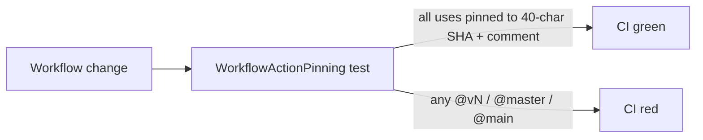

## Summary

Pinned every `uses:` reference in `.github/workflows/*.y*ml` to an immutable
40-character commit SHA (with a comment naming the resolved tag), removing the
mutable-tag supply-chain risk called out in the issue. Adds a regression test
under `test/ci/WorkflowActionPinning.ts` so any future workflow that
reintroduces a `@vN` / `@master` / `@main` pin fails CI. Closes #2696.

## Evidence

This is a CI / configuration change with no UI surface. Verification:

- `deno test --allow-read test/ci/WorkflowActionPinning.ts` — 7 passed,
  0 failed. The two new Issue #2696 tests scan every workflow file and assert
  that each `uses:` reference resolves to a 40-char lowercase hex SHA and is
  accompanied by a tag-name comment for reviewer provenance.
- `./quality.sh --lint-only` — clean (format, lint, bash syntax all pass).
- `grep -nE "uses: [^@]+@(v[0-9]|master|main|HEAD)$" .github/workflows/` —
  returns no matches.

### Pinned actions

| Action | Resolved tag | Commit SHA |
| --- | --- | --- |
| `actions/checkout` | `v4.3.1` | `34e114876b0b11c390a56381ad16ebd13914f8d5` |
| `actions/upload-artifact` | `v4.6.2` | `ea165f8d65b6e75b540449e92b4886f43607fa02` |
| `actions/dependency-review-action` | `v4.9.0` | `2031cfc080254a8a887f58cffee85186f0e49e48` |
| `denoland/setup-deno` | `v2.0.4` | `667a34cdef165d8d2b2e98dde39547c9daac7282` |
| `codecov/codecov-action` | `v5.5.4` | `75cd11691c0faa626561e295848008c8a7dddffe` |
| `EnricoMi/publish-unit-test-result-action` | `v2.23.0` | `c950f6fb443cb5af20a377fd0dfaa78838901040` |
| `peter-evans/create-pull-request` | `v7.0.11` | `22a9089034f40e5a961c8808d113e2c98fb63676` |
| `softprops/action-gh-release` | `v2.6.2` | `3bb12739c298aeb8a4eeaf626c5b8d85266b0e65` |
| `gitleaks/gitleaks-action` | `v2.3.9` | `ff98106e4c7b2bc287b24eaf42907196329070c7` |
| `streetsidesoftware/cspell-action` | `v8.4.0` | `de2a73e963e7443969755b648a1008f77033c5b2` |

`actions/checkout@v6.0.2` (coverage.yaml) and `ludeeus/action-shellcheck@2.0.0`
(shellcheck.yml) were already pinned to SHAs before this change and were left
untouched.

### Regression-prevention flow

## Test Plan

- [x] Added `test/ci/WorkflowActionPinning.ts` with two Issue #2696 checks:
  - every workflow `uses:` is a 40-char commit SHA (rejects `@vN`, `@master`,
    `@main`, `@HEAD`);
  - every pinned action carries a nearby `# owner/repo@<tag>` (or trailing
    `# vX.Y.Z`) comment for reviewer provenance.
- [x] Re-used the existing `extractUses()` helper from
  `test/ci/ShellcheckWorkflowPinning.ts` (Issue #2695) to keep the parser in
  one place.
- [x] `deno test --allow-read test/ci/WorkflowActionPinning.ts` — 7 passed.
- [x] `./quality.sh --lint-only` — clean.
