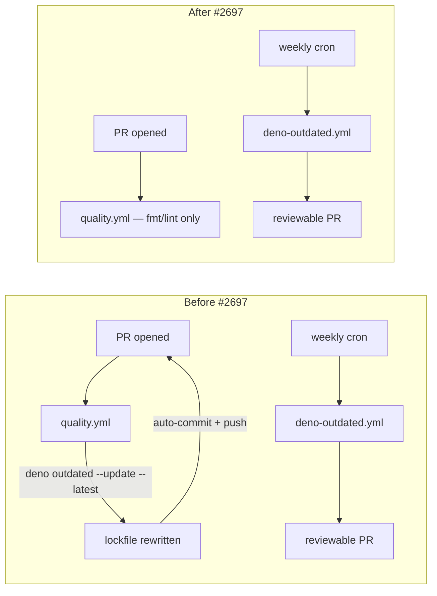

# security: drop inline `deno outdated --update --latest` from quality.yml

## Summary

Removed the inline `Update Deno` step from `.github/workflows/quality.yml`
that ran `deno outdated --update --latest` on every pull request and then
auto-committed/pushed the resulting lockfile changes back to the PR branch
using `secrets.ACTIONS_PUSH`.

The step pulled whatever version was newest at PR run-time, with no
quarantine window for newly-published external (non-`stSoftwareAU/*`)
dependencies. A malicious JSR or npm release going live shortly before a
PR run would be merged into the PR branch automatically under the bot's
signature, bypassing contributor review.

Dep bumps now flow exclusively through the existing scheduled workflow
`.github/workflows/deno-outdated.yml`, which already runs
`deno outdated --update --latest` weekly and raises a separate
reviewable PR via `peter-evans/create-pull-request`. The auto-commit /
push pipeline in `quality.yml` is preserved for genuine fmt/lint fixes —
without the inline update step, the only diff that can reach the commit
step is fmt/lint output, which is safe.

Closes #2697.

## Evidence

This is a CI workflow change with no UI surface. The fix is verified by
new behavioural tests in `test/ci/QualityWorkflowDepBumpQuarantine.ts`
that read the workflow files and assert on their content.

### Before / after



Before: two channels for dep bumps — the inline PR-time channel pulled
fresh external versions with no quarantine and committed them under the
bot. After: a single reviewable channel via the scheduled workflow.

### Test results

```
ok | 115 passed | 0 failed (5s)
```

(All `test/ci/` and `test/scripts/` tests, including the three new
ones for this issue.)

## Test Plan

Added `test/ci/QualityWorkflowDepBumpQuarantine.ts`:

- `quality.yml does not run \`deno outdated --update --latest\` inline (Issue #2697)` —
  fails against the old workflow, passes after the inline step is removed.
- `quality.yml does not auto-commit \`deno fmt and lint fixes\` containing fresh dep versions (Issue #2697)` —
  guards against re-introducing the bug by combining any future
  lockfile-writing Deno step with the existing push-back step.
- `deno-outdated.yml still owns the scheduled dep-update channel (Issue #2697)` —
  pins the dedicated weekly workflow so the reviewable channel cannot
  silently disappear.

Existing tests that continued to pass after the change:

- `test/scripts/DenoOutdatedWorkflow.ts` — verifies the scheduled
  workflow still runs `deno outdated --update --latest` and raises a PR.
- `test/ci/QualityWorkflowScriptInjection.ts` — Issue #2709 guards on
  `quality.yml` still pass after the edit.
- `test/scripts/WorkflowLeastPrivilegePermissions.ts` — `quality.yml`'s
  `permissions:` block is unchanged.
