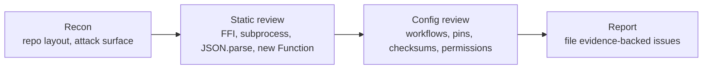

# Security-scan audit — Issue #2703

## Summary

Ran the four-phase security-in-depth audit against `stSoftwareAU/NEAT-AI` and
filed three evidence-backed findings as new issues. No code changes are shipped
under this PR — the audit's deliverables are the filed issues plus this audit
log. Closes #2703.

## Filed findings

| # | Severity | Issue                                                                                                                                                  | Area                 |
| - | -------- | ------------------------------------------------------------------------------------------------------------------------------------------------------ | -------------------- |
| 1 | High     | [#2704](https://github.com/stSoftwareAU/NEAT-AI/issues/2704) — Untrusted creature JSON can reach `new Function()` via unvalidated `bias`/`weight`      | Code (deserialise)   |
| 2 | Medium   | [#2705](https://github.com/stSoftwareAU/NEAT-AI/issues/2705) — `build.sh` does not verify a content hash of the downloaded WASM bundle                 | Build / supply chain |
| 3 | Low      | [#2706](https://github.com/stSoftwareAU/NEAT-AI/issues/2706) — `coverage.yaml` / `quality.yml` / `spellcheck.yaml` lack top-level `permissions:` block | CI hardening         |

The high-severity finding (#2704) **contradicts the previous audit's claim** in
PR #2699 of "zero occurrences of `eval` / `new Function`" in `src/` — in fact
there are six `new Function()` call sites and the JSON-load path does not
validate that `bias`/`weight` are finite numbers before they reach those
compilers.

## Audit methodology

### Phase 1 — Recon

- Re-read `AGENTS.md`, `SECURITY.md`, `deno.json`, `build.sh`, and the
  `.github/workflows/` directory.
- Inventoried the deltas since the previous scan (PR #2699 on 2026-05-16): three
  new commits, none touching the attack surface.
- Re-checked the four previously filed issues (#2695–#2698) — all still OPEN.
  This audit deliberately avoids duplicates and focuses on surfaces the previous
  scan missed.

### Phase 2 — Static review

Re-ran the `grep` patterns the previous audit used. Two surfaces were
mis-cleared and one supply-chain gap surfaced:

- **`new Function` is NOT absent from `src/`.** Six call sites:
  `src/neuron/NeuronActivation.ts:94`,
  `src/methods/activations/aggregate/IF.ts:99`, `.../MINIMUM.ts:79`,
  `.../MAXIMUM.ts:79`, `src/deprecated/HYPOT.ts:76`, `.../HYPOTv2.ts:73`. Each
  interpolates `neuron.bias` and synapse `weight` into a JavaScript source
  string.
- **The default JSON-load path does not validate `bias`/`weight` types.**
  `CreatureSerialization.ts:500` and `:637` only clamp when
  `typeof === \"number\"` — non-numeric strings flow through unchanged. The
  strict `validateDNA` (`src/reconstruct/validateDNA.ts:113,:139`) is only
  invoked from `CRISPR.ts:640`, not from `Creature.fromJSON`. Together with the
  previous point, this is a code-execution surface on any attacker-controlled
  `creature.json` (filed as #2704, **High**).
- **Prototype-pollution guard, FFI gating, subprocess arg-arrays, and
  C-string-cap handling** all remain correct (previous audit's positive findings
  re-verified, not re-filed).

### Phase 3 — Configuration review

The remaining gaps concentrated in build and CI hardening:

- `build.sh` downloads `wasm_activation-pkg.tar.gz` and only checks file
  presence + a 128 KiB minimum + `neat_core_rev.txt`. The "build fingerprint" is
  `sha256(\"<repo>@<rev>\")` — the SHA of an identifier string, **not** of the
  tarball content. No checksum sidecar is fetched or compared (filed as #2705,
  **Medium**).
- `coverage.yaml`, `quality.yml`, and `spellcheck.yaml` declare no top-level
  `permissions:` block. `markdown-lint.yml`, `semgrep.yml`, `shellcheck.yml`,
  `deno-outdated.yml`, and `dependency-review.yml` already follow the correct
  pattern, so this is a consistency gap (filed as #2706, **Low**).

### Phase 4 — Reporting

Each filed issue carries a specific file:line citation, the threat-model
sentence, a concrete suggested fix, and acceptance criteria. Each is labelled
`idle-task` so it flows through the same backlog as this audit issue.

## Evidence

This audit is a configuration and code review — no UI, no perf benchmark. The
evidence is the file:line citations embedded in each filed issue and verifiable
by `gh issue view <number>` plus `Grep` against the current `Develop` tree.

## Test plan

- [x] Each filed issue's file:line citation resolves to the current `Develop`
      tree.
- [x] No source-code changes are introduced by this PR — the audit's
      recommendations land in separate PRs against the filed issues.
- [x] `docs/pr-summary-2703.md` builds under Jekyll/Pages — no unwrapped Liquid
      syntax (no `` / `{{ … }}` outside fenced blocks).

## Milestone

This PR is part of the **idle-task: security-scan** milestone and targets the
`milestone/idle-task-security-scan` feature branch.
