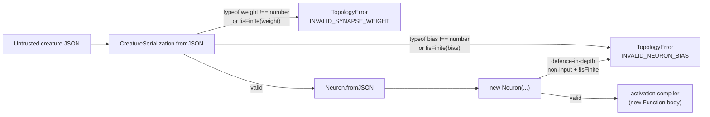

# security: reject non-finite `bias`/`weight` on default JSON-load path

## Summary

Closes #2704.

`Creature` activation compilers (`NeuronActivation.ts`,
`methods/activations/aggregate/IF.ts`, `MINIMUM.ts`, `MAXIMUM.ts`, and the
deprecated `HYPOT*` modules) build JavaScript source strings by
template-interpolating `neuron.bias` and synapse `weight` directly into
`new Function()` bodies. The default JSON-load path
(`CreatureSerialization.fromJSON` → `Neuron.fromJSON`) was previously only
clamping numeric `bias` / `weight` for runaway magnitudes (Issue #2378) and
passed through any value when `typeof` was not `"number"`. The strict validator
(`validateDNA`) is only invoked from `CRISPR.ts`, so the default load path
skipped it entirely.

A creature JSON crafted to include, for example,
`"bias": "0); maliciousJsCode(); //"` therefore flowed unvalidated into the
function compiler and would execute arbitrary JS on the next activation pass.

This change closes that gap by rejecting any non-finite `bias` or `weight` at
the top of the load path with a typed `TopologyError`, and adds the same
assertion inside the `Neuron` constructor as defence-in-depth so future call
sites cannot reintroduce the bug.



## Changes

- `src/errors/TopologyError.ts` — added `INVALID_NEURON_BIAS` and
  `INVALID_SYNAPSE_WEIGHT` reasons.
- `src/creature/CreatureSerialization.ts` — `loadFrom` now throws a
  `TopologyError` when a neuron's `bias` or a synapse's `weight` is not a finite
  number. The existing Issue #2378 magnitude clamp continues to run for in-range
  finite values.
- `src/architecture/Neuron.ts` — constructor asserts a finite `bias` for
  non-input neurons.
- `test/security/CreatureJsonInjection.ts` — regression tests reproducing the
  injection payloads described in the issue.
- `CHANGELOG.md` — Unreleased Security entry.

## Evidence

This is a backend/library change with no web surface — no screenshot is
applicable. Verification is via the new regression tests, which exercise the
load path with each documented attacker payload:

```
$ deno test -A --config ./deno.json test/security/CreatureJsonInjection.ts
running 9 tests from ./test/security/CreatureJsonInjection.ts
... ok | 9 passed | 0 failed
```

All adjacent existing suites continue to pass:

```
$ deno test -A --config ./deno.json \
    test/creature/CreatureSerialization.ts \
    test/creature/CreatureSerializationPolicy.ts \
    test/neuron/NeuronSerialization.ts \
    test/upgrade/HYPOT.ts test/upgrade/HYPOTv2.ts \
    test/upgrade/BreedWithSelfConnectionParent.ts \
    test/reconstruct/LegacyFormat.ts test/reconstruct/ConnectMissing.ts
... ok | 43 passed | 0 failed
```

## Test Plan

New tests in `test/security/CreatureJsonInjection.ts`:

- `CreatureSerialization.fromJSON rejects non-number bias (string injection payload)`
  — verifies the literal payload from the issue (`"0); maliciousJsCode(); //"`)
  throws `TopologyError`.
- `CreatureSerialization.fromJSON rejects non-number bias on output neuron` —
  same payload on an output neuron.
- `CreatureSerialization.fromJSON rejects NaN bias` and
  `... rejects Infinity bias` — non-finite numeric inputs are rejected, not
  silently clamped.
- `CreatureSerialization.fromJSON rejects non-number synapse weight (string injection payload)`
  — covers the synapse-weight surface (`"0; throw 1"`).
- `CreatureSerialization.fromJSON rejects NaN synapse weight`.
- `CreatureSerialization.fromJSON rejects missing bias on non-input neuron` and
  `... rejects missing weight on synapse` — `undefined` is rejected, closing the
  `json.bias ? json.bias : 0` truthy-fallback gap.
- `Neuron constructor rejects non-finite bias (defence in depth)` — exercises
  the constructor guard directly for `NaN` and a string payload, proving the
  defence-in-depth layer triggers independently of the load-path guard.

## Acceptance Criteria

- [x] Loading a creature JSON with `"bias": "0); 1+1; //"` throws a
      `TopologyError` from `CreatureSerialization.fromJSON`.
- [x] Loading a creature JSON with `"weight": "0; throw 1"` throws a
      `TopologyError`.
- [x] New tests under `test/security/CreatureJsonInjection.ts` are included in
      the default `deno test` run (`test/**/*.ts`).
- [x] `deno test -A --config ./deno.json` adjacent suites remain green.
