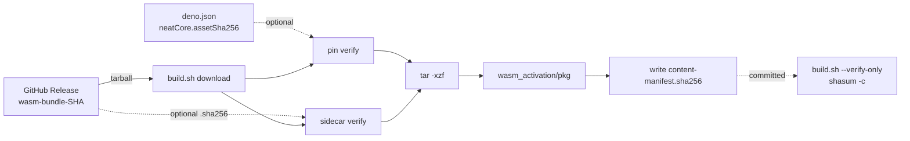

# security: verify content hash of downloaded WASM bundle

## Summary

`build.sh` now content-verifies the WASM tarball before extraction and records a
per-file content manifest that `--verify-only` re-checks on every run.
Previously the script only validated file presence, a minimum WASM size, and the
`neat_core_rev.txt` string it wrote itself — a compromised release asset on
NEAT-AI-core (or a MITM on the unauthenticated `releases/download/...` curl
fallback) would land malicious WASM in this repo and propagate to every JSR
consumer with no detection. Closes #2705.

Three independent guards layered on the existing pin-by-commit-SHA flow:

1. **`deno.json` pin** — optional `neatCore.assetSha256` (64-char SHA-256). When
   set, `build.sh` rehashes the downloaded `wasm_activation-pkg.tar.gz` and
   refuses to extract on mismatch. Reviewers can spot bundle-content changes in
   a single line of diff.
2. **Release sidecar** — if NEAT-AI-core publishes
   `wasm_activation-pkg.tar.gz.sha256` alongside the tarball, `build.sh` fetches
   it (gh first, curl fallback) and verifies the tarball against it.
3. **Per-file manifest** — `wasm_activation/pkg/content-manifest.sha256`
   (standard `shasum -a 256` format) is written after every successful download
   and committed with the rest of `pkg/**`. It's verified on every
   `./build.sh --verify-only` run (which `quality.sh` and CI invoke), so
   post-install tampering is detected without a network round-trip.

If neither sidecar nor pin is available `build.sh` still proceeds (the upstream
workflow may not yet publish a sidecar and the pin is empty on fresh setups) but
prints a clear `WARNING` so reviewers do not silently ship an unverified bundle.

## Evidence

This is a CLI / build-script change with no UI to screenshot. Verification is
provided by tests that drive the real `build.sh` (TDD — tests were written first
against `verify_tarball_sha256` and `--verify-only` and confirmed red before the
implementation landed):

```
running 9 tests from ./test/scripts/BuildScriptContentHash.ts
build.sh declares a content manifest file constant ............. ok
build.sh has tarball SHA-256 verification logic ................ ok
build.sh fails the tarball check on SHA-256 mismatch ........... ok
wasm_activation/pkg/content-manifest.sha256 is committed ....... ok
wasm_activation/pkg/.gitignore allows content-manifest.sha256 .. ok
build.sh --verify-only succeeds when bundle matches manifest ... ok
build.sh --verify-only fails when wasm_activation_bg.wasm is tampered ok
build.sh --verify-only fails when content-manifest.sha256 is missing ok
CORE_DEPENDENCY_POLICY documents the new content-hash step ..... ok
```



## Test Plan

- **New**: `test/scripts/BuildScriptContentHash.ts` — 9 tests covering helper
  unit behaviour (sub-shell sourcing of `verify_tarball_sha256`), manifest
  presence, gitignore allowlist, `--verify-only` success / tamper / missing
  manifest, and documentation.
- **Updated**: `test/scripts/BuildScriptRetry.ts` — the retry test now expects
  two `gh release download` invocations after probe success (tarball +
  best-effort sidecar). The change is documented inline so future readers
  understand the count comes from the supply-chain hardening, not a bug.
- **Unchanged but re-run**: `test/scripts/BuildScript.ts`,
  `test/scripts/BuildFingerprint.ts`, `test/scripts/CoreDependencyPolicy.ts`,
  `test/docs/JekyllLiquidSafety.ts`, `test/docs/DocsIndex.ts`,
  `test/scripts/BashScriptSyntax.ts` — all pass.
- `shellcheck build.sh` — clean.

## Acceptance criteria

- [x] `build.sh` fails fast when the downloaded tarball does not match the
      expected SHA-256 (`neatCore.assetSha256` and/or release sidecar).
- [x] `build.sh --verify-only` fails if
      `wasm_activation/pkg/wasm_activation_bg.wasm` does not match the recorded
      content hash (manifest mismatch).
- [x] The recorded content hash is committed alongside `wasm_activation/pkg/**`
      (`wasm_activation/pkg/content-manifest.sha256`).
- [x] `docs/CORE_DEPENDENCY_POLICY.md` describes the new checksum step.
