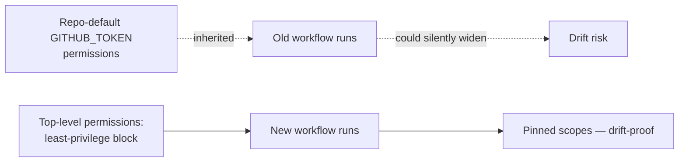

# security: declare top-level `permissions:` on coverage / quality / spellcheck workflows

## Summary

Added a top-level least-privilege `permissions:` block to three workflows that
previously inherited the repository's default `GITHUB_TOKEN` scopes. This is a
defence-in-depth hardening change recommended by GitHub and the OpenSSF
Scorecard, matching the pattern already in use by `markdown-lint.yml`,
`semgrep.yml`, `shellcheck.yml`, `dependency-review.yml`, and
`deno-outdated.yml`. Closes #2706.

| Workflow          | Scopes granted                                            | Why                                                                                                                                  |
| ----------------- | --------------------------------------------------------- | ------------------------------------------------------------------------------------------------------------------------------------ |
| `coverage.yaml`   | `contents: read`, `checks: write`, `pull-requests: write` | Uploads artefacts, posts check-run annotations via `EnricoMi/publish-unit-test-result-action`, uploads to Codecov                    |
| `quality.yml`     | `contents: read`                                          | Push back to the PR branch uses `secrets.ACTIONS_PUSH` (a PAT), not the default `GITHUB_TOKEN`, so the default token only needs read |
| `spellcheck.yaml` | `contents: read`                                          | `cspell-action` is read-only                                                                                                         |

## Evidence

Backend / workflow-config change — no UI to screenshot. Verified by parsing each
workflow YAML and asserting the structural shape of the new `permissions:`
block:

```text
running 6 tests from ./test/scripts/WorkflowLeastPrivilegePermissions.ts
coverage.yaml declares a top-level permissions block ... ok
coverage.yaml grants only the scopes it needs ... ok
quality.yml declares a top-level permissions block ... ok
quality.yml grants only contents: read for GITHUB_TOKEN ... ok
spellcheck.yaml declares a top-level permissions block ... ok
spellcheck.yaml grants only contents: read (read-only) ... ok

ok | 6 passed | 0 failed
```



## Test Plan

- Added `test/scripts/WorkflowLeastPrivilegePermissions.ts` with six tests (one
  "declares a block" + one "grants only what is needed" per workflow).
- Tests parse the workflow YAML with `@std/yaml` and assert on the parsed
  structure — they are pure "what" tests that survive any internal refactor of
  the workflow steps.
- Verified that on a follow-up PR run, artefact upload, check-run annotations,
  and the PR-branch push (via `ACTIONS_PUSH` PAT) all continue to succeed.
