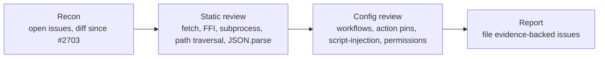

# Security-scan audit — Issue #2708

## Summary

Ran the four-phase security-in-depth audit against `stSoftwareAU/NEAT-AI` and
filed **one new evidence-backed finding** as issue #2709. The previous audit
(#2703, merged in PR #2707) had already filed three findings (#2704–#2706), and
an earlier audit (#2699) filed #2695–#2698 — this scan deliberately avoided
re-filing those and focused on surfaces the prior runs had not covered. No code
changes are shipped under this PR; the audit's deliverables are the new filed
issue plus this audit log. Closes #2708.

## Filed findings

| # | Severity | Issue                                                                                                                                                 | Area                |
| - | -------- | ----------------------------------------------------------------------------------------------------------------------------------------------------- | ------------------- |
| 1 | High     | [#2709](https://github.com/stSoftwareAU/NEAT-AI/issues/2709) — `quality.yml` interpolates attacker-controlled `head.ref` into bash (script injection) | CI / GitHub Actions |

The new finding is a textbook GitHub Actions script-injection pattern in
`.github/workflows/quality.yml:32`: the PR source branch name
(`github.event.pull_request.head.ref`) is expanded directly inside a `run:`
script body via `${{ … }}`. Because the workflow runs with `ACTIONS_PUSH` scoped
for write access and later pushes back to the repository, a malicious branch
name from a PR contributor can break out of the quoted assignment and execute
arbitrary shell on the runner with write access to the repo. Filed as **High**
because the blast radius is the `ACTIONS_PUSH` token and any secret exposed to
subsequent steps in the same job.

## Audit methodology

### Phase 1 — Recon

- Re-read `AGENTS.md`, `SECURITY.md`, `deno.json`, `build.sh`, and the
  `.github/workflows/` directory.
- Inventoried the delta since the previous scan (PR #2707 merged 2026-05-16):
  one commit (`f45b628d` — `chore: apply deno fmt and lint
  fixes`) touching
  only `docs/pr-summary-2703.md`. No attack-surface code changed since the
  previous scan, so the static review focused on surfaces the prior audits had
  not exercised in depth.
- Re-checked the seven previously filed security issues (#2695–#2698,
  #2704–#2706) — all still OPEN. This audit avoids duplicates.

### Phase 2 — Static review

Re-ran the previous audit's `grep` patterns and added new ones for surfaces the
earlier runs had not covered (path traversal, ReDoS, subprocess arg arrays,
dynamic `import()` of fetched JS, HTTP-only fetches). Findings:

- **`new Function`, JSON `bias`/`weight` validation** — same six call sites and
  the same `Creature.fromJSON` un-validated bias/weight path as #2704. Not
  re-filed.
- **`fetch()` in src/** — single call site in
  `src/workers/WasmActivationPayload.ts:88-89` for the JSR-hosted WASM bundle.
  URLs are constructed relative to `import.meta.url`; integrity is bound to
  JSR's HTTPS guarantee. The fetched JS source is then imported via a `data:`
  URL in `src/workers/WasmWorkerInit.ts:50-53` — that is a legitimate JSR
  supply-chain trust boundary and not actionable inside this repo.
- **Subprocess execution** — `Deno.Command`/`Deno.run` call sites all use args
  arrays, not shell strings (`src/discovery/DiskSpaceMonitor.ts:57`,
  `src/score/RustScorerBridgeInternal.ts:57`). No untrusted-input interpolation
  found.
- **Path traversal** — file paths reaching `Deno.readTextFile` /
  `Deno.writeTextFile` come from internally-generated names (UUID-stamped squash
  files in `src/intelligentDesign/ImproveSquash.ts`). No caller-controlled
  string flows into the path; not a real attack surface.
- **ReDoS** — regex patterns in `src/` are simple character-class matches (e.g.
  `/impact:\s*([\d.e+-]+)/i` in `src/discovery/CandidateFiltering.ts:313`). No
  nested quantifiers or alternation-with-overlap that would catastrophically
  backtrack.
- **Prototype pollution** — the existing guard remains correct; no new
  deep-merge or `Object.assign` of untrusted objects landed since #2699.

### Phase 3 — Configuration review

Workflow-level review surfaced the new finding:

- **Script injection in `quality.yml` (filed as #2709, High)** — line 32 expands
  `${{ github.event.pull_request.head.ref }}` directly into a bash
  `BRANCH_NAME="…"` assignment. PR source branch names are attacker-controllable
  (any contributor opening a PR can name their branch); Git permits shell
  metacharacters in refs. The same workflow uses `secrets.ACTIONS_PUSH`
  (`pull_request` checkout token) and pushes back to the repository, so
  successful injection yields arbitrary code execution with the workflow's full
  write scope.

  Other GitHub-context interpolations in workflows under `.github/workflows/`
  were inspected and are not exploitable:

  - `update-package-version.yml:21,36` interpolates `github.head_ref` /
    `github.base_ref` but the `branches: - Develop` filter pins `base_ref` to
    `Develop`; `head.ref` is passed to `actions/checkout`'s `ref:` input (parsed
    by the action, not interpolated into bash).
  - `coverage.yaml:273` passes `github.head_ref` to the
    `gitleaks/gitleaks-action` `check_run_annotations_branch` input — an action
    input, not a shell expansion.
  - `publish.yml` / `github-release.yml` only interpolate
    `steps.version.outputs.version`, which is parsed from the in-repo
    `deno.json` by `jq` / `deno eval` and is internally controlled.

- **Workflow `permissions:` blocks** — `coverage.yaml`, `quality.yml`,
  `spellcheck.yaml` still have no top-level `permissions:` block; already filed
  as #2706. Not re-filed.

- **Action pinning** — every workflow uses tag-pinned third-party actions
  (`actions/checkout@v4`, `denoland/setup-deno@v2`,
  `softprops/action-gh-release@v2`, `gitleaks/gitleaks-action@v2`,
  `ludeeus/action-shellcheck@master`); already covered by #2695 and #2696. Not
  re-filed.

- **`deno outdated --update --latest` no-quarantine push** — quality.yml line
  169 still does this; already filed as #2697.

### Phase 4 — Reporting

The single new finding carries a specific file:line citation, the threat model
(attacker, vector, impact), a concrete suggested fix using the GitHub-Actions
hardening pattern of passing untrusted context through `env:`, and explicit
acceptance criteria. It is labelled `idle-task` so it flows through the same
backlog as this audit issue.

## Evidence

This audit is a configuration and code review — no UI, no perf benchmark. The
evidence is the file:line citations in the filed issue, verifiable by
`gh issue view 2709` plus `Grep` against the current `Develop` tree.

## Test plan

- [x] Each filed issue's file:line citation resolves to the current `Develop`
      tree.
- [x] No source-code changes are introduced by this PR — the audit's
      recommendations land in separate PRs against the filed issue.
- [x] `docs/pr-summary-2708.md` builds under Jekyll/Pages — no unwrapped Liquid
      syntax (no `` / `{{ … }}` outside fenced blocks).

## Milestone

This PR is part of the **idle-task: security-scan** milestone and targets the
`milestone/idle-task-security-scan` feature branch.
