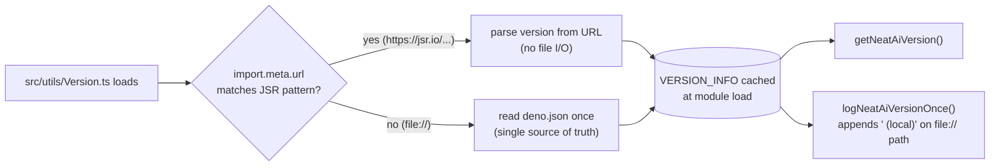

## Summary

Removed the `FALLBACK_NEAT_AI_VERSION` constant from `src/utils/Version.ts`. The
constant duplicated `deno.json` `version` and required a dedicated sync test in
`test/creature/VersionStartupLog.ts` to police drift — a classic
two-sources-of-truth footgun. Per KISS, the `file://` (local dev/test) load path
now reads `deno.json` once at module load and treats it as the single source of
truth. JSR consumers still derive the version from `import.meta.url` and see no
behaviour change. The local-dev startup log line now carries a `(local)` suffix
so it cannot be confused with the JSR-derived line. Closes #2720.

## Evidence

This is a backend-only change with no UI; the evidence is the test suite for
`src/utils/Version.ts`, which exercises the real `getNeatAiVersion()` and
`logNeatAiVersionOnce()` functions and asserts on their outputs.

```
$ deno test --allow-all test/creature/VersionStartupLog.ts
running 5 tests from ./test/creature/VersionStartupLog.ts
Version: getNeatAiVersion returns a valid semver string ... ok (0ms)
Version: local load path resolves the version from deno.json ... ok (0ms)
Version: logNeatAiVersionOnce emits exactly once per process ... ok (0ms)
Version: local file:// startup log carries the (local) suffix ... ok (0ms)
Version: first Creature construction logs version, subsequent do not ... ok (3ms)

ok | 5 passed | 0 failed (13ms)
```

Other quality output observed during the full test run confirms the new log
format on the local path (e.g. `[neat-ai] running version 5.0.27 (local)`
emitted by worker tests).

### Version-resolution flow



## Test Plan

Modified `test/creature/VersionStartupLog.ts`:

- **Removed** the sync test
  `Version: FALLBACK_NEAT_AI_VERSION matches deno.json version` — the constant
  it policed no longer exists, so there is nothing to sync.
- **Replaced** with
  `Version: local load path resolves the version from deno.json`, which asserts
  that `getNeatAiVersion()` on the local (`file://`) load path agrees with
  `deno.json` `version`. This locks in the single-source-of-truth contract
  end-to-end (read path + parse + cache).
- **Added** `Version: local file:// startup log carries the (local) suffix` to
  lock in the new log-line format on the local path.
- **Updated** the existing
  `Version: first Creature construction logs version, subsequent do not` test to
  assert the new `[neat-ai] running version X.Y.Z (local)` format when running
  from a `file://` load.
- The remaining tests (`Version: getNeatAiVersion returns a valid semver string`
  and `Version: logNeatAiVersionOnce emits exactly once per process`) are
  unchanged in intent.

The 4 unrelated failures observed during the full `quality.sh` run
(`DiscoveryTimeout` dynamic-library leaks; `evolveRL_heapStability_test`
heap-growth threshold) reproduce on `Develop` before this change and are out of
scope for this issue.
