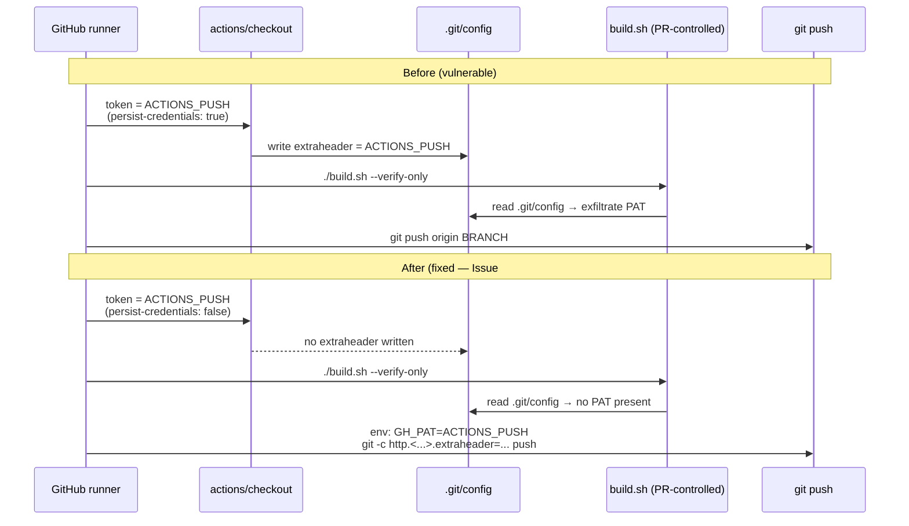

# Strip persisted PAT from PR-controlled workflow checkouts

## Summary

Fixes the PAT-exfiltration vector flagged in issue #2727. Closes #2727.

`.github/workflows/quality.yml` previously checked out the PR head with
`secrets.ACTIONS_PUSH` (a privileged PAT) and left
`actions/checkout`'s default `persist-credentials: true` in place. That
wrote the PAT into `.git/config` as an
`http.https://github.com/.extraheader = AUTHORIZATION: basic …` line for
the rest of the job. A later step then ran PR-controlled code
(`./build.sh --verify-only`), so any contributor able to open a same-repo
PR could read `.git/config` and exfiltrate the PAT.

The fix follows mitigation #1 from the issue (the most surgical option):

1. Add `persist-credentials: false` to the `Checkout Code` step in both
   `quality.yml` and `update-package-version.yml`.
2. Re-introduce the PAT only at push time via a per-command
   `git -c http.https://github.com/.extraheader=...` auth header, with
   the PAT passed through the step `env:` map (consistent with the
   #2709 hardening).

`update-package-version.yml` does not run any PR-controlled script
today, but is fixed pre-emptively so that adding a future step never
silently re-opens the exfiltration channel.

## Evidence

This is a workflow / configuration change with no UI or measurable
performance impact. Behaviour is verified by the test suite
`test/ci/WorkflowPersistCredentialsFalse.ts`, which parses both
workflow YAML files and asserts the required security properties:

- Every checkout that uses `secrets.ACTIONS_PUSH` must declare
  `persist-credentials: false`.
- Every `git push` step must re-introduce the PAT via the step `env:`
  map and use a per-command `http…extraheader` header (no
  `git remote set-url` with embedded credentials, no on-disk
  `.git/config` entry).

```text
running 4 tests from ./test/ci/WorkflowPersistCredentialsFalse.ts
.github/workflows/quality.yml checkout with ACTIONS_PUSH must set
  persist-credentials: false (Issue #2727) ... ok
.github/workflows/update-package-version.yml checkout with ACTIONS_PUSH
  must set persist-credentials: false (Issue #2727) ... ok
quality.yml push step re-introduces ACTIONS_PUSH via env
  (Issue #2727) ... ok
update-package-version.yml push step re-introduces ACTIONS_PUSH via env
  (Issue #2727) ... ok

ok | 4 passed | 0 failed
```

All 29 existing `test/ci/*.ts` tests continue to pass (including the
related Issue #2709 script-injection and #2706 least-privilege gates).

### Sequence: credential lifetime before vs after



## Test Plan

- Added `test/ci/WorkflowPersistCredentialsFalse.ts` with four cases
  pinning the security properties for both `quality.yml` and
  `update-package-version.yml` (checkout `persist-credentials: false`,
  push-time PAT re-introduction via per-command auth header).
- Re-ran the full `test/ci/` suite — 29/29 pass, no regressions in
  the #2709 (script injection) or #2706 (least-privilege) gates.
- `./quality.sh --lint-only` and `./quality.sh --check-only` both pass
  cleanly with the workflow edits.
