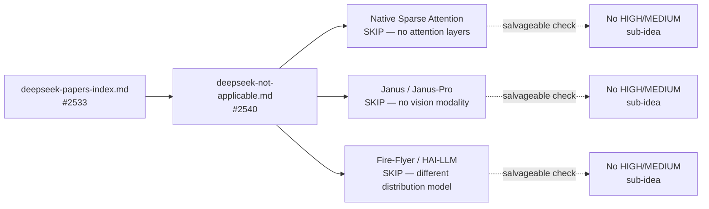

# DeepSeek Papers Not Applicable to NEAT-AI (Issue #2540)

This note is the single negative-results triage record for DeepSeek papers that
do **not** apply to NEAT-AI. It exists so that the next planning round does not
re-investigate these papers from scratch — recording NO-GO with a clear
rationale is itself valuable (see the `negative-result` label policy in the
project guidelines).

The papers covered here are flagged **SKIP** in
[`deepseek-papers-index.md`](deepseek-papers-index.md)
([#2533](https://github.com/stSoftwareAU/NEAT-AI/issues/2533)):

- **Native Sparse Attention (NSA)** — hardware-aligned sparse attention.
- **Janus / Janus-Pro** — decoupled visual encoding for multimodal generation.
- **Fire-Flyer / HAI-LLM** — HPC infrastructure for distributed LLM training.

> **Scope.** Documentation only. No source-code changes. Each entry below
> contains a one-paragraph technical summary, a one-paragraph NO-GO rationale,
> and an explicit "salvageable sub-ideas" check. Anything judged **HIGH** or
> **MEDIUM** applicability has been (or will be) escalated to its own research
> note via [#2533](https://github.com/stSoftwareAU/NEAT-AI/issues/2533) rather
> than buried here. None of the three papers in this round produced such a
> sub-idea.

## Why a single triage note?

The DeepSeek catalogue contains a long tail of papers whose techniques are
specific to transformer attention, multimodal token streams, or ten-thousand-GPU
training fabrics. NEAT-AI is a neuro-evolution library that breeds small
forward-only feed-forward creatures across roughly twenty independent worker
machines that share state via GitHub. A paper whose entire contribution is a
clever attention pattern, a vision-token encoder, or an AllReduce schedule has
no native surface in our system.

Recording these as NO-GO with rationale prevents the same dead-end investigation
from being re-run in every planning cycle, and forces an explicit "is there a
salvageable sub-idea?" question for each — caught early if there is, dismissed
cleanly if there is not.

## 1. Native Sparse Attention (NSA) — **SKIP**

**Technical summary.** NSA (DeepSeek-AI, _Native Sparse Attention:
Hardware-Aligned and Natively Trainable Sparse Attention_, February 2025,
[arXiv:2502.11089](https://arxiv.org/abs/2502.11089)) introduces a block-sparse
attention pattern that is co-designed with GPU memory-access patterns and is
trainable end-to-end (rather than retrofitted onto a dense pre-trained model).
The mechanism uses two co-operating branches — a **compression** branch that
produces coarse-grained block summaries, and a **selection** branch that picks
the small set of query/key blocks whose dense attention is actually computed.
Together they keep wall-clock attention cost roughly linear in sequence length
while retaining the accuracy of dense attention at long context, all without any
post-hoc kernel surgery.

**Rationale (NO-GO).** NEAT-AI has no attention layers. Creatures are
forward-only feed-forward networks evolved by topology mutation; "sparsity" in
our setting is the natural sparsity of an evolved graph (most pairs of neurons
have no synapse), not a dynamic sparsity pattern over a fully-connected matrix.
There is no query-key-value mechanism to gate, no sequence dimension to block,
and no KV cache to compress. NSA's two branches have nothing to attach to in our
pipeline. Recording SKIP here so this paper is not re-investigated in future
planning rounds.

**Salvageable sub-ideas check.**

- _Hardware-aligned sparse-kernel design._ NSA's design discipline — write the
  kernel and the algorithm together so the access pattern matches the device —
  is generic engineering hygiene, not a NEAT-AI-specific idea. Our WASM
  activation path and the Rust discovery scorer already follow this in spirit
  (cache-friendly traversal, contiguous storage of `connections`). No new
  research note is warranted.
- _Sparse activation patterns from selection + compression branches._ The branch
  decomposition is meaningful for attention (where the matrix exists to be
  sparsified). For an evolved feed-forward graph, the structural sparsity is the
  topology, and there is no separate dense baseline to decompose. No applicable
  sub-idea.
- _Trainable-end-to-end sparsity._ NEAT-AI's structural sparsity is already
  trainable end-to-end via mutation/breeding plus local backprop on the retained
  synapses. The lesson "do not graft a non-differentiable sparsifier on top of a
  trained dense model" we already follow by construction — no new note required.

**Outcome.** No HIGH or MEDIUM sub-idea identified. Nothing to escalate.

## 2. Janus / Janus-Pro — **SKIP**

**Technical summary.** Janus (DeepSeek-AI, _Janus: Decoupling Visual Encoding
for Unified Multimodal Understanding and Generation_, October 2024,
[arXiv:2410.13848](https://arxiv.org/abs/2410.13848)) and its successor
Janus-Pro (_Janus-Pro: Unified Multimodal Understanding and Generation with Data
and Model Scaling_, January 2025,
[arXiv:2501.17811](https://arxiv.org/abs/2501.17811)) decouple the image encoder
used for visual **understanding** (a discriminative encoder feeding the
autoregressive backbone) from the encoder used for visual **generation** (a
tokeniser whose codebook the autoregressive head can emit). A single
language-model-style backbone consumes both encoders' outputs, so the model can
both interpret images and generate them while each modality keeps a
representation tuned to its own task. Janus-Pro then scales the recipe with
cleaner data and larger backbones.

**Rationale (NO-GO).** NEAT-AI has no vision modality and no autoregressive
backbone. It is a numeric feed-forward neural network library — creatures take a
fixed-shape numeric input vector and produce a fixed-shape numeric output
vector. There is no token stream, no tokeniser, no image encoder, and no
generative head to drive from a discrete codebook. The decoupled-encoder
contribution requires (a) two distinct modalities and (b) a shared
autoregressive consumer; we have neither. Recording SKIP so the paper is not
re-investigated as a generic "dual-encoder topology" candidate in future rounds.

**Salvageable sub-ideas check.**

- _Dual-encoder topology for paired-input creatures._ One could imagine a
  creature whose two halves consume different input subvectors with different
  topology constraints, then merge into a shared output head. This is already
  trivially expressible via existing speciation and structural mutation —
  Janus's contribution is the decoupling _within an autoregressive LM_, which
  has no analogue here. The "two heads, one body" motif is a generic NN design,
  not a Janus idea. No HIGH/MEDIUM sub-idea worth its own note.
- _Modality-specific data pipelines._ NEAT-AI's analogue of "data pipeline" is
  the fitness-evaluation harness, which already accepts arbitrary
  problem-specific input adapters. Nothing to import.
- _Generation vs. understanding split._ NEAT-AI does not generate; the only
  output is a forward-pass numeric vector. The split has nothing to attach to.

**Outcome.** No HIGH or MEDIUM sub-idea identified. Nothing to escalate.

## 3. Fire-Flyer / HAI-LLM — **SKIP**

**Technical summary.** Fire-Flyer / HAI-LLM (DeepSeek-AI, _Fire-Flyer AI-HPC: A
Cost-Effective Software-Hardware Co-Design for Deep Learning_, August 2024,
[arXiv:2408.14158](https://arxiv.org/abs/2408.14158)) describes the co-designed
cluster, scheduler, and communication library DeepSeek built to train
V2/V3-class models cost-effectively on commodity hardware. The contributions are
largely operational: a cluster topology tuned for deep learning's
collective-communication patterns, a custom AllReduce implementation (HFReduce),
training-job scheduling under hardware faults, and engineering disciplines for
keeping a multi-thousand-GPU training run alive end-to-end at substantially
lower cost-per-FLOP than rented cloud clusters.

**Rationale (NO-GO).** NEAT-AI's distribution model is not a tightly-coupled
AllReduce fabric. It is roughly twenty independent worker machines that breed
creatures locally and exchange state via GitHub-as-shared-population (creatures
pushed/pulled as JSON, discovery cache as a separate artefact). The bottlenecks
Fire-Flyer optimises — collective-communication bandwidth, synchronous-step
stragglers, NCCL topology fit — do not exist in our loosely-coupled fleet. The
bottlenecks we _do_ have (GitHub API rate limiting, CRISPR-injection conflict
resolution, discovery-cache freshness, worker quality-gate stability) are
operational concerns of an entirely different shape. Recording SKIP so HAI-LLM
is not re-investigated as a generic distributed-training reference in future
rounds.

**Salvageable sub-ideas check.**

- _Checkpoint sharding and fault-tolerance discipline._ The general lesson —
  "design for worker death; assume it will happen" — is sound, and the worker
  fleet already follows it (each worker quits cleanly on errors and is restarted
  by the scheduler; creature state is durable in the GitHub-as-population
  store). The Fire-Flyer-specific mechanisms (sharded-tensor checkpoints,
  NCCL-aware restart) do not apply because we have no sharded tensor and no
  NCCL. The applicable lesson is already internalised in the worker design; no
  follow-up research note is needed.
- _Cost-per-FLOP optimisation via co-designed software/hardware._ NEAT-AI's cost
  surface is dominated by GitHub API quotas, discovery scorer wall time, and
  quality-gate runtime — not FLOPs. The Fire-Flyer methodology ("co-design the
  kernel and the cluster") does not transfer to a fleet whose work unit is a CI
  run.
- _Operational checklists for long-running training._ The paper's operational
  discipline (continuous health monitoring, automatic preemption-recovery,
  lifetime-of-run logging) is good practice we already exercise via the worker
  fleet's monitoring and the existing planning-loop hygiene. Re-deriving it from
  Fire-Flyer would not produce new actionable output.

**Outcome.** No HIGH or MEDIUM sub-idea identified. Nothing to escalate.

## Cross-cutting note: when to revisit

This note is the durable record of "we looked at these and they do not apply." A
future change that creates a relevant surface would be the trigger to re-open
one of these entries — for example:

- _NSA._ If NEAT-AI ever grows an attention layer or autoregressive inference
  path (none currently planned), NSA returns to the candidate list; until then,
  it stays SKIP.
- _Janus / Janus-Pro._ If NEAT-AI ever ingests a non-numeric modality (e.g. raw
  audio, image, or text tokens) as a first-class input type, the
  decoupled-encoder idea becomes worth re-reading; until then, it stays SKIP.
- _Fire-Flyer._ If the worker fleet ever switches to a tightly-coupled
  multi-machine training run with collective communication, HAI-LLM's AllReduce
  and scheduler designs become worth re-reading; until then, it stays SKIP.

In each case the trigger is a NEAT-AI surface change, not a new DeepSeek paper.
Re-opening one of these entries should produce a fresh research note under
[#2533](https://github.com/stSoftwareAU/NEAT-AI/issues/2533); this file should
not be retroactively edited to flip a SKIP into a GO without a visible change in
the surrounding system.

## Cross-references

- [`deepseek-papers-index.md`](deepseek-papers-index.md)
  ([#2533](https://github.com/stSoftwareAU/NEAT-AI/issues/2533)) — the
  catalogue. Each of the three SKIP entries above links here.
- [`deepseek-v3-applicability.md`](deepseek-v3-applicability.md)
  ([#2536](https://github.com/stSoftwareAU/NEAT-AI/issues/2536)) — V3 is the
  positive counterpart to NSA in the same DeepSeek release window; cited for
  contrast.
- [`deepseek-moe-applicability.md`](deepseek-moe-applicability.md)
  ([#2535](https://github.com/stSoftwareAU/NEAT-AI/issues/2535)) — MoE/V2's MLA
  section explains the same "no attention surface in NEAT-AI" stance that the
  NSA entry above takes; the two notes deliberately overlap on that point and
  cross-reference each other.

## What this note does not do

- It does not propose any code changes. It is documentation only.
- It does not catalogue _every_ technique in each paper — only the headline
  contributions and any plausibly-portable sub-idea. If a future reader spots a
  sub-idea this note overlooked, the right response is to raise a follow-up
  research issue under
  [#2533](https://github.com/stSoftwareAU/NEAT-AI/issues/2533), not to retrofit
  it here.
- It does not replace the index entries. The
  [`deepseek-papers-index.md`](deepseek-papers-index.md) catalogue remains the
  navigation hub; this note is the depth resource for the SKIP classifications
  it issues.
