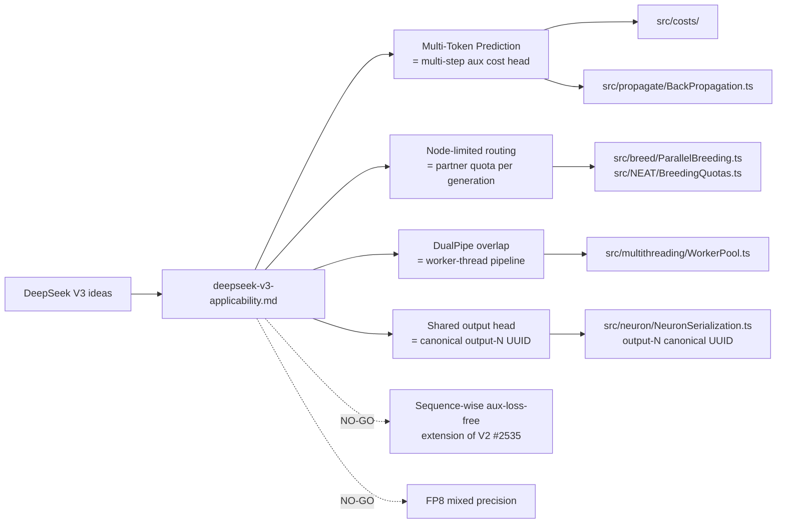

# DeepSeek V3 Applicability to NEAT-AI (Issue #2536)

This research note maps each notable DeepSeek V3 technique onto NEAT-AI's
existing architecture (memetic evolution, MCMC acceptance, speciation, breeding,
backprop, multi-threading) and records a GO / NO-GO recommendation with a
one-paragraph rationale per item. It complements the V4 note (#2526) and the
MoE/V2 note (#2535), and is the foundation document for any experimental
sub-issues spawned from #2536.

> **Source.** DeepSeek-AI, _DeepSeek-V3 Technical Report_, December 2024.
> [`arXiv:2412.19437`](https://arxiv.org/abs/2412.19437). Citations below use
> the form _(V3 §x.y)_ and refer to that PDF.
>
> **Scope.** Documentation only. No source-code changes. Each GO recommendation
> is paired with a proposed experimental sub-issue title and outline; this note
> does not pre-empt those experiments.
>
> **Prior art.** V2-introduced auxiliary-loss-free expert balancing is covered
> in the MoE note (#2535). This note focuses on what V3 adds **on top of V2** so
> the reader knows which paper introduced what.

## Summary table

| # | V3 idea                                                 | Closest NEAT-AI surface                              | Recommendation | Effort | Proposed sub-issue title                                                        |
| - | ------------------------------------------------------- | ---------------------------------------------------- | -------------- | ------ | ------------------------------------------------------------------------------- |
| 1 | Multi-Token Prediction (MTP)                            | `src/costs/`, `src/propagate/BackPropagation.ts`     | **GO**         | M      | "MTP-style multi-step auxiliary cost head for sequence/regression creatures"    |
| 2 | Node-limited routing                                    | `src/breed/ParallelBreeding.ts`, `BreedingQuotas.ts` | **GO**         | S      | "Per-generation cross-species partner quota (node-limited cross-breeding)"      |
| 3 | Sequence-wise auxiliary-loss-free balancing (V3 add-on) | `src/NEAT/Species.ts`, `Genus.ts`                    | **NO-GO**      | M      | —                                                                               |
| 4 | FP8 mixed-precision training                            | `src/propagate/`, `wasm_activation/pkg/`             | **NO-GO**      | L      | —                                                                               |
| 5 | DualPipe (overlapping compute & communication)          | `src/multithreading/WorkerPool.ts`                   | **GO**         | M      | "Overlap backprop and discovery dispatch on the same creature (DualPipe-style)" |
| 6 | Shared-output-head ensemble                             | Canonical `output-N` UUIDs                           | **GO** (audit) | S      | "Audit shared `output-N` UUID identity across MTP-style ensemble heads"         |

## Idea → Module mapping diagram

## 1. Multi-Token Prediction (MTP) — **GO**

**Technical summary.** MTP (V3 §2.2) augments next-token prediction with an
auxiliary objective that predicts the next _D_ tokens jointly during training.
Each future-step head shares a backbone with the primary head; the aggregate
loss is the primary cross-entropy plus a weighted sum of the _D-1_ auxiliary
cross-entropies. The win is denser supervisory signal per training step and a
modest measured improvement on standard benchmarks. At inference, the auxiliary
heads are dropped (or repurposed for speculative decoding) — they exist purely
to enrich the gradient.

**Closest NEAT-AI surface.** The cost surface
([`src/costs/CostInterface.ts`](../../src/costs/CostInterface.ts) and concrete
costs MAE/MSE/MSLE/MAPE/CrossEntropy/HINGE) currently provides a single scalar
loss against a single target vector. Backprop in
[`src/propagate/BackPropagation.ts`](../../src/propagate/BackPropagation.ts)
runs one local gradient pass per training row.

**Rationale (GO).** For sequence and regression problems with multi-step
horizons, training each creature to also predict t+2, t+3 in parallel as an
auxiliary cost head gives the same denser supervision benefit MTP does for
language models, without changing the forward-only creature topology. The
existing canonical `output-N` UUID scheme (see §6 below) means a creature can
expose K logical output channels and the trainer can ask the dataset for K
shifted target columns; the auxiliary contributions are weighted into the same
scalar loss the existing cost interface returns. The experiment in the proposed
sub-issue will measure whether the auxiliary signal accelerates per-iteration
error decay on regression benchmarks where multi-step targets are available.

**Risk.** Low for the UUID invariant (no new neuron rewrites), and low for
`semanticVersion` (training does not change the version field). The principal
risk is **target-column availability** — many existing datasets have only a
single target horizon, so the experiment must be gated on dataset shape and must
default off. A second risk is loss-weighting pathology: if the auxiliary weights
are too high, primary-target accuracy degrades; the experiment must sweep
auxiliary-loss weight and report primary-only metrics.

**Effort.** **M.** New `MultiTargetCostInterface` extension, plumbing through
the per-row training loop, and a target-column adapter for `DataSet.ts`.

**Proposed experimental sub-issue.** _"MTP-style multi-step auxiliary cost head
for sequence/regression creatures"_ — implement an opt-in auxiliary-target cost
wrapper, sweep auxiliary weight ∈ {0.05, 0.1, 0.2, 0.5}, and report
primary-target error and convergence-iteration count on the standard ED-fold
benchmarks. Acceptance gates on a measurable improvement in primary-target error
per iteration with auxiliary weight ≤ 0.5.

## 2. Node-limited routing — **GO**

**Technical summary.** Node-limited routing (V3 §2.1.2) restricts each input
token to route to at most _M_ nodes (devices) per step, where typically _M_ ≪
total experts. The constraint bounds cross-device communication during MoE
training and inference, trading a small accuracy delta for a large
communication-cost reduction.

**Closest NEAT-AI surface.** Cross-species breeding in
[`src/breed/ParallelBreeding.ts`](../../src/breed/ParallelBreeding.ts) and the
quota machinery in
[`src/NEAT/BreedingQuotas.ts`](../../src/NEAT/BreedingQuotas.ts) already enforce
**how many** offspring each species produces per generation; what is missing is
a budget on **how many distinct partner species** each species can pair with per
generation.

**Rationale (GO).** Mapping V3's per-token node budget onto NEAT-AI's
per-generation breeding budget is direct: cap the number of partner species a
given species may breed across in a single generation at _M_. This bounds the
fan-out of cross-species breeding (which is the noisiest crossover path in
NEAT-AI) and gives the population a stable, configurable "communication
diameter" without losing the long-range diversity benefit cross-species breeding
provides. The experiment will measure species count, Shannon diversity, and
best-fitness convergence under _M_ ∈ {1, 2, 4, ∞} (∞ being the current
behaviour).

**Risk.** Low. UUIDs and semantic versions are not touched — this is a quota,
not a topology change. The realistic risk is **diversity collapse** when _M_ is
too small: the experiment must report Shannon diversity time series and
species-count time series alongside fitness, not fitness alone.

**Effort.** **S.** Quota table extension and a counter in the parallel-breeding
loop.

**Proposed experimental sub-issue.** _"Per-generation cross-species partner
quota (node-limited cross-breeding)"_ — add a `maxCrossSpeciesPartnersPerGen`
config knob (default ∞), sweep _M_ ∈ {1, 2, 4, ∞}, and compare fitness and
diversity trajectories across 50 generations on the standard ED-fold harness.
Acceptance gates on diversity preservation at _M_ = 4 within 5 % of the _M_ = ∞
baseline while reducing total breeding work by ≥ 25 %.

## 3. Sequence-wise auxiliary-loss-free balancing — **NO-GO**

**Technical summary.** V3 (§2.1.3) extends the V2 auxiliary-loss-free balancing
mechanism by adding a **sequence-level** rebalancing layer on top of V2's
**expert-level** bias-only correction. V2 nudges the routing bias for each
expert based on **its** running selection rate; V3 additionally tracks the
distribution **across an entire input sequence** and applies a small extra
correction so that no single sequence is monopolised by a small subset of
experts. The expert-level mechanism is doing most of the work; the sequence-
level addition is reported in V3 as a small, measurable accuracy boost.

**What V3 adds beyond V2.** V2 = per-expert bias correction (covered in #2535).
V3 = same plus per-sequence rebalancing, applied at a different time scale (per
sequence rather than per training step).

**Closest NEAT-AI surface.** [`src/NEAT/Species.ts`](../../src/NEAT/Species.ts)
and [`src/NEAT/Genus.ts`](../../src/NEAT/Genus.ts), where #2535's V2 expert-
level bias-only correction would land.

**Rationale (NO-GO).** NEAT-AI does not have a "sequence" abstraction. The V2
expert-level mechanism maps onto species selection rates, which is a useful and
well-defined target (#2535). The V3 sequence-level addition presupposes a
contiguous run of correlated routing decisions inside a single training example
— there is no analogue to that in NEAT-AI's per-row training loop or in its
breeding step (each breeding event is independent and has no sequential
neighbour). Forcing one would require inventing a synthetic "sequence" (e.g. a
mini-batch of training rows) and then proving that mini-batch correlations
matter, which is speculative without prior evidence. Revisit only if NEAT-AI
adopts mini-batch training where intra-batch correlations are observed to skew
species-selection.

**Risk.** N/A (not adopted).

**Effort.** **M** if pursued; would need a synthetic sequence definition plus a
counter on top of #2535's bias-correction work.

## 4. FP8 mixed-precision training — **NO-GO**

**Technical summary.** V3 (§3.3) trains with FP8 weights and activations using
fine-grained tile-wise scaling and fallback FP32 accumulation for sensitive ops.
The win is roughly 2× memory bandwidth and 1.5–2× throughput on hardware with
native FP8 matmul (NVIDIA Hopper / Blackwell). The cost is quantisation-aware
engineering (per-channel scales, stochastic rounding, sensitivity profiling).

**Closest NEAT-AI surface.**
[`src/propagate/BackPropagation.ts`](../../src/propagate/BackPropagation.ts)
weights are FP64 (TypeScript `number`); WASM-side activation buffers are FP32 or
FP64 depending on path.

**WASM toolchain check.** The vendored runtime under `wasm_activation/pkg/`
exposes `Float32Array` / `Float64Array` import/export typed-array bridges only.
There is no FP8 type in the WebAssembly core spec (the WASM SIMD proposal covers
`i8x16` / `f32x4` / `f64x2`), and no FP8 backend is exposed from NEAT-AI-core at
the pinned rev. A grep over the vendored runtime confirms no FP8 path is
present. This matches the V4 note's earlier dismissal (#2526).

**Rationale (NO-GO).** Two independent reasons: **(a) scale** — NEAT-AI
populations are typically hundreds-to-thousands of small networks, and per-
creature memory is dwarfed by per-creature bookkeeping (UUID strings, mutation
history, discovery cache entries); **(b) toolchain** — WASM has no native FP8
type, NEAT-AI-core does not expose one at the pinned rev, and emulating FP8 with
int8 storage plus per-channel scales would pay the quantisation tax (per-neuron
scale tracking, stochastic-round RNG state) without recovering it on small
genomes. Revisit only if (i) WASM gains an FP8 type, **and** (ii) a
single-creature regime emerges where one frozen genome dominates RAM (e.g. a
distilled generalist served at scale).

**Risk.** N/A (not adopted).

**Effort.** **L** if pursued; would need a parity-gate workstream in
NEAT-AI-core (per `docs/PARITY_GATE.md`) before any TS-side changes.

## 5. DualPipe — overlapping compute & communication — **GO**

**Technical summary.** DualPipe (V3 §3.2.2) is a parallel-pipeline schedule in
which forward and backward passes for adjacent micro-batches are **interleaved
across pipeline stages** so that compute on stage _i_ overlaps with
communication between stages _i_ and _i+1_. The win is reduced pipeline-bubble
time at large pipeline-depth × micro-batch counts.

**Closest NEAT-AI surface.**
[`src/multithreading/WorkerPool.ts`](../../src/multithreading/WorkerPool.ts) and
the workers under `src/multithreading/workers/` already split per-creature work
(activation, scoring, backprop, discovery dispatch) across worker threads. Today
these are serialised per creature: backprop completes, then discovery is
dispatched.

**Rationale (GO).** The DualPipe principle — overlap **compute** with
**communication** — applies cleanly to NEAT-AI's worker-thread model: while
backprop runs on a creature's incoming-weight matrices, the orchestrator can
already prepare the **discovery rustRequest** payload (UUID-only wire format per
AGENTS.md "Discovery/cache/FFI wire contract"), serialise it, and ship it to the
discovery worker so that when backprop completes the discovery hint is already
in flight. The gain is wall-clock latency per creature, which compounds across
the population. The proposed sub-issue is a benchmark-first task per the
Performance Task Workflow: instrument the per-creature pipeline, measure
backprop / discovery / serialisation wall-clock components, and only adopt the
overlap if the measured saving is ≥ 10 % of total per-creature cost.

**Risk.** Low for UUIDs / semver — no creature topology change. Higher for
**concurrency hazards**: if the discovery payload references intermediate
backprop state (e.g. running gradient norms), the overlap would race; the
experiment must enumerate the payload's data dependencies and prove the overlap
is sound before measuring speedup. See AGENTS.md "Discovery/cache/FFI wire
contract" — payloads must be UUID-only, and any runtime-integer-id resolution
must happen at the last internal step, **after** backprop has released the
integer-id table.

**Effort.** **M.** Per-creature pipeline instrumentation (a benchmark in
`bench/`), a feature-flagged overlap implementation in `WorkerPool.ts`, and a
tighter wire-format check on the discovery payload.

**Proposed experimental sub-issue.** _"Overlap backprop and discovery dispatch
on the same creature (DualPipe-style)"_ — instrument first, implement only if
the measured saving is ≥ 10 % of per-creature wall-clock; report before/after
benchmark numbers in the PR per the Performance Task Workflow.

## 6. Shared-output-head ensemble — **GO** (audit-only)

**Technical summary.** V3 (§2.2) shares the **output projection** across MTP
heads — i.e. the final linear layer that produces logits is shared between the
primary next-token head and the auxiliary _D-1_ future-token heads. The benefit
is parameter sharing and consistent output-distribution geometry across the
auxiliary heads.

**Closest NEAT-AI surface.** Canonical output-neuron identity in
[`src/neuron/NeuronSerialization.ts`](../../src/neuron/NeuronSerialization.ts):
output neurons are addressed by the canonical wire UUID `output-N` (where N is
the output index). This identity is shared **across all creatures** in a
population by construction — every creature's _N_-th output neuron carries the
same `output-N` wire UUID, regardless of which species or generation it
originated from.

**Rationale (GO — audit-only).** The shared-output-head property V3 needs is
**already true** in NEAT-AI by virtue of the canonical `output-N` UUID contract.
Two creatures' _N_-th output channels are aligned by UUID at every boundary that
matters (export JSON, breeding, discovery FFI). The "GO" here is therefore not
an experimental sub-issue that adds new behaviour — it is a **confirmation
audit** that should be folded into the MTP sub-issue (§1) so that, when
MTP-style auxiliary heads are introduced, the audit explicitly verifies that the
auxiliary heads continue to use canonical `output-N` UUIDs for cross-creature
alignment and do **not** mint fresh UUIDs per head per creature.

**Risk.** Low — this is the existing invariant. The risk is **regression**: if
the MTP experiment accidentally mints a new UUID per auxiliary head, breeding
across machines would fail to align auxiliary outputs. The audit test must fail
loudly in that case.

**Effort.** **S.** A single audit test under `test/neuron/` that builds two
sibling creatures, exposes _D_ output channels each, and asserts that the _N_-th
channel carries the same `output-N` wire UUID across both. Folded into the MTP
sub-issue's test plan.

**Proposed experimental sub-issue.** _"Audit shared `output-N` UUID identity
across MTP-style ensemble heads"_ — folded into the MTP sub-issue (§1) as a
test-only acceptance gate; not a standalone experiment.

## Cross-cutting invariants

Every GO recommendation has been screened against the two critical invariants in
AGENTS.md:

- **Neuron UUID stability.** None of the GO experiments rewrite an existing
  neuron's UUID. MTP (§1) reuses the canonical `output-N` UUID; node-limited
  routing (§2) is a quota and does not touch topology; DualPipe (§5) is a
  scheduling change; the shared-output-head audit (§6) is the existing
  invariant.
- **Semantic version immutability.** None of the GO experiments add a pipeline
  step that re-bumps `semanticVersion`. Training loop changes, quota changes,
  and worker-pool scheduling changes do not interact with the version field.

Every payload that crosses a process, machine, disk, cache, or FFI boundary in
the experiments above must continue to use **UUID-only wire formats** (per
AGENTS.md "Discovery/cache/FFI wire contract"). The DualPipe overlap (§5) is the
most likely place to slip on this rule and so its sub-issue must include a
wire-format test that asserts no runtime integer ids appear in the discovery
payload.

## Differences vs the V2 / MoE note (#2535)

For the reader switching between notes:

- **V2 (#2535) introduces** auxiliary-loss-free expert balancing at the **expert
  level** (per-expert bias-only routing correction) and fine-grained
  - shared experts.
- **V3 (this note) introduces** Multi-Token Prediction, FP8 mixed-precision
  training, node-limited routing, DualPipe pipeline overlap, and shared
  output-head MTP ensembles. V3 also **extends** V2's aux-loss-free balancing
  with a **sequence-level** correction (§3 here, **NO-GO**); the expert-level V2
  mechanism is the part that maps cleanly onto NEAT-AI speciation and is owned
  by #2535.

When a sub-issue cites "aux-loss-free balancing" without qualification, it means
the V2 expert-level mechanism owned by #2535. The V3 sequence-level extension is
explicitly out of scope.

## What this note does not do

- It does not prescribe implementation — each GO experiment owns its own design
  in its sub-issue.
- It does not commit to merging any experiment to `Develop`. Sub-issues must
  produce benchmark evidence (per the Performance Task Workflow in AGENTS.md)
  before adoption.
- It does not re-open V3 ideas marked NO-GO. If circumstances change (e.g. WASM
  gains an FP8 type, or NEAT-AI adopts mini-batch training where intra- batch
  correlations skew species selection), open a new follow-up issue rather than
  re-litigating here.
