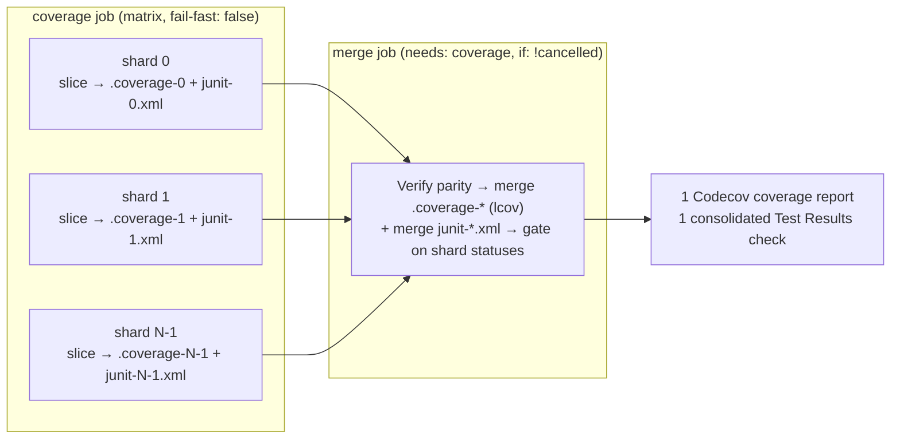

# 🔄 CI / quality.sh Troubleshooting

This document covers CI (Continuous Integration) and local quality-gate
failures: the `coverage.yaml` workflow's shard matrix + per-shard retry
strategy, exit-code meanings, and `quality.sh` step-by-step. See the index in
[`../TROUBLESHOOTING.md`](../TROUBLESHOOTING.md) for other categories.

## 📋 Understanding coverage.yaml

The CI workflow (`coverage.yaml`) runs the ~1k-file suite as a **parallel shard
matrix** to cut wall-clock time (Issue #3173). `deno test` has no native
`--shard` flag, so
[`scripts/shard_test_files.ts`](../../scripts/shard_test_files.ts) partitions
the sorted `test/**/*.ts` list round-robin across `SHARD_TOTAL` shards — shard
`s` runs every file whose sorted index `i` satisfies `i % SHARD_TOTAL === s`, so
every file runs on exactly one shard (no gaps, no double-runs).

**Per shard:** each matrix job sizes the V8 heap / parallelism to the runner,
runs its slice, and — if the runner OOM-kills the run — retries once
single-threaded with a halved heap. Each shard uploads its partial
`.coverage-<shard>` dir, `junit-<shard>.xml`, and a `shard-status-<shard>.txt`
marker; test _failures_ never fail the shard job (the merge job gates the
build), so every shard always publishes its results.

Resource allocation on the first attempt:

- 8+ cores and 8+ GB RAM: 70% memory, parallel enabled
- 4+ cores and 4+ GB RAM: 60% memory, parallel enabled
- Under 4 cores or 4 GB: 50% memory, no parallelism

**Merge job:** re-verifies partition parity, merges the partial coverage dirs
into one `.coverage.lcov` via `deno coverage`, merges the per-shard JUnit
reports into a single `junit.xml` via
[`scripts/merge_junit.ts`](../../scripts/merge_junit.ts), publishes one
consolidated Test Results check + Codecov upload, then fails the build if any
shard reported test failures (`failed`) or a runner crash (`error`/missing
status).

**Per-shard exit code meanings:**

| Exit Code   | Meaning           | Shard Action                           |
| ----------- | ----------------- | -------------------------------------- |
| 0           | All tests passed  | Marker `passed`                        |
| 1           | Test failures     | Marker `failed`; merge job fails build |
| 143/137/134 | OOM kill / signal | Retry once with lower memory           |
| Other       | Unexpected error  | Marker `error`; merge job fails build  |

**Tuning shard count:** set the workflow-level `SHARD_TOTAL` env **and** the
`coverage` job's `strategy.matrix.shard` list to the same value —
`test/ci/CoverageShardMatrix.ts` fails CI if they diverge.

## 🔧 quality.sh failures

The `quality.sh` script runs these steps in order:

1. `deno outdated --update --latest` — Update dependencies
2. `deno fmt` — Format code
3. `deno lint --fix` — Lint with auto-fix
4. Bash syntax check — Validates `.sh` files
5. Discovery library check — Validates Rust library availability
6. `deno check` — Type-check
7. `deno test` — Run all tests with leak detection

If discovery checks fail with exit codes 137 or 9 (segfault), the script
provides diagnostic guidance. See
[Discovery troubleshooting → Architecture mismatch](DISCOVERY.md#-architecture-mismatch-errors-arm64-vs-x86).

## See also

- [Memory troubleshooting](MEMORY.md) — for the OOM retry logic referenced
  above.
- [Discovery troubleshooting](DISCOVERY.md) — segfault / exit-code-137 diagnosis
  when the discovery library is broken.
- [`../../CONTRIBUTING.md`](../../CONTRIBUTING.md) — full quality-gate workflow
  for contributors.

---

**Up to:** [`README.md`](../../README.md) (entry point) ·
[`docs/README.md`](../README.md) (topic index).
