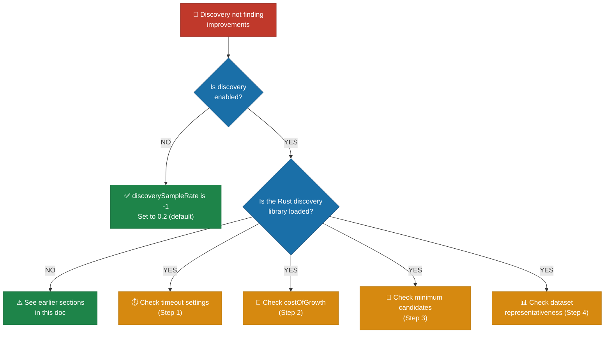

# 🦀 Discovery / FFI Troubleshooting

The [NEAT-AI-Discovery](https://github.com/stSoftwareAU/NEAT-AI-Discovery) Rust
FFI (Foreign Function Interface) extension provides GPU (Graphics Processing
Unit) accelerated structural analysis. It is **optional** — if unavailable, the
discovery phase is skipped.

This document covers building, locating, and loading the Rust library, GPU
backend selection / fallback, and the "discovery is enabled but not finding
improvements" diagnostic flow. See the index in
[`../TROUBLESHOOTING.md`](../TROUBLESHOOTING.md) for other categories.

## Table of contents

- [Building NEAT-AI-Discovery locally](#-building-neat-ai-discovery-locally)
- [Setting NEAT_AI_DISCOVERY_LIB_PATH](#-setting-neat_ai_discovery_lib_path)
- [Architecture mismatch errors (arm64 vs x86)](#-architecture-mismatch-errors-arm64-vs-x86)
- [Discovery is always optional](#-discovery-is-always-optional)
- [FFI permission denied](#-ffi-permission-denied)
- [No GPU detected](#-no-gpu-detected)
- [Discovery not finding improvements](#-discovery-not-finding-improvements)

## 🔧 Building NEAT-AI-Discovery locally

```bash
# Clone into a sibling directory
git clone https://github.com/stSoftwareAU/NEAT-AI-Discovery.git ../NEAT-AI-Discovery
cd ../NEAT-AI-Discovery

# Build and install
cargo build --release
./scripts/runlib.sh
```

The build script installs the library to `~/.cargo/lib/`.

## 🔧 Setting NEAT_AI_DISCOVERY_LIB_PATH

If the library is not in a standard location, set the environment variable:

```bash
export NEAT_AI_DISCOVERY_LIB_PATH="/absolute/path/to/libneat_ai_discovery.dylib"
```

This can point to either the library file or a directory containing it.

**Resolution order** (the first match wins):

1. `NEAT_AI_DISCOVERY_LIB_PATH` environment variable
2. `~/.cargo/lib/`
3. `./target/release/`
4. `../NEAT-AI-Discovery/target/release/`

**Library names by platform:**

| Platform | Library Name                 |
| -------- | ---------------------------- |
| macOS    | `libneat_ai_discovery.dylib` |
| Linux    | `libneat_ai_discovery.so`    |
| Windows  | `libneat_ai_discovery.dll`   |

## ⚠️ Architecture mismatch errors (arm64 vs x86)

**Symptoms:**

- Segmentation fault ("Killed: 9") when loading the library.
- Library file exists but cannot be loaded.
- Silent initialisation failure.

**Diagnosis:**

```bash
# macOS: check architecture and dependencies
file ~/.cargo/lib/libneat_ai_discovery.dylib
otool -L ~/.cargo/lib/libneat_ai_discovery.dylib

# Linux: check architecture and dependencies
file /path/to/libneat_ai_discovery.so
ldd /path/to/libneat_ai_discovery.so
```

**Solutions:**

- Rebuild the library on the target machine:
  ```bash
  cd ../NEAT-AI-Discovery && cargo build --release
  ```
- Ensure `rustup` targets match your system architecture.
- Use the verification script:
  ```bash
  deno run --allow-ffi scripts/check_discovery_safe.ts
  ```

## 💡 Discovery is always optional

Discovery tests skip gracefully when the Rust library is not available — no
environment variable is required. The library already probes for GPU
availability internally and falls back to CPU (Central Processing Unit) when no
GPU is present.

> [!NOTE]
> If you want to disable discovery during training, set
> `discoverySampleRate: -1` in your configuration instead.

## 🔐 FFI permission denied

**Symptom:** `FFI permission denied for discovery library`

**Solution:** Run with the `--allow-ffi` flag:

```bash
deno run --allow-ffi --allow-read --allow-env your_script.ts
```

## 🖥️ No GPU detected

**Symptom:** `Discovery disabled: Rust library loaded but GPU probe failed`

This is a **non-fatal** condition. The library loaded but no usable GPU was
found. Discovery simply will not run. On macOS, ensure Metal is available.

The Rust extension uses `wgpu` to negotiate Metal (macOS), Vulkan (Linux), or
DirectX 12 (Windows). When no compatible adapter is available it falls back to
CPU; if even the CPU path is unavailable, discovery is disabled. See
[`../GPU_ACCELERATION.md`](../GPU_ACCELERATION.md) for backend selection
details.

## 🔬 Discovery not finding improvements

**Symptom:** Discovery runs complete but no structural improvements are applied
to the population.



**Step 1 — Check timeout settings:**

Discovery has two phases — recording and analysis. If either times out too
early, the analysis may not produce useful candidates.

```typescript
discoveryRecordTimeOutMinutes: 10,  // More time for recording (default: 5)
discoveryAnalysisTimeoutMinutes: 20, // More time for analysis (default: 10)
discoverySampleRate: 0.3,            // Sample more data (default: 0.2)
```

Also check the replay timeout if caching is enabled:

```typescript
discoveryReplayTimeoutMinutes: 10,  // More time for replay (default: 5)
discoveryReplayMinTimeMinutes: 0.5, // Lower min-time threshold (default: 1)
```

**Step 2 — Check `costOfGrowth`:**

A high `costOfGrowth` penalises structural changes, meaning discovery candidates
that add neurons or synapses may be rejected because their complexity penalty
outweighs the fitness gain.

```typescript
costOfGrowth: 0.00000001, // Lower penalty (default: 0.0000001)
```

**Step 3 — Check minimum candidates per category:**

Ensure discovery produces enough candidates in each category:

```typescript
discoveryMinCandidatesPerCategory: {
  addNeurons: 2,      // Default: 1
  addSynapses: 2,     // Default: 1
  changeSquash: 2,    // Default: 1
  removeLowImpact: 5, // Default: 3
}
```

Increase `discoveryMaxNeurons` to analyse more neurons per iteration:

```typescript
discoveryMaxNeurons: 10, // Default: 6
```

**Step 4 — Check dataset representativeness:**

Discovery analyses error patterns in the training data. If the dataset is too
small, too noisy, or not representative of the problem domain:

- **Increase `discoverySampleRate`** to give the analyser more data:
  ```typescript
  discoverySampleRate: 0.5, // 50% of records (default: 0.2)
  ```
- **Increase `discoveryBatchSize`** for more observations per batch:
  ```typescript
  discoveryBatchSize: 256, // Default: 128
  ```
- Ensure your training dataset adequately covers the input space — discovery
  cannot find structural improvements if the data does not expose the weaknesses
  in the current network topology

## See also

- [Discovery cluster guide](../DISCOVERY_GUIDE.md) for the end-to-end discovery
  workflow.
- [Discovery architecture](../DISCOVERY_ARCHITECTURE.md) for FFI internals.
- [Memory troubleshooting](MEMORY.md) for discovery-specific memory tuning.
- [GPU acceleration](../GPU_ACCELERATION.md) for backend selection details.
