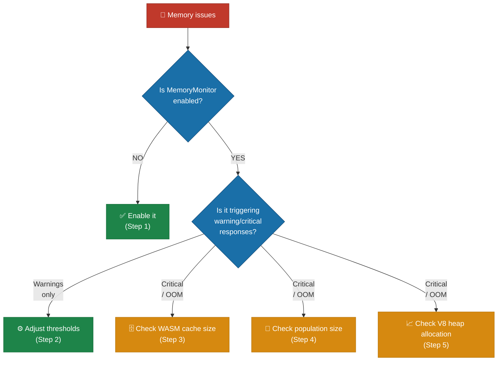
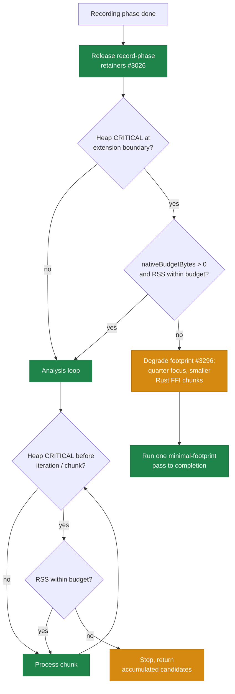

# 🧠 Memory Troubleshooting

This document covers OOM (out-of-memory) symptoms during evolution, the
`MemoryMonitor`, V8 (the JavaScript engine that powers Deno) heap configuration,
WASM (WebAssembly) cache sizing, and memory-leak regression tests. See the index
in [`../TROUBLESHOOTING.md`](../TROUBLESHOOTING.md) for other categories.

## Table of contents

- [Memory issues during training](#-memory-issues-during-training)
- [V8 heap size configuration](#-v8-heap-size-configuration)
- [Test parallelism and memory pressure](#-test-parallelism-and-memory-pressure)
- [Exit code 143 (SIGTERM / OOM kill)](#-exit-code-143-sigterm--oom-kill)
- [Memory leak detection tests](#-memory-leak-detection-tests)
- [Discovery memory tuning](#-discovery-memory-tuning)

## 💾 Memory issues during training

**Symptom:** Out-of-memory errors, process killed (exit code 143/137), or
performance degrades over long runs.



**Step 1 — Enable `MemoryMonitor`:**

The `MemoryMonitor` proactively evicts caches before the heap fills up. It is
enabled by default but can be configured:

```typescript
memory: {
  enabled: true,
  warningThreshold: 0.70,   // Start cache eviction at 70% heap usage
  criticalThreshold: 0.85,  // Aggressive cleanup at 85% heap usage
}
```

At **warning level** (70%), the monitor halves the WASM activation cache and
evicts the oldest quarter of entries. At **critical level** (85%), it reduces
the cache to a single entry and clears the compilation cache.

> **Thresholds are measured against the real V8 heap limit** (`heap_size_limit`,
> i.e. `--max-old-space-size`), **not** the dynamically-committed `heapTotal`
> (Issue #3410). Committed `heapTotal` starts far below the configured limit and
> grows on demand, so measuring against it would read ~100% usage early in a run
> and fire a spurious CRITICAL response while gigabytes of headroom remain. The
> `[MemoryMonitor] Heap: <used> / <limit> (<pct>%)` log line shows the real
> ceiling. When the runtime cannot report the limit the monitor falls back to
> `heapTotal` (legacy behaviour).

**Step 2 — Adjust `MemoryMonitor` thresholds:**

If warnings trigger too frequently, your workload may need more headroom:

```typescript
memory: {
  warningThreshold: 0.60,   // Trigger earlier to prevent spikes
  criticalThreshold: 0.75,  // More aggressive critical threshold
}
```

**Step 3 — Check WASM cache size:**

The WASM activation cache stores compiled creature networks. Reduce the limit
for memory-constrained environments:

```typescript
import { setMaxCachedWasmCreatureActivations } from "@stsoftware/neat-ai";
setMaxCachedWasmCreatureActivations(256); // Effective default: populationSize * 2
```

> A configured `Neat` run derives the WASM activation-cache limit from your
> population — the **effective default is `populationSize * 2`**. The bare `512`
> is only the low-level module fallback used when the LRU is driven directly
> without a `Neat` config; a normal run never sees it.

<!-- -->

> The package exposes a single entry point, `@stsoftware/neat-ai`; every public
> symbol is re-exported from it. There are no subpath specifiers.

**Step 4 — Check population size:**

Each creature consumes memory for its network structure, activation state, and
WASM compilation. Reduce `populationSize` if memory is tight:

```typescript
populationSize: 30, // Reduce from default 50
```

Also consider limiting network complexity:

```typescript
maxConns: 100,            // Limit connections
maximumNumberOfNodes: 30, // Limit neurons
```

**Step 5 — Check V8 heap allocation:**

Increase the V8 heap size for large workloads:

```bash
deno run --v8-flags=--max-old-space-size=8192 your_script.ts
```

Or reduce parallelism to lower peak memory:

```typescript
threads: 4, // Fewer concurrent workers
```

See the next sections for V8 heap configuration and OOM recovery.

## 🔧 V8 heap size configuration

For large populations or long training runs, increase the V8 heap:

```bash
deno test --v8-flags=--max-old-space-size=8192 ...
```

The `quality.sh` script uses 8,192 MB (8 GB) by default.

## ⚠️ Test parallelism and memory pressure

Running tests with `--parallel` uses more memory. If you encounter OOM kills:

1. **Reduce heap allocation:**
   ```bash
   deno test --v8-flags=--max-old-space-size=4096 ...
   ```
2. **Disable parallelism:**
   ```bash
   deno test ...  # omit --parallel flag
   ```
3. **Use `--expose-gc`** for explicit garbage collection hints (used by
   `quality.sh`).

## 💀 Exit code 143 (SIGTERM / OOM kill)

**Symptoms:**

- `deno test exited with 143 (SIGTERM)`
- Test process killed by the operating system or container orchestrator.

**Cause:** Memory usage exceeded system limits. Common when running all 2,000+
tests in parallel with a large heap.

**Solutions:**

- Reduce `--max-old-space-size` to leave headroom for the OS.
- Run tests without `--parallel`.
- In CI, the `coverage.yaml` workflow automatically retries once if the first
  attempt exits with code 143 — it **stays parallel** but caps the worker pool
  (`DENO_JOBS=2`) and halves the heap (Issue #3174), rather than dropping to a
  serial re-run that would blow the job timeout. See [CI troubleshooting](CI.md)
  for the retry logic.

## 🔬 Memory leak detection tests

Issue #1505 added automated tests that verify WASM resources are properly
reclaimed throughout the activation lifecycle. These tests live in `test/wasm/`:

| Test File                  | What It Verifies                                                                                                                       |
| -------------------------- | -------------------------------------------------------------------------------------------------------------------------------------- |
| `WasmMemoryLifecycle.ts`   | `disposeWasm()` clears cached state; repeated activate/dispose cycles produce consistent output; LRU eviction respects capacity bounds |
| `WorkerMemoryIsolation.ts` | Workers activate and terminate cleanly; multiple spawn/terminate cycles succeed; worker disposal does not affect parent WASM state     |
| `FFICleanupLifecycle.ts`   | Repeated FFI calls with `free_discovery_result()` cleanup succeed; library close/reopen cycles work (requires Rust discovery library)  |

**Running the tests:**

```bash
# Run all memory lifecycle tests
deno test --allow-all test/wasm/WasmMemoryLifecycle.ts test/wasm/WorkerMemoryIsolation.ts

# Run FFI cleanup tests (requires discovery library)
deno test --allow-all test/wasm/FFICleanupLifecycle.ts
```

**Detecting regressions:** If a change removes `disposeWasm()` calls or breaks
the LRU eviction logic, these tests will fail because:

- Creatures will retain `cachedWasmActivation` after disposal
- The LRU cache count will exceed the configured maximum
- Evicted creatures will not have their WASM resources freed

## 📊 Discovery memory tuning

For discovery workloads, tune these options to control peak memory:

| Option                        | Default | Effect                             |
| ----------------------------- | ------- | ---------------------------------- |
| `discoveryRustFlushRecords`   | 4,096   | Samples buffered before Rust flush |
| `discoveryRustFlushBytes`     | ~50 MiB | Byte threshold before flush        |
| `discoveryDrainEveryNBatches` | 10      | Drain frequency for promise chains |

Lower values reduce peak memory at the cost of more I/O.

### Heap guards around discovery analysis

Two `MemoryMonitor`-driven guards keep discovery analysis from fatally OOMing
when a large layered seed (e.g. 986 neurons / ~109k synapses) is evolved over a
large supervised `.bin` stream:

1. **Extension-boundary guard** (Issue #2594; degrade-and-continue since Issue
   #3296): before the recording phase extends the timeout to make room for
   analysis, it samples the heap once. If pressure is already CRITICAL it now
   **degrades the analysis footprint and continues** rather than skipping to a
   partial result. `resolveDegradedAnalysisBoundary` reduces the focus breadth
   to a quarter of the neurons (floored at one), bounds the Rust FFI chunks to a
   small chunk, and runs one minimal-footprint pass to completion, logging the
   degrade decision with each reduced knob's `from->to` value so the smaller
   footprint is observable. The result is a genuine completion — candidates, or
   an honest no-improvement result — instead of a zero-candidate skip. See
   [Degrade and continue at the extension boundary (Issue #3296)](#degrade-and-continue-at-the-extension-boundary-issue-3296).

2. **In-loop guard** (Issue #2735): analysis itself runs many chunks across up
   to ten retry iterations, and the per-chunk squash analysis allocates
   aggressively (Issue #2642). The loop now re-samples the heap at the start of
   each retry iteration and before each chunk; on CRITICAL pressure it stops
   submitting work and returns the candidates accumulated so far, logging
   `[Neat] Discovery <id> analysis aborted: heap CRITICAL during analysis loop`.
   This degrades gracefully instead of pressing on into
   `Fatal JavaScript out of memory`.

Both guards honour `memory.enabled` and the shared `criticalThreshold`, so
raising the V8 heap (Step 5) or lowering `criticalThreshold` (Step 2) changes
when they fire. A graceful abort means analysis produced no (or partial)
structural candidates for that cycle — evolution continues; it does not crash.

#### Releasing record-phase retainers before the boundary (Issue #3026)

Before the extension-boundary guard samples the heap, `DataRecorder` now calls
`DiscoverStructure.releaseRecordingRetainers()`. By the time recording finishes
it has already persisted everything analysis reads — the merged
`discovery_data.parquet` and the `selected_indices.json` written during
recording — yet the in-memory sample accumulators (`rustAccumulatedData`,
`rustAccumulatedNeuronData`) and the per-file sampled-index map
(`selectedIndices`) are still alive on the small default worker heap. On their
own they push the sampled heap fraction artificially toward CRITICAL.

Dropping those in-memory copies at the record→analysis handoff lowers the
sampled `heapUsed` so the guard reads the heap analysis actually needs, not the
record-phase leftovers — the per-chunk cache release of #2642 applied to the
boundary. State analysis still consumes is preserved
(`recordedNeuronTotalAbsError` for focus ranking, `parquetFilePath`,
`combinedRustAnalysis`, `creature`), so there is no use-after-free and no change
to recorded output. When `memory.proactiveGc` is enabled a best-effort
`globalThis.gc?.()` runs after the references are dropped, but correctness never
depends on GC running.

#### Off-heap (RSS / native budget) awareness (Issue #3025)

The discovery worker runs on a small default V8 heap (~269 MB), so after a
recording phase the V8 heap fraction sits near the critical threshold even
though the bulk of memory is native/Rust RSS with plenty of headroom (GRQ-23
observed `heap=231MB/269MB rss=13289MB`). Deciding solely on the V8 fraction
mis-classified that healthy run as fatal.

Set `memory.nativeBudgetBytes` to the worker's total resident-set (RSS) budget
to make the guards off-heap aware:

| `nativeBudgetBytes` | Worker-V8-only CRITICAL  | RSS over budget |
| ------------------- | ------------------------ | --------------- |
| `0` (default)       | aborts (legacy)          | aborts          |
| `> 0`               | continues (RSS headroom) | aborts (OOM)    |

The decision lives in the pure, unit-tested `shouldAbortOnHeapPressure`: a
CRITICAL sample driven only by the V8 fraction no longer aborts while RSS stays
within `nativeBudgetBytes`, but RSS exceeding the budget — or RSS being
unreported — still aborts, so a genuine OOM is never masked. The default of `0`
preserves the legacy V8-only behaviour.



#### Degrade and continue at the extension boundary (Issue #3296)

The extension-boundary guard used to **skip-to-partial**: on CRITICAL heap
pressure it returned an empty `DiscoverResult` carrying
`heapAbortedAtExtensionBoundary: true`, logging
`[Neat] Discovery <id> analysis aborted: heap CRITICAL at extension boundary`.

> [!NOTE]
> **Negative result — skip-to-partial was reclassified as a failure.** A loud
> degraded skip that returns zero candidates is still a failure: the iteration
> did no useful work. Do **not** re-attempt the skip-to-partial approach.

The production boundary now **degrades and continues** instead
(`resolveDegradedAnalysisBoundary`):

- **Reduce the footprint** — `computeDegradedAnalysisKnobs` cuts the focus
  breadth to a quarter of the neurons (floored at one) and bounds the Rust FFI
  combined-analysis chunks to a small chunk. The degrade decision is logged with
  each reduced knob's `from->to` value.
- **Run one minimal-footprint pass to completion** — `DataRecorder` runs
  `runAnalysisLoop` with the degraded knobs and a `degradedFirstPass` signal, so
  the first (retry-attempt 0) pass runs through — including its first chunk —
  rather than aborting immediately. Subsequent iterations honour the in-loop
  guard normally, so a run that stays CRITICAL still bails with whatever
  candidates it has found.

The outcome is a genuine completion — candidates, or an honest no-improvement
result — instead of a zero-candidate skip.

The legacy skip-to-partial function `resolveHeapAbortBoundary` (and its
`heapAbortedAtExtensionBoundary` wire contract) is **retained only for its unit
tests**; it is no longer the production path.

## See also

- [WASM troubleshooting](WASM.md) for WASM cache sizing context and
  `RuntimeError: unreachable` from heap exhaustion.
- [Discovery troubleshooting](DISCOVERY.md) for the discovery-side knobs.
- [Performance tuning guide](../PERFORMANCE_TUNING.md) for end-to-end memory and
  throughput tuning.

---

**Up to:** [`README.md`](../../README.md) (entry point) ·
[`docs/README.md`](../README.md) (topic index).
