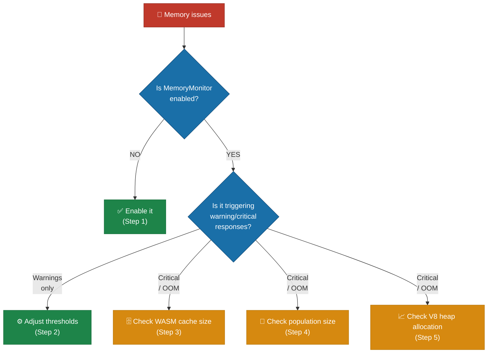
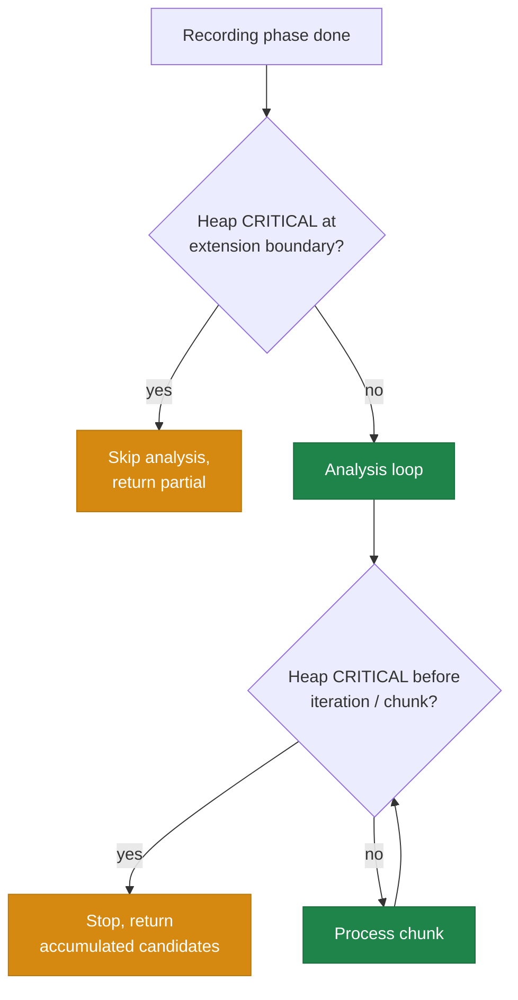

# 🧠 Memory Troubleshooting

This document covers OOM (out-of-memory) symptoms during evolution, the
`MemoryMonitor`, V8 (the JavaScript engine that powers Deno) heap configuration,
WASM (WebAssembly) cache sizing, and memory-leak regression tests. See the index
in [`../TROUBLESHOOTING.md`](../TROUBLESHOOTING.md) for other categories.

## Table of contents

- [Memory issues during training](#-memory-issues-during-training)
- [V8 heap size configuration](#-v8-heap-size-configuration)
- [Test parallelism and memory pressure](#-test-parallelism-and-memory-pressure)
- [Exit code 143 (SIGTERM / OOM kill)](#-exit-code-143-sigterm--oom-kill)
- [Memory leak detection tests](#-memory-leak-detection-tests)
- [Discovery memory tuning](#-discovery-memory-tuning)

## 💾 Memory issues during training

**Symptom:** Out-of-memory errors, process killed (exit code 143/137), or
performance degrades over long runs.



**Step 1 — Enable `MemoryMonitor`:**

The `MemoryMonitor` proactively evicts caches before the heap fills up. It is
enabled by default but can be configured:

```typescript
memory: {
  enabled: true,
  warningThreshold: 0.70,   // Start cache eviction at 70% heap usage
  criticalThreshold: 0.85,  // Aggressive cleanup at 85% heap usage
}
```

At **warning level** (70%), the monitor halves the WASM activation cache and
evicts the oldest quarter of entries. At **critical level** (85%), it reduces
the cache to a single entry and clears the compilation cache.

**Step 2 — Adjust `MemoryMonitor` thresholds:**

If warnings trigger too frequently, your workload may need more headroom:

```typescript
memory: {
  warningThreshold: 0.60,   // Trigger earlier to prevent spikes
  criticalThreshold: 0.75,  // More aggressive critical threshold
}
```

**Step 3 — Check WASM cache size:**

The WASM activation cache stores compiled creature networks. Reduce the limit
for memory-constrained environments:

```typescript
import { setMaxCachedWasmCreatureActivations } from "neat-ai/wasm";
setMaxCachedWasmCreatureActivations(256); // Default: 512
```

**Step 4 — Check population size:**

Each creature consumes memory for its network structure, activation state, and
WASM compilation. Reduce `populationSize` if memory is tight:

```typescript
populationSize: 30, // Reduce from default 50
```

Also consider limiting network complexity:

```typescript
maxConns: 100,            // Limit connections
maximumNumberOfNodes: 30, // Limit neurons
```

**Step 5 — Check V8 heap allocation:**

Increase the V8 heap size for large workloads:

```bash
deno run --v8-flags=--max-old-space-size=8192 your_script.ts
```

Or reduce parallelism to lower peak memory:

```typescript
threads: 4, // Fewer concurrent workers
```

See the next sections for V8 heap configuration and OOM recovery.

## 🔧 V8 heap size configuration

For large populations or long training runs, increase the V8 heap:

```bash
deno test --v8-flags=--max-old-space-size=8192 ...
```

The `quality.sh` script uses 8,192 MB (8 GB) by default.

## ⚠️ Test parallelism and memory pressure

Running tests with `--parallel` uses more memory. If you encounter OOM kills:

1. **Reduce heap allocation:**
   ```bash
   deno test --v8-flags=--max-old-space-size=4096 ...
   ```
2. **Disable parallelism:**
   ```bash
   deno test ...  # omit --parallel flag
   ```
3. **Use `--expose-gc`** for explicit garbage collection hints (used by
   `quality.sh`).

## 💀 Exit code 143 (SIGTERM / OOM kill)

**Symptoms:**

- `deno test exited with 143 (SIGTERM)`
- Test process killed by the operating system or container orchestrator.

**Cause:** Memory usage exceeded system limits. Common when running all 2,000+
tests in parallel with a large heap.

**Solutions:**

- Reduce `--max-old-space-size` to leave headroom for the OS.
- Run tests without `--parallel`.
- In CI, the `coverage.yaml` workflow automatically retries with 50% memory and
  no parallelism if the first attempt exits with code 143. See
  [CI troubleshooting](CI.md) for the retry logic.

## 🔬 Memory leak detection tests

Issue #1505 added automated tests that verify WASM resources are properly
reclaimed throughout the activation lifecycle. These tests live in `test/wasm/`:

| Test File                  | What It Verifies                                                                                                                       |
| -------------------------- | -------------------------------------------------------------------------------------------------------------------------------------- |
| `WasmMemoryLifecycle.ts`   | `disposeWasm()` clears cached state; repeated activate/dispose cycles produce consistent output; LRU eviction respects capacity bounds |
| `WorkerMemoryIsolation.ts` | Workers activate and terminate cleanly; multiple spawn/terminate cycles succeed; worker disposal does not affect parent WASM state     |
| `FFICleanupLifecycle.ts`   | Repeated FFI calls with `free_discovery_result()` cleanup succeed; library close/reopen cycles work (requires Rust discovery library)  |

**Running the tests:**

```bash
# Run all memory lifecycle tests
deno test --allow-all test/wasm/WasmMemoryLifecycle.ts test/wasm/WorkerMemoryIsolation.ts

# Run FFI cleanup tests (requires discovery library)
deno test --allow-all test/wasm/FFICleanupLifecycle.ts
```

**Detecting regressions:** If a change removes `disposeWasm()` calls or breaks
the LRU eviction logic, these tests will fail because:

- Creatures will retain `cachedWasmActivation` after disposal
- The LRU cache count will exceed the configured maximum
- Evicted creatures will not have their WASM resources freed

## 📊 Discovery memory tuning

For discovery workloads, tune these options to control peak memory:

| Option                        | Default | Effect                             |
| ----------------------------- | ------- | ---------------------------------- |
| `discoveryRustFlushRecords`   | 4,096   | Samples buffered before Rust flush |
| `discoveryRustFlushBytes`     | ~50 MiB | Byte threshold before flush        |
| `discoveryDrainEveryNBatches` | 10      | Drain frequency for promise chains |

Lower values reduce peak memory at the cost of more I/O.

### Heap guards around discovery analysis

Two `MemoryMonitor`-driven guards keep discovery analysis from fatally OOMing
when a large layered seed (e.g. 986 neurons / ~109k synapses) is evolved over a
large supervised `.bin` stream:

1. **Extension-boundary guard** (Issue #2594): before the recording phase
   extends the timeout to make room for analysis, it samples the heap once. If
   pressure is already CRITICAL it skips analysis and returns a partial result,
   logging
   `[Neat] Discovery <id> analysis aborted: heap CRITICAL at extension boundary`.

2. **In-loop guard** (Issue #2735): analysis itself runs many chunks across up
   to ten retry iterations, and the per-chunk squash analysis allocates
   aggressively (Issue #2642). The loop now re-samples the heap at the start of
   each retry iteration and before each chunk; on CRITICAL pressure it stops
   submitting work and returns the candidates accumulated so far, logging
   `[Neat] Discovery <id> analysis aborted: heap CRITICAL during analysis loop`.
   This degrades gracefully instead of pressing on into
   `Fatal JavaScript out of memory`.

Both guards honour `memory.enabled` and the shared `criticalThreshold`, so
raising the V8 heap (Step 5) or lowering `criticalThreshold` (Step 2) changes
when they fire. A graceful abort means analysis produced no (or partial)
structural candidates for that cycle — evolution continues; it does not crash.



## See also

- [WASM troubleshooting](WASM.md) for WASM cache sizing context and
  `RuntimeError: unreachable` from heap exhaustion.
- [Discovery troubleshooting](DISCOVERY.md) for the discovery-side knobs.
- [Performance tuning guide](../PERFORMANCE_TUNING.md) for end-to-end memory and
  throughput tuning.

---

**Up to:** [`README.md`](../../README.md) (entry point) ·
[`docs/README.md`](../README.md) (topic index).
