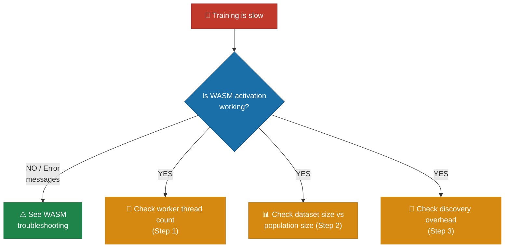

# 🐢 Performance Troubleshooting

This document covers training that runs unexpectedly slowly — worker thread
sizing, dataset / population scaling, and discovery overhead. See the index in
[`../TROUBLESHOOTING.md`](../TROUBLESHOOTING.md) for other categories.

## Training is slow

**Symptom:** Each generation takes a long time, or evolution progresses too
slowly overall.



**Step 1 — Check worker threads:**

Verify how many threads are being used. By default, NEAT-AI uses
`navigator.hardwareConcurrency` (all available CPU cores).

```typescript
// Check effective thread count
const config = createNeatConfig({
  threads: 8, // Explicit thread count
  verbose: true, // Log thread allocation
});
```

If you have limited memory, the `workerThreadCap` can automatically reduce
threads:

```typescript
workerThreadCap: {
  maxMemoryMB: 8192,              // 8 GB memory budget
  estimatedMemoryPerWorkerMB: 2048, // 2 GB per worker (default)
}
// Effective threads = min(threads, floor(8192 / 2048)) = 4
```

Check logs for "thread count capped" warnings — this indicates your thread count
was reduced due to memory constraints.

**Step 2 — Check dataset size vs population size:**

Large datasets with large populations multiply compute per generation:

- **Reduce `trainingSampleRate`** to use a fraction of the dataset per
  generation (stochastic training):
  ```typescript
  trainingSampleRate: 0.5, // Use 50% of data each generation (default: 1)
  ```
- **Reduce `populationSize`** for prototyping — start with `10`–`30`
- **Reduce `trainPerGen`** to `0` if you want evolution-only (no
  backpropagation):
  ```typescript
  trainPerGen: 0, // Disable per-generation backpropagation
  ```

**Step 3 — Check discovery overhead:**

Discovery (structural analysis via Rust FFI — Foreign Function Interface) can be
time-consuming. If you do not need structural improvements:

```typescript
discoverySampleRate: -1, // Disable discovery entirely
```

If discovery is needed but slow, tune its time budgets:

```typescript
discoveryRecordTimeOutMinutes: 3,   // Reduce from default 5
discoveryAnalysisTimeoutMinutes: 5, // Reduce from default 10
```

> [!NOTE]
> WASM (WebAssembly) activation is mandatory in NEAT-AI and is the primary
> performance driver. If WASM is failing to initialise — even silently —
> training will appear extremely slow or may hang. Always confirm WASM is active
> before investigating other bottlenecks.

## See also

- [WASM troubleshooting](WASM.md) — confirm WASM is initialised and not falling
  back silently.
- [Memory troubleshooting](MEMORY.md) — when slowness is caused by paging /
  cache eviction under memory pressure.
- [Performance tuning guide](../PERFORMANCE_TUNING.md) — operational tuning
  beyond the symptom-driven flow above.

---

**Up to:** [`README.md`](../../README.md) (entry point) ·
[`docs/README.md`](../README.md) (topic index).
